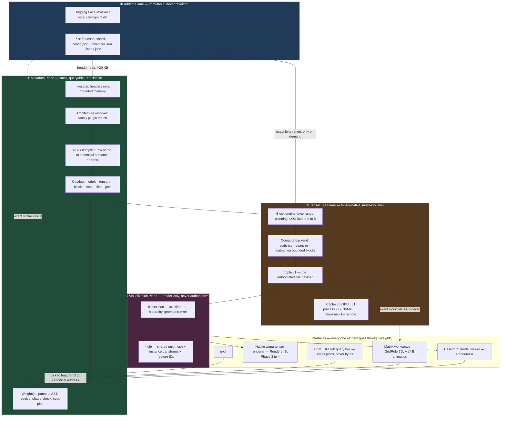
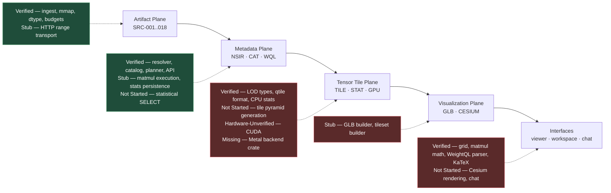
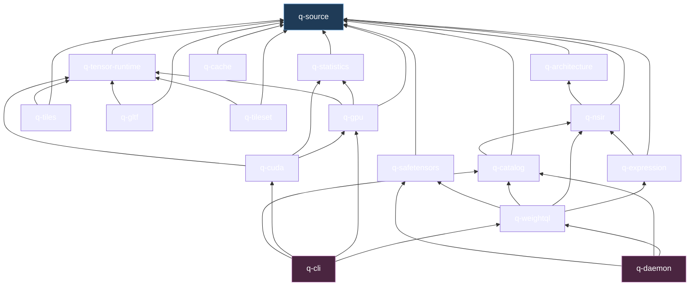
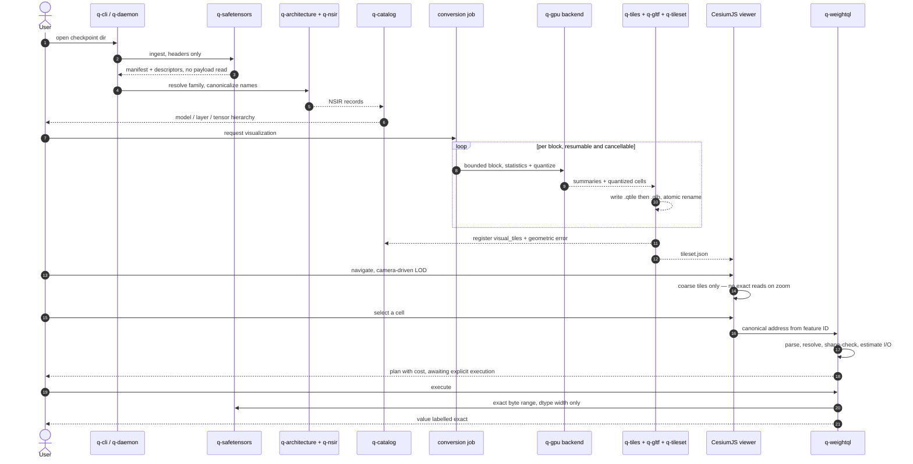
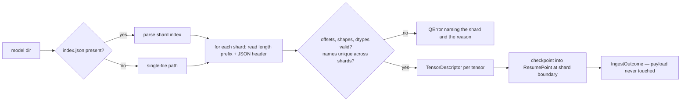
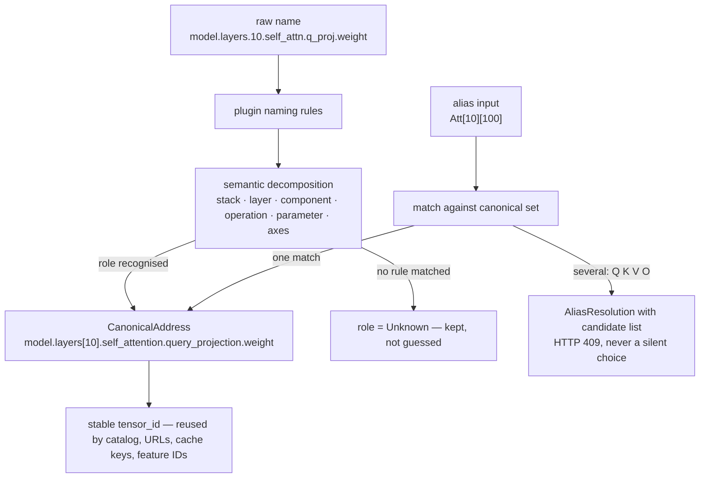
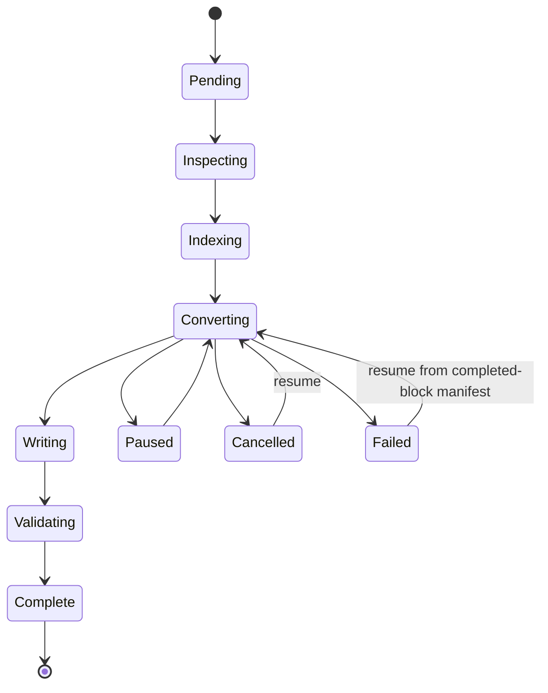
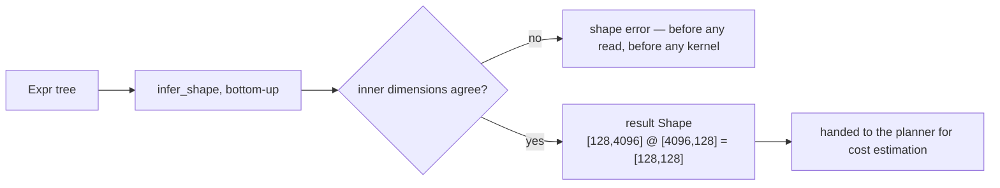
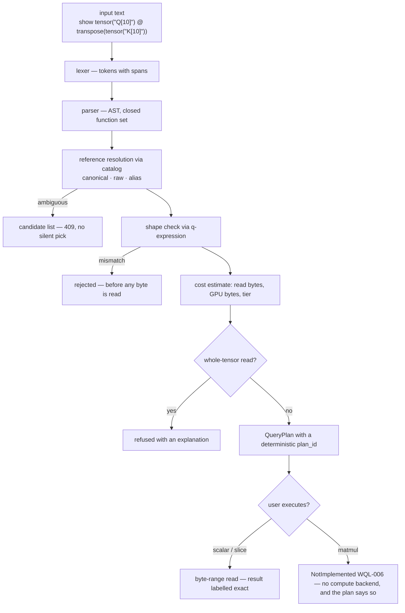
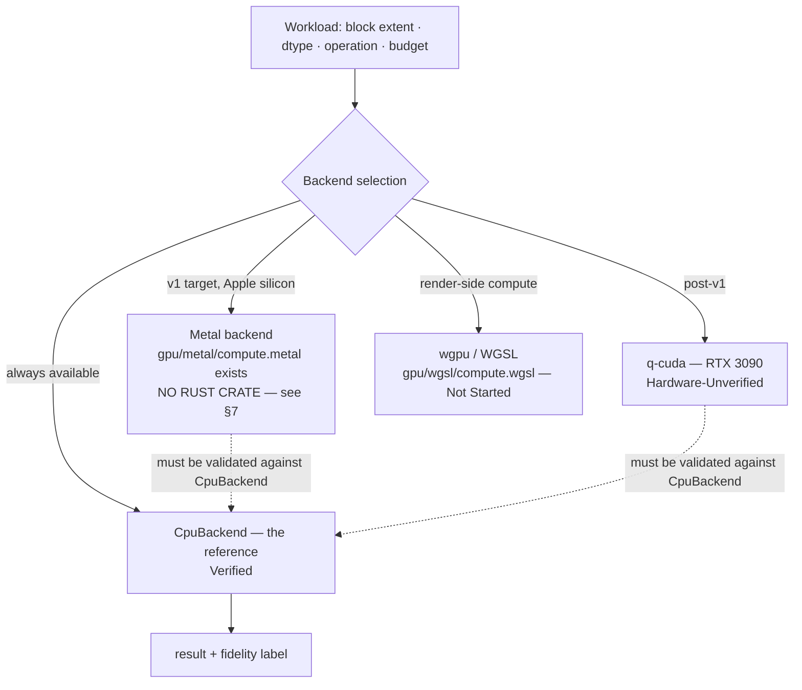

# COMPONENTS_MAP — Quatricmorph component and module map

**This document is subordinate.** The canonical implementation architecture is
[`ARCHITECTURE.md`](ARCHITECTURE.md); the canonical requirement→code→test record
is [`STATUS.md`](STATUS.md). If anything here conflicts with either, follow
them, not this file. This is a **component inventory and target workflow map** —
it does not define architecture, and it must never become a second source of
truth.

**How this document was built**

| Layer                                                              | Source                                                                                         |
| ------------------------------------------------------------------ | ---------------------------------------------------------------------------------------------- |
| Component boundaries, responsibilities, workflows, target diagrams | `ARCHITECTURE.md`, `MASTER_DOCUMENT.md`, `docs/PRODUCT_BRIEF.md` — **design intent, not code** |
| Rust module inventory (which `.rs` files exist per crate)          | The filesystem — factual listing only                                                          |
| Status labels and requirement IDs                                  | `STATUS.md` (test run 2026-08-03: 290 Rust + 101 web tests)                                    |

Status vocabulary is **reused verbatim from `STATUS.md` §"Status vocabulary"** so
that this map stays auditable against it:

`Verified` · `Implemented` · `Partial` · `Stub` · `Hardware-Unverified` · `Not Started`

---

## 1. What Quatricmorph should be

The product thesis (`docs/PRODUCT_BRIEF.md`, `ARCHITECTURE.md` §20):

```text
SafeTensors
→ semantic tensor address space
→ queryable block hierarchy
→ procedural multiresolution visualization
→ exact on-demand computation
```

The tensor database and the query substrate are the product. Visualization is
**one projection** of that substrate — not the product, and not a separate
pipeline with its own truth.



### The five invariants the diagram encodes

1. **Bytes flow up only on demand.** The only unconditional read of the Artifact
   Plane is the header read during ingestion. Everything else is a byte range
   requested by an explicit selection or an executed plan (`ARCHITECTURE.md`
   §13.3).
2. **One query layer.** Viewer, workspace, chat, CLI and HTTP API all enter
   through WeightQL. Nothing else reads weight bytes (§15).
3. **GLB is not a tensor database.** `.qtile` carries values; GLB carries
   geometry, instancing and feature IDs (§10.1).
4. **Position is derived, never stored per scalar.** `tile origin + logical
   index + layout rule` (§19).
5. **Fidelity is a first-class field.** Every result declares exact / sampled /
   quantized / approximate all the way from the reader to the UI (§18 AC-010).

### Same diagram, annotated with today's reality

Design comes from the docs above; these labels come from `STATUS.md`.



---

## 2. Plane → crate assignment

Per `ARCHITECTURE.md` §2.1. Every crate declares its plane in its top-of-file
doc comment; this table reproduces those declarations.

| Plane           | Crates                                                                                    | What it owns                                                                                                     |
| --------------- | ----------------------------------------------------------------------------------------- | ---------------------------------------------------------------------------------------------------------------- |
| ① Artifact      | `q-source`, `q-safetensors`                                                               | Immutable checkpoint bytes, headers, shard index, byte-range reads                                               |
| ② Metadata      | `q-architecture`, `q-nsir`, `q-catalog`, `q-tensor-runtime`, `q-expression`, `q-weightql` | Canonical addresses, semantic roles, the queryable catalog, block/LOD addressing, the shape algebra, the planner |
| ③ Tensor Tile   | `q-tiles`, `q-statistics`, `q-gpu`, `q-cuda`, *(`q-metal` — declared, absent)*            | `.qtile` payloads, summaries, compute backends                                                                   |
| ④ Visualization | `q-tileset`, `q-gltf`                                                                     | `tileset.json`, GLB tile content                                                                                 |
| Cross-plane     | `q-cache`, `q-daemon`, `q-cli`                                                            | Caching across ②③, the HTTP surface, the terminal surface                                                        |

---

## 3. Crate dependency graph

Rooted at `q-source`, which every other crate depends on for `QError`,
`MemoryBudget`, `TensorDescriptor` and `DType`. This is a DAG — there are no
cycles, and the layering matches the plane order above.



**Two structural observations.**

- `q-cache` is a leaf on `q-source` only. **No library or binary crate depends
  on it**; the `tests` crate declares it in `Cargo.toml` but no test source
  references it. That is the graph shape of `CACHE-008` (*"the cache works;
  nothing calls it yet"*).
- `q-tiles`, `q-gltf` and `q-tileset` all depend on `q-tensor-runtime` and none
  depend on each other. The target conversion pipeline (§11) requires
  `q-tiles → q-gltf → q-tileset` sequencing; today that sequencing exists only
  as a plan, which is why `TILE-004` is Not Started.

---

## 4. Primary product workflow

`MASTER_DOCUMENT.md` §2 — the target end-to-end path, as a sequence.



**Where this workflow stops today:** at the `request visualization` step.
Ingestion → NSIR → catalog → WeightQL → exact value is Verified end to end
(`tests/tests/end_to_end_scalar_slice.rs`, `AC-005`). The job runner
(`JOB-002`), the tile pyramid (`TILE-004`), the GLB builder (`GLB-001`), the
tileset builder (`CESIUM-001`) and the viewer (`CESIUM-005`) are the unbuilt
span.

---

## 5. Rust component map

17 crates, plus the `tests` integration crate. **12 of 17 crates are a single
`lib.rs`** — the module lists below are the literal `.rs` files on disk, not an
idealized decomposition.

---

### 5.1 `q-source` — Artifact Plane · foundation

**Target responsibility** (`ARCHITECTURE.md` §4.1, `MASTER_DOCUMENT.md` §6):
own the immutable source. Preserve source identity and hash, resolve shard
locations, read exact byte ranges, and never allocate proportional to
checkpoint size. Every other crate's error type, memory budget and dtype
decoding lives here.

| Module          | Role                                                                                                    |
| --------------- | ------------------------------------------------------------------------------------------------------- |
| `lib.rs`        | Crate root; `MAX_HEADER_BYTES`, `MAX_SINGLE_READ_BYTES`, `MAX_QUERY_RESULT_ELEMENTS`; access-scale type |
| `error.rs`      | `QError` — the workspace-wide error, including `NotImplemented(requirement_id)`                         |
| `budget.rs`     | `MemoryBudget` — named, enforced ceilings                                                               |
| `cancel.rs`     | `CancellationToken`, `Cancellable`, `ResumePoint`                                                       |
| `descriptor.rs` | `TensorDescriptor` — the Artifact→Metadata bridge record                                                |
| `dtype.rs`      | f32 / bf16 / f16 exact decode; unsupported dtypes refused, never guessed                                |
| `ids.rs`        | Stable `model_id` / `tensor_id` derivation (blake3)                                                     |
| `local.rs`      | `LocalFsSource` — mmap reads, model-root confinement, traversal refusal                                 |
| `http.rs`       | `HttpByteRange` — range arithmetic; transport not built                                                 |
| `manifest.rs`   | `ModelManifest` — shard set and source identity                                                         |
| `role.rs`       | `TensorRole` — semantic role enum, with `Unknown` as a first-class value                                |

**Upstream:** none. **Downstream:** every crate.

**Workflow:** `model URI → manifest → shard list → (offset, length) → bounded
byte window`, with every step passing a `MemoryBudget` and a
`CancellationToken`.

**Status:** `Verified` — SRC-001…018 except `SRC-008` (HTTP Range transport) =
`Stub`, and `SEC-001` (root confinement) = `Verified`.

---

### 5.2 `q-safetensors` — Artifact Plane → Metadata Plane

**Target responsibility** (§4.1): parse SafeTensors headers, handle
`model.safetensors.index.json`, verify offsets and shapes, and perform the
exact reads that back every scalar and slice query. Ingestion must be
cancellable and resumable and must never read payload.

| Module      | Role                                                                                                      |
| ----------- | --------------------------------------------------------------------------------------------------------- |
| `lib.rs`    | Crate root; `METADATA_KEY`; `is_single_file`                                                              |
| `header.rs` | `SafeTensorsHeader`, `HeaderEntry` — length prefix, JSON, offset validation, duplicate/corruption refusal |
| `index.rs`  | `ShardIndex`, `ShardIndexMetadata` — sharded checkpoint resolution, missing-shard reporting               |
| `ingest.rs` | `CheckpointIngestor`, `IngestOutcome`, `ingest_local` — the bounded import loop                           |
| `read.rs`   | `read_scalar`, `read_slice_2d`, `read_row` — `ScalarRead` / `SliceRead` with byte accounting              |



**Upstream:** `q-source`. **Downstream:** `q-weightql`, `q-daemon`, `q-cli`.

**Status:** `Verified` (SRC-001…004, 009…016). The header path refuses an
absurd header length *before allocating*.

---

### 5.3 `q-architecture` — Metadata Plane

**Target responsibility** (§4.2): the architecture-plugin registry. A family
plugin is a declarative manifest claiming models by `config.json` `model_type` /
`architectures`, and mapping raw names to semantic components. **A resolver must
be allowed to return `unknown` and must never infer a role from matching
shapes.**

| Module   | Role                                                                                                                                                                           |
| -------- | ------------------------------------------------------------------------------------------------------------------------------------------------------------------------------ |
| `lib.rs` | `ArchitecturePlugin`, `Registry`, `Selection`; `MatchSpec` / `NamingSpec` / `Rule` / `AliasRule` / `MatchKind`; the five `BUILTIN_*` plugins compiled in from `architectures/` |

**Plugins on disk:** `generic`, `llama`, `qwen`, `kimi`, `deepseek` — each a
single `plugin.toml`, embedded via `include_str!`.

| Plugin                     | Status                                                                                                    |
| -------------------------- | --------------------------------------------------------------------------------------------------------- |
| `generic`                  | `Verified` (NSIR-001) — returns `unknown` for names it was not taught                                     |
| `llama`                    | `Verified` (NSIR-002, NSIR-003 incl. MoE expert addressing)                                               |
| `qwen`, `kimi`, `deepseek` | **`Not Started`** (NSIR-006) — declared with `implemented = false`, and tested to **never claim a model** |

**Workflow:** `config.json → candidate plugins by model_type → highest-specificity
match → Selection → naming rules handed to q-nsir`; no match falls back to
`generic`, never to a guess.

**Upstream:** `q-source`. **Downstream:** `q-nsir`.

**Status:** registry `Verified` (NSIR-008: priority selection and generic
fallback); family coverage as in the table above.

---

### 5.4 `q-nsir` — Metadata Plane · the addressing core

**Target responsibility** (§4.2, §6, `MASTER_DOCUMENT.md` §7): normalize
architecture-specific tensor names into canonical semantic identities, and
resolve contextual aliases. `model.layers.10.self_attn.q_proj.weight` becomes
`model.layers[10].self_attention.query_projection.weight`, and `Q[10][100,42]`
resolves to that same object. **An ambiguous alias returns candidates, never a
silent pick.**

| Module        | Role                                                                                             |
| ------------- | ------------------------------------------------------------------------------------------------ |
| `lib.rs`      | Crate root; `ResolvedModel`, `NsirRecord`                                                        |
| `address.rs`  | `CanonicalAddress`, `PathSegment`, `ElementSelector`, `IndexTerm` — the address grammar          |
| `alias.rs`    | `ParsedAlias`, `AliasCandidate`, `AliasResolution` — contextual alias resolution with confidence |
| `record.rs`   | `canonical_name` — record → stable canonical string                                              |
| `resolver.rs` | `NsirResolver` — plugin rules applied to raw names                                               |



**Upstream:** `q-source`, `q-architecture`. **Downstream:** `q-catalog`,
`q-expression`, `q-weightql`.

**Status:** `Verified` — NSIR-001 (unknown preserved), NSIR-003 (MoE expert
addressing), NSIR-004 (canonical construction and stability), NSIR-005 (the five
alias forms from `ARCHITECTURE.md` §6.2), NSIR-007 (candidates, never a silent
pick — `API-007` proves it end to end as a 409), NSIR-009 (invalid syntax
rejected, not guessed). The crate is complete for the families that exist;
NSIR-006 is a `q-architecture` gap, not an addressing gap.

---

### 5.5 `q-catalog` — Metadata Plane

**Target responsibility** (§5, `MASTER_DOCUMENT.md` §8): the queryable metadata
store — models, tensors, blocks, statistics, visual tiles, conversion jobs.
Hierarchy queries, role filters, byte-range resolution, tile↔tensor resolution,
schema versioning and migration.

| Module      | Role                                                                                                                                             |
| ----------- | ------------------------------------------------------------------------------------------------------------------------------------------------ |
| `lib.rs`    | `Catalog`, `ModelRow`, `TensorRow`, `LayerSummary`, `TensorFilter`; `list_layers`, `get_by_canonical_name`, `find_by_role`, `resolve_byte_range` |
| `schema.rs` | DDL, `CURRENT_SCHEMA_VERSION`, `MIGRATIONS`, `migrate`                                                                                           |
| `job.rs`    | `ConversionJob`, `JobKind`, `JobState` — the resumable-job state machine                                                                         |

**Engine departure (recorded):** the architecture text says DuckDB/Parquet; the
implementation is SQLite via `rusqlite` (bundled). This is
`docs/decisions/ADR-003-catalog-sqlite.md`, with the measured condition that
would trigger a move. The public API is engine-agnostic. **Do not "fix" the
code to match the prose.**

**Job state machine** (`MASTER_DOCUMENT.md` §15):



**Upstream:** `q-source`, `q-nsir`. **Downstream:** `q-weightql`, `q-daemon`,
`q-cli`.

**Status:** `Verified` — CAT-001…009: schema, idempotent versioned migrations
with future schemas refused, hierarchy browsing, canonical lookup with raw-name
fallback, role/dtype/rank/layer filters, pure-arithmetic byte-range resolution,
survival across close-and-reopen, idempotent re-import. Plus JOB-001 (illegal
transitions rejected), JOB-003 (job persistence), SEC-005 (no SQL-injection
surface). `CAT-006` indexes a 10¹²-parameter manifest — 47 278 tensors,
1.048×10¹² parameters, 2.10 TB described — with **35.7 MB peak allocation**,
opening no artifact. `CAT-010` (DuckDB/Arrow/Parquet backend) is `Not Started`
by decision, not by omission. The job **runner** (`JOB-002`) is `Stub`.

---

### 5.6 `q-tensor-runtime` — Metadata Plane · block and LOD addressing

**Target responsibility** (§5.3, §9, §10): the shared addressing primitives —
what a block is, which byte runs it covers, which LOD level it sits at, and what
its stable tile identity is. Scope in this pass is **types only**; nothing here
reads or executes.

| Module   | Role                                                                                             |
| -------- | ------------------------------------------------------------------------------------------------ |
| `lib.rs` | `Lod` (0–5, closed), `BlockExtent`, `TensorBlock`, `SourceByteRanges`, `TileId`, `BlockEncoding` |

**The LOD ladder** (§9.1) — the contract shared by the catalog, the tile
compiler, the tileset and the viewer:

| LOD | Object        | Data                                         | Reads payload?                  |
| --- | ------------- | -------------------------------------------- | ------------------------------- |
| 0   | Model         | parameter count, bytes, global distributions | no                              |
| 1   | Subsystem     | layer ranges, aggregate norms                | no                              |
| 2   | Layer         | tensor count, mean norm, anomaly score       | no                              |
| 3   | Tensor        | shape, dtype, histogram, spectrum summary    | no                              |
| 4   | Block         | block statistics, quantized samples          | conversion time only            |
| 5   | Scalar region | exact or sampled values                      | **yes — on explicit selection** |

**Upstream:** `q-source`. **Downstream:** `q-tiles`, `q-gltf`, `q-tileset`,
`q-gpu`, `q-cuda`.

**Status:** `Verified` types (TILE-001…003). Block planning derives one byte run
per row without reading.

---

### 5.7 `q-statistics` — Tensor Tile Plane · CPU ground truth

**Target responsibility** (§5.4): the CPU reference implementation of tensor
statistics. **This is the ground truth every backend is validated against** —
`MASTER_DOCUMENT.md` acceptance criterion 12 requires GPU results to be checked
against it.

| Module   | Role                                                                                                                                         |
| -------- | -------------------------------------------------------------------------------------------------------------------------------------------- |
| `lib.rs` | `TensorStatistics`, `Histogram`, `StatisticsAccumulator` (Welford), `compute_exact`, `cosine_similarity`, `relative_l2`, `ALGORITHM_VERSION` |

**Workflow:** `values (streamed in chunks) → Welford accumulator → min/max/mean/
variance/L1/L2/zero-positive-negative ratios/histogram → TensorStatistics with a
fidelity label`. `ALGORITHM_VERSION` is a cache-key component (§13.2), so a
change to the algorithm invalidates derived tiles rather than silently mixing
generations.

**Upstream:** `q-source`. **Downstream:** `q-gpu`, `q-cuda`.

**Status:** `Verified` (STAT-001, 003…006 — expected values computed by hand).
`STAT-002` (persisted and served) is `Stub`: statistics are computed but nothing
has run a pass, so `tensor_statistics` is empty and the API returns 501.

---

### 5.8 `q-expression` — Metadata Plane · the shape algebra

**Target responsibility** (§7.4): the mathematical-expression AST and its type
system. `(A @ B) @ C` becomes a tree, and **an incompatible expression fails
before any GPU execution** (`ARCHITECTURE.md` §7, acceptance criterion 9).

| Module   | Role                                                                                              |
| -------- | ------------------------------------------------------------------------------------------------- |
| `lib.rs` | `Expr` (closed enum), `Shape`, `Reduction`, `ComparisonMetric`, `ShapeEnvironment`, `infer_shape` |



The enum is **closed by design** — that is the mechanism behind `WQL-009` /
`SEC-002`: there is no expression node that can express arbitrary code.

**Upstream:** `q-source`, `q-nsir`. **Downstream:** `q-weightql`.

**Status:** `Verified` (WQL-004, WQL-009, AC-009).

---

### 5.9 `q-weightql` — Metadata Plane · the single query layer

**Target responsibility** (§7, §14.5, §15): **the one door.** The viewer, the
workspace, the CLI, the HTTP API and the chat assistant all call this; none of
them read weight bytes. Parse → resolve → shape-check → estimate cost → emit a
quotable plan → execute only when the user explicitly asks.

| Module      | Role                                                                                                       |
| ----------- | ---------------------------------------------------------------------------------------------------------- |
| `lib.rs`    | `QueryEngine` — the entry point                                                                            |
| `lexer.rs`  | `tokenize`, `Token`, `Spanned` — spans carry the caret position for error reporting                        |
| `parser.rs` | `parse`, `Statement`, `Script` — assignment, `show`, `SELECT value`, `SELECT slice`; closed function set   |
| `plan.rs`   | `QueryPlan`, `QueryOutcome`, `ResolvedReference`, `ReferenceKind` — resolution, cost estimation, execution |



**Upstream:** `q-expression`, `q-nsir`, `q-catalog`, `q-safetensors`.
**Downstream:** `q-daemon`, `q-cli`.

**Status:** `Partial`. Verified: tokenizer, parser, resolution, shape rejection,
scalar/slice execution, cost estimates, whole-tensor refusal, deterministic plan
IDs, no-arbitrary-code (WQL-001…005, 009…012). `Stub`: matmul execution
(WQL-006), stacked slice composition (WQL-008). `Not Started`: statistical
`SELECT … GROUP BY layer_index` (WQL-007) — the parser rejects it *by name*.

---

### 5.10 `q-tiles` — Tensor Tile Plane · the `.qtile` container

**Target responsibility** (§10.3, §11.1): the tensor-native sidecar format. A
`.qtile` holds the actual values; the GLB beside it holds only geometry. Binary
schema, endianness, versioning, alignment, checksums and forward compatibility
are part of the format contract.

| Module   | Role                                                                                                           |
| -------- | -------------------------------------------------------------------------------------------------------------- |
| `lib.rs` | `QTileHeader` (72 bytes), `QTile`, `QTILE_MAGIC`, `QTILE_VERSION`, `MAX_QTILE_PAYLOAD_BYTES`, `dequantize_i16` |

**Format contract:** magic `QTILE\0\0\0`, little-endian regardless of host,
`tensor_id` + `origin` + `extent` + `min_value` / `max_value` in the header,
Morton-coordinate + quantized-value payload. A quantized tile **declares itself
lossy** — that flag is what the UI's exact/approximate indicator reads.

**Upstream:** `q-source`, `q-tensor-runtime`. **Downstream:** the (unbuilt) tile
compiler; the viewer via the daemon.

**Status:** `Verified` format (TILE-005…008: byte-exact round trip, 8 distinct
corruption refusals, host-independent endianness). **`Not Started`: anything
that generates tiles for a model** (TILE-004). The container exists; the
pyramid builder does not.

---

### 5.11 `q-gpu` — compute backend boundary

**Target responsibility** (§12.3): the trait every compute backend implements,
plus the CPU reference implementation that defines correct behaviour. Backends
are interchangeable behind this trait: CPU today, **Metal for v1**, CUDA
post-v1.

| Module   | Role                                                                                                      |
| -------- | --------------------------------------------------------------------------------------------------------- |
| `lib.rs` | `Backend` trait, `CpuBackend`, `ComputeCapabilities`, `Workload`, `BlockData`, `block_statistics_default` |



**Backend responsibilities** (`MASTER_DOCUMENT.md` §9): dtype conversion,
quantization, reductions, ratios, histograms, block sampling, visual
classification, Morton encoding, optional block matmul. **Not** backend
responsibilities: header parsing, catalog queries, path handling, GLB writing,
tileset generation, browser state.

**Upstream:** `q-source`, `q-statistics`, `q-tensor-runtime`.
**Downstream:** `q-cuda`, `q-cli`.

**Status:** `Verified` (GPU-001, GPU-002 — 7 tests, plus hand-computed matmul
under MATMUL-004). `GPU-003` (wgpu/Metal backends) is `Not Started`.

---

### 5.12 `q-cuda` — Tensor Tile Plane · deferred accelerator lane

**Target responsibility** (§12.3): an RTX 3090 conversion lane behind the same
`Backend` trait. **Explicitly post-v1**, per `ARCHITECTURE.md` §12.3 and
`.plan/decisions/ADR-CANDIDATE-003-metal-build.md`.

| Module   | Role                                                                           |
| -------- | ------------------------------------------------------------------------------ |
| `lib.rs` | `CudaBackend`, `RTX_3090_VRAM_BYTES`, `USABLE_VRAM_FRACTION`, `KERNEL_SOURCES` |

**Kernel sources** in `gpu/cuda/`: `reduce.cu`, `histogram.cu`, `matmul.cu`,
`quantize.cu` — **never compiled, never executed.**

**Status:** `Hardware-Unverified` (CUDA-001…005). The crate compiles no kernels
and links no driver; every operation returns `NotImplemented` with its
requirement ID. `CUDA-006` (VRAM ceiling) is `Verified` as *arithmetic on a
declared limit*, not as a device query.

---

### 5.13 `q-gltf` — Visualization Plane

**Target responsibility** (§10.1–§10.2): GLB tile content — shared unit
geometry, instance transforms, quantized visual classes, feature IDs, tile-local
metadata. Never full weights, never one mesh per parameter, never the only
carrier of tensor values.

| Module   | Role                                                                                             |
| -------- | ------------------------------------------------------------------------------------------------ |
| `lib.rs` | `GlbBuilder` trait, `GlbTileSpec`, `MAX_INSTANCES_PER_TILE` (262 144), `UnimplementedGlbBuilder` |

**Status:** `Stub` for generation (`GLB-001` — the builder *refuses rather than
emitting a placeholder GLB*). Two guard rails are already `Verified`:
`GLB-002` rejects cube-per-weight explosions, `GLB-003` rejects a GLB with no
`.qtile` sidecar. The architecture's §19 non-goals are enforced in code before
the feature exists.

---

### 5.14 `q-tileset` — Visualization Plane

**Target responsibility** (§9, §10): 3D Tiles 1.1 `tileset.json` — hierarchy,
bounding volumes, geometric error, content URIs, refinement policy. This is what
lets CesiumJS load by camera rather than by model size.

| Module   | Role                                                                                                                                                   |
| -------- | ------------------------------------------------------------------------------------------------------------------------------------------------------ |
| `lib.rs` | `TilesetBuilder` trait, `TilesetNode`, `BoundingBox`, `GeometricError`, `TILES_VERSION` ("1.1"), `ROOT_GEOMETRIC_ERROR`, `UnimplementedTilesetBuilder` |

**Status:** `Stub` for generation (`CESIUM-001` — refuses rather than emitting a
fake tileset). `CESIUM-004` is `Verified`: geometric error halves down the
ladder, and a child that never refines is rejected.

---

### 5.15 `q-cache` — cross-plane

**Target responsibility** (§13): five levels, one content-addressed key. The key
(§13.2) hashes source model hash + tensor ID + logical slice + LOD + summary
algorithm + algorithm version + visualization encoding — **but not the palette**,
because colour is computed in the shader.

| Module   | Role                                                                                                                             |
| -------- | -------------------------------------------------------------------------------------------------------------------------------- |
| `lib.rs` | `CacheKey`, `CacheTier` trait, `L1Cache`, `L2Cache`, `L3BrowserCache`, `L4RemoteCache`, `LayeredCache`, `HitLevel`, `MemoryTier` |

| Level | Medium                                           | Status                            |
| ----- | ------------------------------------------------ | --------------------------------- |
| L0    | GPU-resident active blocks                       | `Not Started` (CACHE-005)         |
| L1    | Process-memory LRU, evicts by count and by bytes | `Verified` (CACHE-002)            |
| L2    | Local NVMe, content-addressed, budgeted eviction | `Verified` (CACHE-003, CACHE-004) |
| L3    | Browser Cache Storage / IndexedDB                | `Stub` (CACHE-006)                |
| L4    | Remote object storage / CDN                      | `Stub` (CACHE-007)                |

**Status:** the key and L1/L2 are `Verified`, including reuse after reopen
(`AC-008`). `CACHE-008` — *wired into the query path* — is `Not Started`.

---

### 5.16 `q-daemon` — local HTTP API (binary)

**Target responsibility** (§14, `MASTER_DOCUMENT.md` §15): connect browser apps
to the catalog, source files, cache and compute runtime. **Every route goes
through `q-weightql`; none reads weight bytes directly** — the same rule §15
imposes on chat, for the same reason.

| Module    | Role                                                                                  |
| --------- | ------------------------------------------------------------------------------------- |
| `lib.rs`  | `router`, `AppState`, `DaemonConfig`, `ModelRoot`, `ApiError`, request/response types |
| `main.rs` | Binary entry point, `--model-root`, tracing setup                                     |

| Route                                                                                 | Status                                               |
| ------------------------------------------------------------------------------------- | ---------------------------------------------------- |
| `GET /v1/models`, `/v1/models/:id`, `/v1/models/:id/layers`, `/v1/models/:id/tensors` | `Verified` (API-001)                                 |
| `GET /v1/tensors/:id`, `/v1/tensors/:id/value`                                        | `Verified` (API-002, AC-005)                         |
| `GET /v1/tensors/:id/blocks`                                                          | `Verified` (API-003)                                 |
| `POST /v1/query`                                                                      | `Verified` (API-004) — scalars execute, matmuls plan |
| `GET /v1/tensors/:id/statistics`                                                      | 501 + `STAT-002`                                     |
| `GET /v1/visualizations/:id/tileset.json`, `/tiles/:id.glb`, `/tiles/:id.qtile`       | 501 + `TILE-004` / `GLB-001` / `CESIUM-001`          |
| `POST /v1/conversions`, `/v1/jobs/*`                                                  | 501 + `JOB-002`                                      |

**Error contract** — the part worth preserving: 400 for shape mismatch *before
any read* (API-006), 409 with candidates for an ambiguous alias (API-007), 501
carrying a requirement ID for a declared gap (API-005). A 501 here is a value,
not a retryable failure; the web client tests that distinction (`CESIUM-003`).

**Status:** `Verified` for what is routed; startup ingests metadata only
(API-008), and the model-root boundary is enforced (SEC-001).

---

### 5.17 `q-cli` — terminal surface (binary)

**Target responsibility:** the same query layer from a shell, so the platform is
usable and testable before any renderer exists.

| Module    | Role                                                                                    |
| --------- | --------------------------------------------------------------------------------------- |
| `main.rs` | `clap` command tree: `inspect`, `layers`, `tensors`, `value`, `slice`, `query`, `stats` |

**Workflow:** `q-cli → q-safetensors ingest → q-catalog → q-weightql plan →
optional execute`. `stats` additionally goes through `q-gpu` (CPU backend) and
can name `q-cuda` as a backend that refuses.

**Status:** `Implemented` / `Verified` through the requirements its commands
exercise (SRC-*, NSIR-*, CAT-*, WQL-*, STAT-007).

---

### 5.18 `tests` — cross-crate integration

| Module                             | Role                                                                                                                                                                     |
| ---------------------------------- | ------------------------------------------------------------------------------------------------------------------------------------------------------------------------ |
| `tests/end_to_end_scalar_slice.rs` | The vertical slice: fixture → ingest → resolve → catalog → plan → exact read, asserted against `fixtures/tiny-llama-2shard/golden.json` produced by Python `safetensors` |

**Status:** `Verified` — `AC-005`, and the byte-accounting assertions behind
`AC-001` and `AC-007`.

---

## 6. Non-Rust components

Listed for completeness; the Rust map above is the deliverable.

| Path                                                           | Role                                                          | Status                                                                                                                             |
| -------------------------------------------------------------- | ------------------------------------------------------------- | ---------------------------------------------------------------------------------------------------------------------------------- |
| `architectures/{generic,llama,qwen,kimi,deepseek}/plugin.toml` | Declarative family resolvers, compiled into `q-architecture`  | generic + llama `Verified` (NSIR-001…003); qwen/kimi/deepseek `Not Started` (NSIR-006, `implemented = false`, never claim a model) |
| `schemas/{nsir,qtile,weightql,visualization}/schema.json`      | Cross-language contracts for the four artifacts               | present                                                                                                                            |
| `gpu/cuda/*.cu`                                                | Reduction, histogram, matmul, quantize kernels                | `Hardware-Unverified` — never compiled                                                                                             |
| `gpu/metal/compute.metal`                                      | v1 accelerator shader source                                  | placeholder; no Rust backend                                                                                                       |
| `gpu/wgsl/compute.wgsl`                                        | Render-side compute                                           | placeholder (GPU-003)                                                                                                              |
| `apps/web/model-viewer/`                                       | Renderer A shell: `lod-policy.ts`, `tile-client.ts`           | policy + client `Verified`; rendering `Not Started` (CESIUM-005)                                                                   |
| `apps/web/query-interface/`                                    | `weightql.ts`, `katex-preview.ts`, `app.ts`                   | `Verified` (CHAT-002…004); chat assistant `Not Started` (CHAT-001)                                                                 |
| `apps/web/matrix-workspace/`                                   | GridRuler3D, TensorGridFrame, matmul math, animation schedule | GRID-001/002/005, MATMUL-001…003, 005 `Verified`; GRID-004 `Stub`                                                                  |
| `python/`                                                      | Python bindings                                               | scaffold                                                                                                                           |
| `fixtures/`                                                    | Checked-in SafeTensors fixtures + generator + golden values   | `Verified` — no test touches the network                                                                                           |
| `mm/`                                                          | Historical matrix-viz reference                               | read-only; **not a product surface**                                                                                               |

---

## 7. Target vs. current — gaps this map surfaced

Recorded here as observations. **Nothing in this list has been acted on**; each
is a decision for the maintainer, and several may already be tracked in
`.plan/`.

1. **The v1 accelerator lane has no Rust crate.** `ARCHITECTURE.md` §12.3 and
   `MASTER_DOCUMENT.md` §9 both state that **v1 conversion runs on CPU and
   Metal, with CUDA deferred to post-v1**. On disk: `q-cuda` exists (the
   deferred lane, `Hardware-Unverified`), `gpu/metal/compute.metal` exists as a
   placeholder shader — but **there is no `q-metal` crate implementing
   `q_gpu::Backend`**. The declared v1 lane is the one with no Rust
   implementation, and the deferred lane is the one with a crate. This is the
   sharpest target-vs-current gap in the workspace.
2. **Directory naming drift.** `README.md` and `STATUS.md` reference
   `apps/web/quatricmorph-workspace/` (including its `LICENSE` and `NOTICE.md`
   attribution paths, which matter legally). The directory on disk is
   `apps/web/matrix-workspace/`. Commit `103297d` renamed the *references*, not
   the directory — so every `GRID-*` and `MATMUL-*` file path cited in
   `STATUS.md` currently points at a path that does not exist.
3. **Family coverage is one resolver deep.** `ARCHITECTURE.md` §4.2 lists seven
   families; `architectures/` has five directories, of which only `generic` and
   `llama` are implemented — `qwen`, `kimi` and `deepseek` are declared with
   `implemented = false` (NSIR-006), and `mistral` / `gemma` have no directory
   at all. The MVP profile in §18 targets "Qwen or Llama-like", so llama is the
   only resolver that satisfies it today; the concrete v1 input
   (`models/distilbert-distilgpt2/`, GPT-2 architecture) resolves through
   `generic`.
4. **`apps/desktop/`** appears in the §16 target layout and does not exist —
   consistent with Renderer B being Phase 3–4, but the layout tree reads as
   present tense.
5. **`gpu/shaders/`** exists and is empty; it is not in the §16 layout.
6. **`MASTER_DOCUMENT.md` §5** lists a legacy `quatricmorph/` Three.js directory
   under "legacy / reference paths". No such directory exists at the repository
   root — that row appears stale.
7. **The conversion spine is the single largest unbuilt span.** `JOB-002`
   (runner) → `TILE-004` (pyramid) → `GLB-001` → `CESIUM-001` → `CESIUM-005`
   form one contiguous chain; every one of the five is `Stub` or `Not Started`,
   and every downstream 501 in the daemon traces to it. Nothing else in the
   workspace blocks on more than one of them.
8. **`q-cache` has no inbound edges from any library or binary.** The only
   `Cargo.toml` that names it besides its own is `tests/`, and no test source
   references it. `CACHE-008` is visible in the dependency graph as a leaf.

---

## 8. Phase → component activation

`ARCHITECTURE.md` §17 / `MASTER_DOCUMENT.md` §18. Which components each phase
brings online. **The component assignment below is derived** from the phase
goals plus the dependency graph in §3 — §17 states goals, not crate lists. A
crate listed in a later phase may already be partly exercised earlier
(`q-catalog` and `q-architecture`'s generic resolver, for instance, are
prerequisites of the Phase 0 daemon; they are listed at Phase 1 because that is
where their *full* surface is required).

| Phase | Name                                 | Components activated                                                                                                    |
| ----- | ------------------------------------ | ----------------------------------------------------------------------------------------------------------------------- |
| **0** | Tensor Tiling Spike *(active track)* | `q-source`, `q-safetensors`, `q-nsir`, `q-tensor-runtime`, `q-tiles`, `q-gltf`, `q-tileset`, `q-daemon`, `model-viewer` |
| 1     | Dense Model Browser                  | + `q-architecture` (all families), `q-catalog`, `q-statistics`, `q-cache` (L1–L3 wired)                                 |
| 2     | Mathematical Query Engine            | + `q-expression`, `q-weightql` execution, `matrix-workspace`, `query-interface`                                         |
| 3     | Custom WebGPU Renderer               | + `gpu/wgsl`, procedural cells, compute culling; Cesium demoted to overview                                             |
| 4     | Native GPU Desktop                   | + `apps/desktop` (Tauri + wgpu), Metal/Vulkan/DX12, **`q-cuda` activation**, GPU memory scheduler                       |
| 5     | Runtime Neural Observability         | + activation capture, MoE routing, prompt-conditioned visualization                                                     |
| 6     | Trillion-Scale Remote Execution      | + `q-cache` L4, object storage, distributed block workers, streaming                                                    |

**Phase 0 is the active default track** until Phase 1+ is explicitly started
(`docs/requirements/VIZ_MVP.md`, `TILE-*`).

---

## 9. Rules any new component must satisfy

Derived from `ARCHITECTURE.md` §19 and `MASTER_DOCUMENT.md` §4.2. A component
that violates one of these is wrong regardless of how well it performs.

1. Declare its data plane in its top-of-file doc comment.
2. Never read weight bytes except through a WeightQL plan.
3. Never allocate proportionally to checkpoint size.
4. Return `NotImplemented` with a requirement ID rather than a plausible-looking
   result.
5. Never guess a semantic role from a shape; `Unknown` is a valid answer.
6. Derive position from `tile origin + logical index + layout rule`; never store
   a position per scalar.
7. Label every result exact / sampled / quantized / approximate.
8. Validate any new compute backend against `q_gpu::CpuBackend`.
9. Keep GLB free of authoritative tensor values — `.qtile` carries them.
10. Estimate cost before executing anything expensive, and require an explicit
    execution step.
