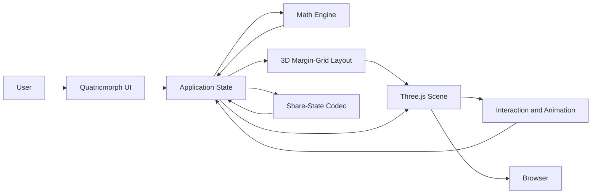
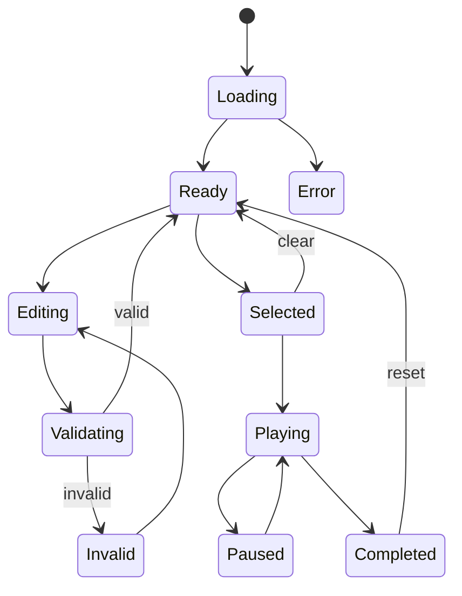

# Generate the Quatricmorph System Architecture Document

Act as a principal software architect, Three.js engineer, mathematical-visualization engineer, and frontend platform engineer.

Your task is to analyze the existing Quatricmorph repository and write an implementation-grade system architecture for the first Quatricmorph MVP.

Quatricmorph is being developed by transforming:

```text
https://github.com/bhosmer/mm
```

Target document:

```text
docs/SYSTEM_ARCHITECTURE.md
```

The architecture must be grounded in:

```text
docs/TECHNICAL_REQUIREMENTS.md
```

Treat the technical requirements as the authoritative product and engineering contract.

Do not implement the application during this task.

---

# Mission

Define the target architecture required to transform the existing `mm` matrix-multiplication visualizer into the first Quatricmorph MVP.

The architecture must explain:

* How mathematical data is represented
* How matrix multiplication is calculated
* How matrices, vectors, and scalars are mapped into 3D
* How the shared 3D margin grid controls spatial placement
* How Three.js scene objects are created and updated
* How interaction and animation are managed
* How application state is structured
* How shareable URLs are encoded and restored
* How resources are owned and disposed
* How the system can be tested
* How the current repository should migrate incrementally

The document must provide sufficient context for autonomous coding agents to make consistent implementation decisions without repeatedly reverse-engineering the entire project.

---

# Product Scope

The first MVP supports one expression:

```text
A @ B = C
```

Supported combinations:

```text
Matrix @ Matrix → Matrix
Matrix @ Column Vector → Column Vector
Row Vector @ Matrix → Row Vector
Row Vector @ Column Vector → Scalar
```

The primary product feature is the shared:

```text
3D Margin Grid
```

Every matrix, vector, scalar, tensor frame, tensor value, guide, label, highlight, and camera-fit boundary must derive its spatial position from the same coordinate system.

---

# Explicit Non-Goals

Do not design architecture for:

* Attention visualization
* Q, K, V pipelines
* Transformer blocks
* LoRA
* Batched tensor operations
* Broadcasting
* Automatic differentiation
* Gradient visualization
* Model loading
* PyTorch runtime integration
* Notebook integration
* Backend services
* Authentication
* Collaboration
* Cloud persistence
* Desktop applications
* Mobile applications
* Plugin systems
* Distributed computing
* AI-generated explanations

Do not build speculative abstractions for future features unless they are required to keep the MVP architecture clean.

---

# Required Analysis

Before writing the architecture:

1. Read the complete repository.
2. Read `docs/TECHNICAL_REQUIREMENTS.md`.
3. Inspect:

   * Source files
   * Entry points
   * Build configuration
   * Dependencies
   * Assets
   * Examples
   * Existing documentation
4. Identify:

   * Existing module boundaries
   * Global mutable state
   * Mathematical abstractions
   * Three.js scene architecture
   * Shader usage
   * Matrix placement logic
   * Camera setup
   * Interaction handling
   * Animation flow
   * URL-state handling
   * GUI coupling
   * Resource-disposal behavior
5. Trace the complete runtime flow from page load to rendering.
6. Distinguish:

   * Reusable implementation
   * Code requiring refactoring
   * Code that should be isolated
   * Code that should be removed
   * Code that may remain temporarily
7. Identify technical constraints imposed by the existing repository.
8. Mark anything that cannot be confirmed as:

```text
Assumption Requiring Verification
```

Do not describe an idealized architecture without mapping it to the existing code.

---

# Required Document Structure

## 1. Document Control

Include:

* Document title
* Product name
* Architecture version
* MVP version
* Status
* Intended audience
* Source repository
* Related documents
* Last updated date
* Architecture owner
* Reviewers
* Change-history table

Use placeholders where information is unavailable.

---

## 2. Executive Summary

Summarize:

* The current architecture
* The target architecture
* The main architectural transformation
* The major boundaries
* The role of the 3D margin grid
* The migration strategy
* The most important technical decisions

Keep this section concise.

---

## 3. Architecture Goals

Define the architecture goals.

At minimum:

* Mathematical correctness
* Deterministic behavior
* Explicit coordinate conventions
* Reusable 3D margin-grid layout
* Separation of mathematics and rendering
* Separation of state and GUI
* Predictable scene lifecycle
* Deterministic animation
* Resource safety
* Testability
* Lightweight browser deployment
* Incremental migration from `mm`
* Minimal unnecessary rewriting

---

## 4. Architecture Principles

Define principles such as:

### 4.1 Pure Mathematics

Mathematical modules must not depend on:

* Three.js
* Browser DOM
* GUI controls
* Camera state
* Animation state

### 4.2 Derived Rendering

Rendered objects must be derived from canonical mathematical and layout state.

### 4.3 Single Coordinate Authority

Only the layout subsystem may define tensor-to-world placement.

### 4.4 Canonical State

Application state must have one authoritative representation.

### 4.5 Explicit Resource Ownership

Every Three.js and DOM resource must have an identifiable owner.

### 4.6 Deterministic Transitions

The same state and action must produce the same result.

### 4.7 Incremental Refactoring

Preserve verified working behavior unless replacement is required.

### 4.8 MVP Scope Discipline

Do not design unused frameworks for excluded features.

---

## 5. Current-System Architecture

Document the architecture found in the repository.

Include:

* Runtime entry point
* JavaScript module structure
* Three.js initialization
* Matrix representation
* Matrix multiplication implementation
* Matrix object construction
* Scene hierarchy
* Shader architecture
* Camera configuration
* Controls
* GUI
* Hover handling
* Selection handling
* Animation handling
* URL-state handling
* Asset loading
* Cleanup behavior

Provide a table:

| Existing File | Current Responsibility | Coupling | Reusability | Recommended Action |
| ------------- | ---------------------- | -------- | ----------- | ------------------ |

Recommended actions:

```text
Retain
Refactor
Wrap
Split
Deprecate
Remove
Investigate
```

Do not invent files that do not exist.

---

## 6. Current Architectural Problems

Identify repository-specific issues.

Evaluate:

* Large modules
* Mixed responsibilities
* Global state
* Hard-coded placement
* Hidden coordinate conventions
* Rendering and mathematics coupling
* GUI and state coupling
* Animation and rendering coupling
* Incomplete resource disposal
* Unsafe expression evaluation
* Synchronous network loading
* Experimental code paths
* Legacy attention functionality
* URL-state complexity
* Unclear data ownership
* Difficult testing boundaries

For each issue include:

* Evidence
* Impact
* MVP risk
* Recommended treatment
* Migration priority

---

## 7. Target System Context

Create a Mermaid system-context diagram.

Example conceptual structure:



Adapt the diagram to the actual recommended architecture.

Explain every boundary.

---

## 8. Target Module Architecture

Define the target module structure.

Recommended conceptual structure:

```text
src/
  app/
    application.js
    bootstrap.js
    commands.js

  math/
    tensor.js
    tensor-shape.js
    matrix-parser.js
    matmul.js
    numeric-validation.js

  state/
    app-state.js
    state-reducer.js
    selectors.js
    state-schema.js
    share-state.js

  layout/
    coordinate-system.js
    margin-grid-3d.js
    tensor-layout.js
    matmul-layout.js
    bounds.js

  scene/
    scene-context.js
    scene-controller.js
    tensor-renderer.js
    tensor-frame-renderer.js
    grid-renderer.js
    guide-renderer.js
    label-renderer.js
    camera-controller.js
    resource-manager.js

  interaction/
    raycast-controller.js
    hover-controller.js
    selection-controller.js
    animation-controller.js
    keyboard-controller.js

  ui/
    app-shell.js
    matrix-editor.js
    toolbar.js
    display-controls.js
    animation-controls.js
    validation-view.js
    share-control.js

  config/
    defaults.js
    limits.js

  main.js
```

This is a conceptual target.

Modify it after analyzing the real repository.

For every module define:

* Responsibility
* Public API
* Dependencies
* Prohibited dependencies
* Owned state
* Owned resources
* Input
* Output
* Error behavior
* Test strategy

---

## 9. Dependency Rules

Define an allowed dependency graph.

Example:

```text
config
  ↓
math
  ↓
state
  ↓
layout
  ↓
scene
  ↓
interaction
  ↓
ui
  ↓
app
```

The actual graph may contain controlled lateral dependencies, but cycles must be prohibited.

Required rules:

* `math` must not import Three.js.
* `math` must not access the DOM.
* `layout` must not depend on GUI controls.
* `layout` must not create Three.js objects unless explicitly justified.
* `scene` must not calculate matrix multiplication.
* `ui` must not mutate Three.js objects directly.
* `interaction` must issue state actions rather than directly rewriting canonical data.
* `share-state` must not serialize runtime objects.
* `camera-controller` must not own canonical tensor data.
* `resource-manager` must not contain product logic.

Create a dependency diagram.

---

## 10. Canonical Mathematical Model

Define the mathematical data architecture.

Use:

```text
A ∈ R^(m×k)
B ∈ R^(k×n)
C = A @ B
C ∈ R^(m×n)
```

Element definition:

```text
C[i,j] = Σ A[i,k] × B[k,j]
```

Define canonical data structures.

Example:

```ts
type TensorId = "A" | "B" | "C";

interface TensorShape {
  rows: number;
  columns: number;
}

interface Tensor2D {
  id: TensorId;
  shape: TensorShape;
  values: Float64Array;
}
```

The exact type may differ depending on whether the project remains JavaScript or adopts TypeScript.

Document:

* Storage ordering
* Shape validation
* Address calculation
* Immutability policy
* Result derivation
* Numeric precision
* Invalid-value handling
* Vector representation
* Scalar representation
* Conversion from user input
* Conversion to render data

Clarify whether the existing `Array2D` abstraction is:

```text
Retained
Wrapped
Refactored
Replaced
```

Explain the decision.

---

## 11. Matrix Parsing Architecture

Define a separate parsing pipeline:

```text
Raw Text
    ↓
Tokenization
    ↓
Row Parsing
    ↓
Numeric Validation
    ↓
Rectangularity Validation
    ↓
Tensor Construction
```

Parsing must not:

* Use `eval`
* Execute expressions
* Load remote data
* Mutate existing valid tensor state before validation succeeds

Define parsing-result types:

```ts
interface ParseSuccess {
  ok: true;
  tensor: Tensor2D;
}

interface ParseFailure {
  ok: false;
  errors: ValidationError[];
}
```

Describe error ownership and UI presentation.

---

## 12. Application-State Architecture

Define one canonical application-state model.

Example categories:

```ts
interface AppState {
  tensors: TensorState;
  layout: LayoutSettings;
  display: DisplaySettings;
  interaction: InteractionState;
  animation: AnimationState;
  camera: CameraState;
  validation: ValidationState;
  share: ShareStateMetadata;
}
```

Distinguish:

### Canonical State

State that must be stored directly.

### Derived State

State calculated from canonical state.

### Runtime State

Non-serializable objects such as:

* Three.js objects
* DOM references
* Raycasters
* Event listeners
* Animation-frame IDs
* Timers
* GPU resources

Define:

* State update mechanism
* Commands
* Actions
* Reducer or update functions
* Selectors
* Subscription model
* Scene synchronization
* UI synchronization
* Error handling

Avoid adopting a large external state library unless required.

---

## 13. State Transition Architecture

Create a Mermaid state-flow diagram.

Example:



Define transitions for:

* Initial load
* Input edit
* Validation
* Scene update
* Output selection
* Play
* Pause
* Step forward
* Step backward
* Reset
* URL restoration
* Invalid URL
* Camera reset

---

## 14. Coordinate-System Architecture

Define one global coordinate convention.

Use:

```text
I = output-row dimension
J = output-column dimension
K = contraction dimension
```

Recommended mapping:

```text
World X → J
World Y → I
World Z → K
```

Document:

* Handedness
* Origin
* Axis direction
* Camera up vector
* Grid cell unit
* Index-to-world conversion
* World-to-index conversion
* Tensor-plane orientation
* Positive and negative direction
* Coordinate tolerances
* Label orientation
* Bounding-box calculation

Define pure coordinate functions such as:

```ts
worldPositionForTensorCell(
  tensorId,
  row,
  column,
  layout
): Vector3Like
```

Prefer plain coordinate data from the layout layer rather than Three.js vector objects when possible.

---

## 15. 3D Margin-Grid Architecture

Define the central abstraction:

```text
MarginGrid3D
```

It is responsible for:

* Global cell size
* Minor-grid spacing
* Major-grid intervals
* Tensor anchors
* Tensor margins
* Frame padding
* Label margins
* Operand gaps
* Depth spacing
* Axis alignment
* Grid bounds
* Camera-fit bounds

Suggested configuration:

```ts
interface MarginGridConfig {
  cellSize: number;
  minorGridSpacing: number;
  majorGridInterval: number;
  framePadding: number;
  titleMargin: number;
  labelMargin: number;
  operandGap: number;
  depthSpacing: number;
  origin: Point3;
}
```

Define pure outputs:

```ts
interface TensorLayout {
  tensorId: TensorId;
  origin: Point3;
  rowAxis: AxisDirection;
  columnAxis: AxisDirection;
  frameBounds: Bounds3;
  cellCenters: Point3[];
  labelAnchors: LabelAnchor[];
}
```

The layout subsystem must not depend on viewport dimensions.

It must derive all positions from:

* Tensor shapes
* Coordinate convention
* Margin-grid configuration

---

## 16. Tensor-Plane Architecture

Define how tensors map into space:

```text
A → I × K
B → K × J
C → I × J
```

Create a diagram showing the planes.

Explain:

* Where each plane is anchored
* How each plane is oriented
* How shared axes align
* How vectors are represented
* How scalars are represented
* How frames avoid overlap
* How labels remain readable
* How result values relate spatially to input values

Define layout invariants:

```text
A.I aligns with C.I
A.K aligns with B.K
B.J aligns with C.J
```

These invariants must be testable without rendering.

---

## 17. Tensor Margin-Frame Architecture

Define:

```text
TensorMarginFrame
```

It owns the layout description for:

* Frame boundary
* Internal grid
* Title region
* Shape label
* Axis labels
* Row guides
* Column guides
* Interaction bounds

Separate:

```text
TensorMarginFrameLayout
```

from:

```text
TensorMarginFrameRenderer
```

The layout object should be testable without WebGL.

The renderer should translate layout data into Three.js objects.

Document:

* Geometry strategy
* Material strategy
* Label strategy
* Update strategy
* Disposal strategy
* Visibility strategy
* Selection-state rendering

---

## 18. Scene Graph Architecture

Define the target Three.js scene graph.

Example:

```text
Scene
├── EnvironmentGroup
│   ├── Lighting
│   └── Background
│
├── GridGroup
│   ├── MinorGrid
│   ├── MajorGrid
│   └── AxisGuides
│
├── TensorGroup
│   ├── TensorAGroup
│   │   ├── Frame
│   │   ├── Values
│   │   ├── Labels
│   │   └── InteractionTargets
│   │
│   ├── TensorBGroup
│   └── TensorCGroup
│
├── GuideGroup
│   ├── RowHighlight
│   ├── ColumnHighlight
│   ├── ContractionGuides
│   └── RunningSum
│
└── OverlayGroup
    ├── HoverIndicator
    └── SelectionIndicator
```

Adapt it to the actual implementation.

Define:

* Node ownership
* Update boundaries
* Visibility behavior
* Naming convention
* Metadata convention
* Raycast eligibility
* Disposal behavior

---

## 19. Scene Controller Architecture

Define a scene controller responsible for synchronizing application state with the Three.js scene.

It must:

* Create scene infrastructure
* Apply layout changes
* Create tensor visualizations
* Update values
* Update visibility
* Update selection
* Update animation guides
* Update camera-fit bounds
* Dispose replaced resources

It must not:

* Parse matrix text
* Calculate matrix multiplication
* Own canonical application state
* Serialize URL state
* Implement UI controls

Define update classes:

```text
Full Scene Rebuild
Layout Update
Tensor Value Update
Display Update
Interaction Update
Animation Update
Camera Update
```

Explain when each update is used.

---

## 20. Rendering Architecture

Analyze whether to retain:

* Existing point sprites
* Custom shaders
* Current color mapping
* Current size mapping
* Existing labels
* Existing matrix objects

Evaluate alternatives:

```text
Point sprites
Instanced cubes
Instanced planes
Voxel meshes
Hybrid renderer
```

For the MVP, choose one recommended renderer.

Include a decision table:

| Option | Advantages | Risks | Migration Cost | MVP Decision |
| ------ | ---------- | ----- | -------------- | ------------ |

Define:

* Geometry reuse
* Material reuse
* Value normalization
* Positive values
* Negative values
* Zero values
* Extreme values
* Marker size constraints
* Transparency
* Depth behavior
* Sorting
* Rendering order

---

## 21. Label Architecture

Define how labels are rendered.

Evaluate:

* DOM overlays
* CSS2DRenderer
* Canvas textures
* Signed-distance-field text
* Three.js sprites
* Existing label mechanism

Choose a recommended MVP strategy.

Define label types:

* Tensor name
* Shape label
* Axis label
* Value label
* Hover tooltip
* Running sum
* Validation message

Specify which labels exist in:

```text
World Space
Screen Space
DOM UI
```

Define:

* Ownership
* Position calculation
* Visibility
* Scaling
* Occlusion behavior
* Disposal
* Accessibility fallback

---

## 22. Camera Architecture

Define:

```text
CameraController
```

It owns:

* Camera configuration
* OrbitControls
* Camera presets
* Reset behavior
* Fit View
* Resize handling
* Camera serialization
* Camera restoration

Supported presets:

```text
Isometric
Front
Top
Multiplication Volume
```

Define Fit View using calculated world bounds.

Do not fit only tensor values. Include:

* Tensor frames
* Titles
* Shape labels
* Relevant axes
* Multiplication guides when active

Document:

* Perspective or orthographic decision
* Near and far planes
* Field of view
* Up vector
* Control damping
* Minimum distance
* Maximum distance
* Target point
* Device-pixel-ratio handling

---

## 23. Interaction Architecture

Define interaction controllers.

### Raycast Controller

Responsibilities:

* Pointer normalization
* Raycast execution
* Hit ordering
* Metadata extraction
* Interaction-target filtering

### Hover Controller

Responsibilities:

* Current hover target
* Hover metadata
* Hover visuals
* Tooltip state
* Hover cleanup

### Selection Controller

Responsibilities:

* Selected output cell
* Selected row
* Selected column
* Selected contraction path
* Clear-selection behavior

### Keyboard Controller

Responsibilities:

* Shortcut registration
* Focus protection
* Command dispatch
* Listener cleanup

Interaction controllers must issue application commands rather than mutate rendering objects directly where practical.

---

## 24. Multiplication Animation Architecture

Define:

```text
AnimationController
```

Animation state must include:

```ts
interface MatmulAnimationState {
  status: AnimationStatus;
  outputRow: number;
  outputColumn: number;
  contractionIndex: number;
  runningSum: number;
  completedCells: OutputCellId[];
  speed: number;
}
```

Define deterministic sequence:

```text
Select C[i,j]
    ↓
Highlight A[i,:]
    ↓
Highlight B[:,j]
    ↓
For each k:
    Highlight A[i,k]
    Highlight B[k,j]
    Show product
    Update running sum
    ↓
Reveal C[i,j]
```

Define:

* Play behavior
* Pause behavior
* Step-forward behavior
* Step-backward behavior
* Reset behavior
* Input-change cancellation
* Selection-change cancellation
* Scene-rebuild synchronization
* Completion behavior

Decide whether Step Backward:

```text
Restores snapshots
```

or:

```text
Recomputes animation state deterministically
```

Prefer deterministic recomputation unless performance analysis proves it unsuitable.

---

## 25. Command Architecture

Define application commands such as:

```text
SET_MATRIX_A
SET_MATRIX_B
SET_DIMENSIONS
APPLY_PRESET
VALIDATE_INPUT
SELECT_OUTPUT_CELL
CLEAR_SELECTION
PLAY_ANIMATION
PAUSE_ANIMATION
STEP_FORWARD
STEP_BACKWARD
RESET_ANIMATION
SET_DISPLAY_OPTION
SET_GRID_OPTION
SET_CAMERA_PRESET
RESET_CAMERA
FIT_CAMERA
RESTORE_SHARED_STATE
COPY_SHARE_LINK
```

For each command define:

* Input
* Validation
* State changes
* Derived recalculations
* Scene update
* Failure behavior
* Serializability

Commands should be the primary entry points for UI interaction.

---

## 26. Share-State Architecture

Define a versioned serialization format.

Example:

```ts
interface ShareStateV1 {
  version: 1;
  tensors: {
    A: SerializableTensor;
    B: SerializableTensor;
  };
  layout: SerializableLayoutSettings;
  display: SerializableDisplaySettings;
  camera: SerializableCameraState;
  selection?: SerializableSelectionState;
}
```

Define:

* Encoding format
* Compression
* Query string or hash fragment
* Default-value omission
* Validation
* Schema versioning
* Migration
* Invalid payload fallback
* URL-length constraints
* Clipboard behavior

Do not serialize:

* Result tensor when it can be recomputed
* Animation timers
* Three.js objects
* DOM references
* Event handlers
* GPU resources

---

## 27. Resource-Management Architecture

Define:

```text
ResourceManager
```

or an equivalent explicit ownership strategy.

Track:

* Geometries
* Materials
* Textures
* Shader materials
* Render targets
* Label elements
* Event listeners
* Timers
* Animation-frame handles
* OrbitControls
* Renderer
* Resize observers

Define lifecycle methods:

```text
create
update
replace
dispose
disposeAll
```

Every scene component must state which resources it owns.

Document disposal rules for:

* Tensor shape changes
* Tensor value changes
* Renderer changes
* Grid changes
* Application reset
* Hot reload
* Page unload

---

## 28. Runtime Lifecycle

Create a Mermaid sequence diagram for application startup.

Include:

```text
Browser
Bootstrap
State
Math
Layout
Scene
UI
Animation Loop
```

Example flow:

```text
Load page
Initialize defaults
Parse URL state
Validate state
Compute result
Generate layout
Create scene
Create UI
Bind interactions
Start render loop
```

Also document lifecycle for:

* Matrix edit
* Invalid matrix input
* Shape change
* Selection
* Animation
* Camera preset
* Share-link restoration
* Window resize
* Application teardown

---

## 29. Error Architecture

Define error categories:

```text
Input Error
Validation Error
Mathematical Error
Layout Error
Rendering Error
WebGL Error
Share-State Error
Asset Error
Unexpected Runtime Error
```

For each category define:

* Detection layer
* Error representation
* Logging behavior
* User-facing behavior
* Recovery strategy
* Whether the previous valid scene remains visible

Do not allow one invalid user input to crash the render loop.

---

## 30. Security Architecture

Document client-side security boundaries.

Include:

* No `eval` for user input
* No arbitrary remote data execution
* Safe URL-state parsing
* Input-size limits
* Safe DOM rendering
* No unsafe `innerHTML` for user values
* Dependency review
* CSP compatibility
* Clipboard permission handling
* Safe state merging
* No repository secrets
* No arbitrary remote module loading

Identify existing repository behavior that violates or risks these requirements.

Provide a migration recommendation.

---

## 31. Performance Architecture

Define performance-sensitive areas:

* Grid geometry
* Value markers
* Labels
* Raycasting
* Scene rebuilding
* Animation guides
* URL encoding
* Camera fitting
* High-DPI rendering

Define strategies:

* Geometry reuse
* Material reuse
* Instancing where appropriate
* Bounded pixel ratio
* Partial updates
* Cached layout calculations
* Cached tensor bounds
* Reduced raycast targets
* Avoiding unnecessary allocations
* Avoiding synchronous remote requests
* Avoiding full scene reconstruction for value-only changes

Define recommended limits:

```text
Recommended interactive maximum
Functional maximum
Stress-test maximum
```

Include the target of interactive use for matrices up to at least:

```text
32 × 32
```

---

## 32. Testing Architecture

Define test layers.

### Pure Unit Tests

Test:

* Parsing
* Validation
* Tensor addressing
* Matmul
* Coordinate conversion
* Layout
* Bounds
* State transitions
* Animation transitions
* Serialization

### Scene Integration Tests

Test:

* Scene node creation
* Tensor updates
* Frame updates
* Visibility changes
* Selection visuals
* Resource replacement
* Disposal

### Browser Tests

Test:

* Default application
* Input editing
* Invalid input
* Camera controls
* Hover
* Selection
* Animation
* Share links
* Resize behavior

### Visual Regression Tests

Test:

* Default scene
* Matrix-vector
* Vector-matrix
* Vector-vector scalar
* Active selection
* Active animation
* Grid toggles
* Camera presets

### Performance Tests

Test:

* Startup
* `32 × 32` rendering
* Repeated matrix changes
* Repeated reset
* Memory growth
* Frame responsiveness

Define test boundaries that avoid requiring WebGL for pure mathematical and layout tests.

---

## 33. Technology Decisions

Evaluate the project’s current stack and recommend decisions for:

* JavaScript versus TypeScript
* Native ES modules
* Vite
* Three.js
* OrbitControls
* `lil-gui`
* Native HTML controls
* Unit-test framework
* Browser-test framework
* Linting
* Formatting
* Visual regression tooling

For every decision include:

```text
Context
Options
Decision
Rationale
Consequences
Migration Cost
MVP Requirement
```

Do not introduce a framework without a demonstrated requirement.

---

## 34. Architecture Decision Records

Identify ADRs that should be created.

At minimum consider:

```text
ADR-001 Coordinate-System Convention
ADR-002 Tensor-Plane Placement
ADR-003 Canonical Tensor Representation
ADR-004 State-Management Strategy
ADR-005 Rendering Primitive
ADR-006 Label Rendering
ADR-007 Share-State Encoding
ADR-008 Scene Resource Ownership
ADR-009 JavaScript or TypeScript
ADR-010 Build and Test Tooling
```

For each proposed ADR include:

* Decision status
* Reason it requires an ADR
* Main alternatives
* Recommended decision

Do not write the full ADRs unless explicitly requested.

---

## 35. Repository Migration Architecture

Define an incremental transformation plan.

Recommended phases:

### Phase 0 — Establish Baseline

* Run current application
* Capture screenshots
* Record current behavior
* Identify build process
* Establish test commands
* Document current URL-state format

### Phase 1 — Extract Pure Mathematics

* Isolate parsing
* Isolate shape validation
* Isolate matmul
* Add unit tests

### Phase 2 — Establish Canonical State

* Separate state from GUI
* Define actions and selectors
* Preserve current rendering

### Phase 3 — Extract Coordinate and Layout Logic

* Define global axes
* Define tensor layouts
* Remove hard-coded placement

### Phase 4 — Implement 3D Margin Grid

* Grid layout
* Tensor frames
* Labels
* Bounds

### Phase 5 — Refactor Scene Ownership

* Scene controller
* Renderer components
* Resource manager
* Disposal tests

### Phase 6 — Simplify Product UI

* Quatricmorph branding
* Matrix inputs
* Display controls
* Animation controls
* Remove advanced UI

### Phase 7 — Interaction and Animation

* Hover
* Selection
* Deterministic animation
* Camera presets

### Phase 8 — Share State and Hardening

* Versioned URL state
* Validation
* Browser tests
* Performance tests
* Documentation

For each phase define:

* Inputs
* Outputs
* Files affected
* Dependencies
* Verification
* Rollback strategy
* Completion criteria

---

## 36. Compatibility Strategy

Define how much compatibility to preserve with the original `mm`.

Evaluate:

* Existing share URLs
* Existing examples
* Existing matrix initializers
* Existing animations
* Existing attention explorer
* Existing GUI parameters
* Existing shader behavior
* Existing reference pages

Classify each as:

```text
Preserve
Migrate
Temporarily retain
Deprecate
Remove from MVP
Out of scope
```

Do not preserve legacy behavior when it conflicts with the focused MVP unless there is a documented reason.

---

## 37. Deployment Architecture

Define a lightweight static deployment architecture.

Include:

```text
Source
    ↓
Build
    ↓
Static Assets
    ↓
Static Hosting
    ↓
Browser
```

Specify:

* Production build output
* Asset paths
* Cache behavior
* Base-path handling
* GitHub Pages compatibility
* Local preview
* Error-page behavior
* Source maps
* Build reproducibility

Do not introduce backend infrastructure.

---

## 38. Repository Documentation Map

Define the role of each document.

At minimum:

```text
README.md
docs/TECHNICAL_REQUIREMENTS.md
docs/SYSTEM_ARCHITECTURE.md
docs/TESTING_GUIDELINE.md
docs/COORDINATE_SYSTEM.md
docs/SCENE_LIFECYCLE.md
docs/STATE_MODEL.md
docs/adr/
```

For each document define:

* Purpose
* Authority
* Audience
* Update trigger
* Relationship to other documents

Avoid duplicating the same content across documents.

---

## 39. Architecture Invariants

Create a dedicated table of invariants.

At minimum include:

| ID             | Invariant                                            | Enforcement Layer | Verification     |
| -------------- | ---------------------------------------------------- | ----------------- | ---------------- |
| QM-ARC-INV-001 | Mathematical modules do not import Three.js          | Module boundaries | Static analysis  |
| QM-ARC-INV-002 | Every tensor value occupies one grid cell            | Layout            | Unit test        |
| QM-ARC-INV-003 | `A.K` aligns with `B.K`                              | Layout            | Unit test        |
| QM-ARC-INV-004 | `A.I` aligns with `C.I`                              | Layout            | Unit test        |
| QM-ARC-INV-005 | `B.J` aligns with `C.J`                              | Layout            | Unit test        |
| QM-ARC-INV-006 | Three.js objects are never serialized                | Share-state       | Unit test        |
| QM-ARC-INV-007 | Invalid input does not replace valid canonical state | State             | Integration test |
| QM-ARC-INV-008 | Scene resources have explicit owners                 | Scene lifecycle   | Review and tests |
| QM-ARC-INV-009 | Animation does not mutate input tensors              | Animation         | Unit test        |
| QM-ARC-INV-010 | UI does not directly calculate matmul                | Dependency rules  | Static review    |

Add any additional invariants discovered during analysis.

---

## 40. Risks and Trade-Offs

Document architecture risks.

At minimum:

* Refactoring monolithic source files
* Preserving existing behavior during extraction
* Shader portability
* Label complexity
* Resource leaks
* Coordinate-system mistakes
* Grid performance
* URL size
* State synchronization
* Animation determinism
* Browser differences
* Migrating experimental code
* Overengineering the MVP
* Removing too much reusable code
* Retaining too much legacy complexity

For each risk define:

* Probability
* Impact
* Mitigation
* Detection
* Contingency
* Blocking status

---

## 41. Open Architecture Questions

List unresolved decisions.

At minimum evaluate:

* Point sprites or instanced cubes
* JavaScript or TypeScript
* Existing GUI or native controls
* DOM or world-space labels
* Perspective or orthographic default camera
* Full camera serialization or preset-only serialization
* URL hash or query-string state
* Snapshot or recomputation for Step Backward
* Maximum editable matrix dimensions
* Whether to retain existing initializers
* Whether to retain legacy URLs
* Whether to retain existing examples

For each question provide:

* Context
* Options
* Recommended default
* Consequences
* Decision deadline
* Blocking phase

---

## 42. Target Runtime Flow

Provide a detailed end-to-end runtime flow.

Required flow:

```text
User enters A and B
    ↓
UI dispatches update command
    ↓
Parser validates textual values
    ↓
Shape validator validates dimensions
    ↓
Canonical input state is updated
    ↓
Math engine derives C
    ↓
Layout engine derives A, B, and C placements
    ↓
Scene controller applies layout
    ↓
Tensor renderers update visual markers
    ↓
Camera-fit bounds are recalculated
    ↓
Interaction metadata is rebuilt
    ↓
Renderer displays the updated scene
```

Describe failure paths at every stage.

---

## 43. Example Architecture Walkthrough

Use the default example:

```text
A = [
  [1, 2, 3],
  [4, 5, 6]
]

B = [
  [7, 8],
  [9, 10],
  [11, 12]
]
```

Result:

```text
C = [
  [58, 64],
  [139, 154]
]
```

Walk through:

1. Parsing
2. Canonical tensor creation
3. Validation
4. Result calculation
5. Tensor-plane assignment
6. Cell-coordinate generation
7. Frame generation
8. Scene-node generation
9. Camera fitting
10. Hover metadata
11. Selection of `C[0,0]`
12. Animation over `k = 0..2`
13. Share-state serialization
14. Resource cleanup after a shape change

Use concrete indices and positions where possible.

---

## 44. Implementation Guidance for Autonomous Agents

Define rules for coding agents.

Agents must:

* Read technical requirements first
* Read this architecture before editing
* Identify affected architecture layers
* Preserve dependency rules
* Add tests for new behavior
* Update relevant documentation
* Avoid unrelated refactors
* Avoid adding excluded features
* Verify resource disposal
* Report unverified assumptions
* Use requirement IDs in plans and PR descriptions
* Keep mathematical logic out of scene code
* Keep placement logic out of UI code

Agents must not:

* Introduce a new framework without an ADR
* Change coordinate conventions silently
* Duplicate tensor placement calculations
* Add global mutable state
* Serialize Three.js objects
* Add unsafe input evaluation
* Mark implementation complete without verification

---

## 45. Architecture Acceptance Criteria

The architecture document is complete only when:

1. It reflects the actual repository.
2. It maps existing files to target responsibilities.
3. It defines the canonical mathematical model.
4. It defines the canonical application-state model.
5. It defines one coordinate-system authority.
6. It defines the 3D margin-grid architecture.
7. It defines tensor-plane placement.
8. It defines scene ownership.
9. It defines resource disposal.
10. It defines interaction boundaries.
11. It defines deterministic animation.
12. It defines share-state serialization.
13. It defines dependency rules.
14. It defines testing boundaries.
15. It defines an incremental migration plan.
16. It identifies architecture risks.
17. It identifies unresolved decisions.
18. It does not expand the MVP scope.
19. It is consistent with `TECHNICAL_REQUIREMENTS.md`.
20. An autonomous coding agent can use it to decompose implementation work.

---

# Diagram Requirements

Include Mermaid diagrams for:

1. System context
2. Module dependencies
3. Mathematical data flow
4. Coordinate-system mapping
5. Tensor-plane arrangement
6. Application-state transitions
7. Runtime startup sequence
8. Matrix-edit sequence
9. Animation state machine
10. Scene lifecycle
11. Resource ownership
12. Deployment flow

Ensure all Mermaid syntax is valid.

Keep diagrams readable and avoid extremely large graphs.

---

# Writing Rules

Use precise technical English.

Use normative language where appropriate:

```text
must
must not
shall
```

Clearly distinguish:

```text
Current Architecture
Target Architecture
Temporary Migration State
Future Possibility
```

Do not:

* Write marketing copy
* Repeat the complete technical requirements
* Present assumptions as facts
* Recommend unnecessary frameworks
* Design backend systems
* Design future attention or LoRA architecture
* Hide unresolved decisions
* Use vague phrases such as “clean architecture” without defining boundaries
* Claim tests or behavior were verified when they were not

---

# Final Response

After creating `docs/SYSTEM_ARCHITECTURE.md`, provide:

```text
1. Repository files inspected
2. Existing architecture summary
3. Target architecture summary
4. Main module boundaries
5. Main dependency rules
6. Coordinate-system decision
7. Margin-grid architecture decision
8. Rendering recommendation
9. State-management recommendation
10. Resource-ownership strategy
11. Migration phases
12. Proposed ADRs
13. Major risks
14. Open architecture questions
15. Information that could not be verified
```

Do not implement source-code changes during this task.

Do not modify unrelated files.

Do not claim the architecture is implemented merely because it has been documented.
