# Quatricmorph System Architecture — Visualization MVP

## 1. Document Control

| Field | Value |
| --- | --- |
| Document title | Quatricmorph System Architecture |
| Product name | Quatricmorph |
| Architecture version | 0.2.0 |
| MVP version | Visualization MVP (Track A / `VIZ-*`) |
| Status | Draft — grounded in repository analysis |
| Intended audience | Engineers, graphics engineers, QA, autonomous coding agents, maintainers |
| Source repository | Reference upstream: https://github.com/bhosmer/mm ; product code: `quatricmorph/` in this workspace |
| Related documents | `docs/TECHNICAL_REQUIREMENTS.md` *(see Authority note)*, `docs/requirements/VIZ_MVP.md`, `prompts.md`, `docs/PRODUCT_BRIEF.md`, `docs/PRODUCT_ARCHITECTURE_v1.md`, `docs/TESTING.md`, `AGENTS.md`, `docs/agent/CHARTER.md` |
| Last updated | 2026-08-03 |
| Architecture owner | *[TBD]* |
| Reviewers | *[TBD]* |

### Authority note

**Assumption Requiring Verification / Open Question:** `docs/TECHNICAL_REQUIREMENTS.md` is not present as a published requirements document. The repository root file `TECHNICAL_REQUIREMENTS.md` is a *generation prompt* for that TRD, not the TRD itself.

This architecture is grounded in:

1. The MVP scope and technical contract encoded by that TRD prompt and by `prompts.md`.
2. Published Track A requirements in `docs/requirements/VIZ_MVP.md`.
3. Direct analysis of `quatricmorph/` (active product) and read-only `mm/` (reference).

When `docs/TECHNICAL_REQUIREMENTS.md` is published, this architecture **must** be re-checked for consistency. Until then, `VIZ_MVP.md` + this document jointly govern Track A implementation. Platform requirements in `docs/requirements/MVP_REQUIREMENTS.md` (`PLAT-P0-*`) are **out of scope** for this visualization MVP architecture.

### Change history

| Version | Date | Author | Summary |
| --- | --- | --- | --- |
| 0.1.0 | 2026-08-03 | Architecture draft | Initial system architecture from repository analysis |
| 0.2.0 | 2026-08-03 | Architecture update | Reflect partial `math/` / `layout/` / `interaction/` extraction; correct Temporary Migration State |

---

## 2. Executive Summary

**Current architecture.** Quatricmorph’s active application is a Vite + TypeScript port of `mm` under `quatricmorph/`. Runtime entry is `src/main.ts` → `createApp()`. A mutable nested `params` object drives leaf matrix initialization (`Array2D` + `INIT_FUNCS`), embedded matmul (`MatMul.dotprod`), point-sprite rendering (`Mat` + shared GLSL1 `ShaderMaterial`), operand placement via `layout/margin-grid.ts` `placeOperands` (still composed under `MatMul` with root `rotation.x = π`), lil-gui controls, orbit camera, spotlight hover labels, and query-string URL state. Advanced features (nested matmul trees, expression `eval`, remote `url`/`config` loading, attention examples) remain in the build surface.

**Temporary Migration State (as of 2026-08-03).** Partial extraction has begun:

| Layer | Status |
| --- | --- |
| `math/` (`matmul`, `parse`, `validate`, `presets`, `shape`) | Present; `validateMatmulDims` used by `MatMul`; pure `matmul()` not yet the product multiply path |
| `layout/` (`margin-grid`, `tensor-frame`) | Present; `MatMul.getPlanePlacement()` calls `placeOperands` |
| `interaction/` (`animation`, `selection`) | Present as pure helpers; **not wired** into `create-app` / GUI |
| Canonical `AppState` / commands | **Not present** — still global mutable `params` |
| Scene controller / ResourceManager | **Not present** — `initObj()` full rebuild |
| MVP product UI | **Not present** — lil-gui still primary |

**Target architecture.** A layered browser application for one expression `A @ B = C` with matrix/vector/scalar shapes, where:

- Pure math modules own tensors and matmul.
- A pure layout subsystem (`MarginGrid3D`) is the single spatial authority.
- A scene controller derives Three.js objects from canonical state + layout.
- Commands update state; UI and interaction do not own math or placement.
- Share-state encodes serializable snapshots only.
- Resources have explicit owners and disposal paths.

**Main transformation.** From a params-driven monolithic visualizer (`Mat`/`MatMul`/GUI coupled) to a command/state/layout/scene pipeline with a shared 3D margin grid as the product feature.

**Major boundaries.** `config` → `math` → `state` → `layout` → `scene` → `interaction`/`ui` → `app`. Cycles prohibited.

**3D margin grid role.** Every tensor plane, cell, frame, label anchor, guide, and camera-fit bound must derive from `MarginGrid3D` + coordinate convention (`X→J`, `Y→I`, `Z→K`).

**Migration strategy.** Incremental extraction inside `quatricmorph/`; keep `mm/` read-only; hide/remove MVP-excluded UX; add tests before each structural cut; prefer wiring existing pure modules over rewriting them.

**Important decisions.** Retain point sprites for MVP; retain/refactor `Array2D`; introduce lightweight reducer-style state (no Redux); complete margin-grid authority (partial today); remove `eval` and sync XHR from product paths; keep TypeScript; prefer deterministic animation recomputation for step-back.

---

## 3. Architecture Goals

| ID | Goal |
| --- | --- |
| G1 | Mathematical correctness for `C[i,j] = Σ_k A[i,k]·B[k,j]` |
| G2 | Deterministic behavior for fixed inputs, layout config, and animation commands |
| G3 | Explicit coordinate conventions documented and testable |
| G4 | Reusable 3D margin-grid layout as sole placement authority |
| G5 | Separation of mathematics and rendering |
| G6 | Separation of canonical state and GUI |
| G7 | Predictable scene lifecycle (create / update / replace / dispose) |
| G8 | Deterministic animation (play / pause / step / reset) |
| G9 | Resource safety (no orphaned GPU/DOM listeners after updates) |
| G10 | Testability of math/layout/state without WebGL |
| G11 | Lightweight static browser deployment |
| G12 | Incremental migration from `mm` / current `quatricmorph` |
| G13 | Minimal unnecessary rewriting of verified rendering behavior |

---

## 4. Architecture Principles

### 4.1 Pure Mathematics

Mathematical modules must not depend on Three.js, the browser DOM, GUI controls, camera state, or animation timers.

### 4.2 Derived Rendering

Rendered objects must be derived from canonical mathematical state and layout outputs. Scene objects are not sources of truth.

### 4.3 Single Coordinate Authority

Only the layout subsystem may define tensor-to-world placement. Scene code may transform layout points into Three.js objects; it must not invent alternate anchors.

### 4.4 Canonical State

Application state must have one authoritative representation. GUI widgets mirror state; they must not hold a second source of truth.

### 4.5 Explicit Resource Ownership

Every Three.js geometry/material/texture, DOM node owned by the app, event listener, timer, and animation-frame handle must have an identifiable owner and disposal path.

### 4.6 Deterministic Transitions

The same canonical state and command sequence must produce the same derived math, layout, animation indices, and share payload (modulo documented non-determinism such as random initializers, which MVP default paths must avoid).

### 4.7 Incremental Refactoring

Preserve verified working behavior unless replacement is required for correctness, security, or MVP scope.

### 4.8 MVP Scope Discipline

Do not design unused frameworks for attention, LoRA, nested expressions, backends, or other excluded features.

---

## 5. Current-System Architecture

### 5.1 Runtime entry and build

| Item | Location |
| --- | --- |
| Product entry HTML | `quatricmorph/index.html` |
| Bootstrap | `quatricmorph/src/main.ts` imports `createApp()` |
| App wiring | `quatricmorph/src/app/create-app.ts` |
| Build | Vite 8 + `tsc`; multi-page inputs: main, ref, intro, attngpt2, attnqkov |
| Dependencies | `three` ^0.185, `lil-gui` ^0.21, Vitest, TypeScript |
| Tests | `npm test` (Vitest); present tests: `viz/__tests__/array2d.test.ts`, `viz/__tests__/expr.test.ts` |
| Reference (read-only) | `mm/` — original ES-module visualizer with vendored `lib/` |

Almost all legacy product TS files still use `// @ts-nocheck`. Newer `math/`, `layout/`, and `interaction/` modules are typed.

### 5.2 Runtime flow (page load → first frame)

```text
index.html
  → main.ts
  → createApp()
      → createDefaultParams()
      → createUrlInfo() / createScene()  (PerspectiveCamera, WebGLRenderer, OrbitControls, Raycaster)
      → initFromSearchParams()
          → updateObjectFromSearchParams OR resetParams
          → genExpr(params)
          → initFromParams()
              → saveUrlInfo (optional)
              → apply camera
              → initObj() → new MatMul(params, context)
                  → validateMatmulDims (throws before leaf/Three creation on mismatch)
                  → initLeft/Right/Result (Array2D + Mat/MatMul)
                  → initViz via placeOperands positions/rotations
              → group.rotation.x = π; center(); initAnimation(); scene.add
              → gui.initGui(params, callbacks, info)
      → animate() loop (requestAnimationFrame)
      → window.onload → setupInstructions
```

### 5.3 Mathematical representation (current)

- `Array2D` (`viz/array2d.ts`): `{ h, w, data: Float32Array }`, row-major `addr = i*w + j`. Still imports epilog helpers.
- Leaf matrices filled by `getInitFunc` (`viz/init.ts`) from named initializers, optional sync URL CSV, or `eval` expression.
- Result computed in `MatMul.initResult` via embedded `dotprod(i,j,0,D)` over left/right data arrays (not `math/matmul.ts`).
- Pure `math/matmul.ts` and `math/parse.ts` exist for tests/future wiring.
- Nested `matmul` children allowed (expression tree); epilogs may rescale/transform results.
- Default MVP example values live in `math/presets.ts` (`DEFAULT_A`, `DEFAULT_B`, `DEFAULT_C`) and are referenced from `viz/defaults.ts`.

### 5.4 Matrix object construction and scene hierarchy (current)

```text
Scene
└── MatMul.group  (additionally rotated x=π by create-app, then centered)
    ├── left.group   (Mat or nested MatMul; placement from placeOperands A)
    ├── right.group  (Mat or nested MatMul; placement from placeOperands B)
    ├── result.group (Mat; placement from placeOperands C)
    ├── flow_guide_group (optional)
    └── anim_mats[*].group (animation intermediates)
```

Each `Mat` owns:

- `Points` geometry with `position`, `pointSize`, `pointColor`
- shared `MATERIAL` shader (ball texture from `/assets/ball.png`)
- legend text meshes (`getText` / FontLoader shapes from vendored typeface)
- optional row guides and spotlight label meshes

### 5.5 Placement logic (current)

Placement is **partially** migrated to MarginGrid helpers:

1. Unit cell indices mapped to local XY in `emptyPoints` (`j`→x, `i`→y, z=0), with block `gap` offsets.
2. Operand rotations/translations from `placeOperands` in `layout/margin-grid.ts` (called by `MatMul.getPlanePlacement`).
3. Global `group.rotation.x = Math.PI` flipping the composed volume in `create-app`.
4. `center()` translating so the world AABB center is at origin.

**Assumption Requiring Verification:** Exact equivalence between current “negative polarity + left/top/front” layout plus the π flip and the target `X→J, Y→I, Z→K` planes after removing the π flip has not been formally proven; Phase 3 must measure and document.

**Current gap vs target:** There is no shared world major/minor grid mesh derived from `MarginGridConfig`; tensor frames from `buildTensorFrame` are layout DTOs only and are not yet rendered by a dedicated frame renderer.

### 5.6 Interaction, animation, URL, GUI, disposal (current)

| Concern | Current behavior |
| --- | --- |
| Hover | Raycast against `Points`; rebuild world-space text labels within spotlight threshold |
| Selection | Pure helpers in `interaction/selection.ts` exist; **no product wiring** for persistent `C[i,j]` selection |
| Animation | `MatMul.initAnimation` + `bump` closures; algs: dotprod/axpy/mv/vm/vv; pause/step in create-app. Pure `interaction/animation.ts` exists but is unwired |
| URL | Query string: flattened+compressed keys or `params=` JSON; optional sync `config=` XHR |
| GUI | Global lil-gui instance; mutates `params` and often calls `initObj()` full rebuild |
| Disposal | `disposeAndClear` disposes geometries recursively; **materials generally not disposed**; shared `MATERIAL` intentional |

### 5.7 Existing file map

| Existing File | Current Responsibility | Coupling | Reusability | Recommended Action |
| --- | --- | --- | --- | --- |
| `quatricmorph/src/main.ts` | Entry | Low | High | Retain |
| `quatricmorph/src/app/create-app.ts` | App orchestration, input, RAF loop | High (everything) | Medium | Split |
| `quatricmorph/src/app/scene.ts` | Camera/renderer/orbit bootstrap | Medium | High | Refactor → scene-context |
| `quatricmorph/src/app/url.ts` | URL info + history push | Medium | Medium | Wrap → share-state |
| `quatricmorph/src/app/default-params.ts` | Default nested params | Medium | Medium | Refactor → config + state schema |
| `quatricmorph/src/app/instructions.ts` | Instructions modal | Low | High | Retain / brand |
| `quatricmorph/src/math/matmul.ts` | Pure matmul + `dotprodCell` | Low | High | Retain; wire as product path |
| `quatricmorph/src/math/parse.ts` | Text matrix parser (no eval) | Low | High | Retain; wire to UI |
| `quatricmorph/src/math/validate.ts` | Dim compatibility | Low | High | Retain |
| `quatricmorph/src/math/presets.ts` | Default A/B/C + fill presets | Low | High | Retain |
| `quatricmorph/src/math/shape.ts` | Shape helpers | Low | High | Retain / expand |
| `quatricmorph/src/layout/margin-grid.ts` | MarginGrid config, snap, placeOperands, camera presets | Low–medium | High | Retain; expand as sole authority |
| `quatricmorph/src/layout/tensor-frame.ts` | Pure TensorMarginFrame metrics | Low | High | Retain; add renderer consumer |
| `quatricmorph/src/interaction/animation.ts` | Pure anim step state machine | Low | High | Retain; wire via commands |
| `quatricmorph/src/interaction/selection.ts` | Pure selection helpers | Low | High | Retain; wire via commands |
| `quatricmorph/src/viz/array2d.ts` | 2D tensor storage | Low (epi import) | High | Retain + Refactor (isolate epi) |
| `quatricmorph/src/viz/matmul.ts` | Matmul + layout call + anim + guides | Very high | Medium core / low structure | Split |
| `quatricmorph/src/viz/mat.ts` | Points viz, color/size, labels | High (Three.js) | High renderer ideas | Split |
| `quatricmorph/src/viz/material.ts` | Point sprite shader | Medium | High | Retain |
| `quatricmorph/src/viz/sizing.ts` | Points geometry, elem size globals | Medium | High | Refactor |
| `quatricmorph/src/viz/layout.ts` | Nested layout scheme rules | Medium | Low for MVP | Deprecate (MVP UI) / Isolate |
| `quatricmorph/src/viz/expr.ts` | Expr gen/sync; uses `eval` | High / unsafe | Low for MVP | Deprecate product path |
| `quatricmorph/src/viz/init.ts` | Initializers; URL sync XHR; `eval` | High / unsafe | Partial | Split / Remove unsafe |
| `quatricmorph/src/viz/epilog.ts` | Post-matmul transforms | Medium | Low for MVP | Isolate / hide |
| `quatricmorph/src/viz/defaults.ts` | Default dims/cam/leaves | Low | Medium | Refactor |
| `quatricmorph/src/viz/constants.ts` | Enums, child counts | Low | Medium | Refactor |
| `quatricmorph/src/gui/index.ts` | lil-gui surface | Very high | Low for MVP UX | Wrap then Replace |
| `quatricmorph/src/util/params.ts` | URL encode/decode; sync config XHR | High | Medium encode utils | Split |
| `quatricmorph/src/util/objects.ts` | flatten/compress/copy/dispose | Low–medium | High | Retain |
| `quatricmorph/src/util/geometry.ts` | Axes, row/flow guides | Medium | High guides | Refactor |
| `quatricmorph/src/util/text.ts` | Font mesh labels | Medium | High | Retain (MVP) |
| `quatricmorph/src/examples/*` | Attention explorers | High / OOS | Research only | Remove from MVP / Out of scope |
| `quatricmorph/src/ref/*` | Reference gallery page | Medium | Docs | Temporarily retain |
| `mm/*` | Original reference | N/A | Reference | Retain read-only |
| `public/assets/ball.png` | Sprite texture | Low | High | Retain |

Recommended actions vocabulary: Retain | Refactor | Wrap | Split | Deprecate | Remove | Investigate.

---

## 6. Current Architectural Problems

| Issue | Evidence | Impact | MVP risk | Treatment | Priority |
| --- | --- | --- | --- | --- | --- |
| Monolithic `MatMul` | `matmul.ts` ~883 lines: math, layout call, viz, animation | Hard to test/change placement | High | Split into math/layout/scene/animation | P0 |
| Dual matmul paths | `MatMul.dotprod` vs unused product-path `math/matmul.ts` | Divergence risk | High | Make pure matmul authoritative | P0 |
| Mixed responsibilities in `create-app` | URL, input, mag lens, GUI callbacks, RAF | Opaque lifecycle | High | Extract controllers + commands | P0 |
| Global mutable `params` | Single object mutated by GUI, URL, postMessage | No clear transitions | High | Canonical state + commands | P0 |
| Incomplete margin-grid authority | `placeOperands` wired; no shared grid mesh; π flip outside layout | Product feature incomplete | Critical | Finish layout authority + remove conflicting flips | P0 |
| Hidden coordinate conventions | Local i/j axes + `rotation.x=π` + polarity enums | Easy to break alignment | Critical | Document + pure converters + tests | P0 |
| Math coupled to rendering | `dotprod` inside `MatMul` construction with Three groups | Cannot unit-test product path cleanly | High | Use `math/matmul` only | P0 |
| GUI coupled to state | `gui/index.ts` mutates params + rebuilds scene | UI changes rewrite architecture | High | Commands; MVP native UI | P1 |
| Animation coupled to scene rebuild | Anim mats created as full `Mat` instances; pure anim unwired | Heavy; hard to reverse step | High | Wire deterministic anim state machine | P1 |
| Incomplete disposal | `disposeAndClear` skips materials; label mats per mesh | Leak risk on churn | Medium | ResourceManager + material policy | P1 |
| Unsafe expression evaluation | `eval` in `expr.ts`, `init.ts` | XSS / arbitrary code | Critical | Remove from product paths | P0 |
| Synchronous network loading | `XMLHttpRequest` sync in `init.ts`, `params.ts` | UI freeze; CSP/network risk | High | Remove from MVP | P0 |
| Experimental / nested expr paths | Nested matmul, schemes, fuse, epilogs | Scope creep | High | Isolate; hide from MVP UI | P1 |
| Legacy attention functionality | `examples/attngpt2`, `attnqkov` in Vite inputs | Distracts MVP; build cost | Medium | Remove from MVP build surface | P2 |
| URL-state complexity | flatten/compress + JSON + config URL | Fragile restore | Medium | Versioned ShareStateV1 | P1 |
| Unclear data ownership | `Mat.data` mutated; params copied into MatMul | Dual copies of params | Medium | Canonical tensors in state | P0 |
| Difficult testing boundaries | Three.js classes hold math; few pure tests beyond Array2D/expr | Slow/fragile tests | High | Expand pure-layer tests | P0 |
| Zero values invisible | `sizeFromData(0)=0`, black color | Conflicts with visible-zero intent | High | Layout cell + distinct zero style | P0 |
| Title uses `innerHTML` | `create-app` `updateTitle` | XSS if names ever user-hostile | Medium | `textContent` | P1 |
| Shape validation partial | Constructor throws on mismatch (good); GUI paths may still rebuild unsafely | Invalid scenes / crashes | High | Hard validate before any scene mutate; keep last-good | P0 |
| Unwired interaction modules | `interaction/*` not imported by app | Dead code / drift | Medium | Wire in Phase 7 or delete stubs | P1 |

---

## 7. Target System Context

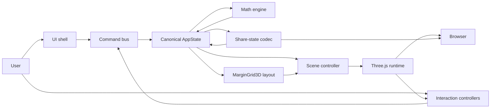

### Boundary explanations

| Boundary | Rule |
| --- | --- |
| UI → Command | UI may only dispatch commands; never write tensors or Three.js nodes directly |
| Command → State | Validates and applies transitions; records validation errors without clobbering last-good tensors |
| State → Math | Math reads inputs; writes derived `C` into state (or derived cache owned by state module) |
| State → Layout | Layout is pure: shapes + grid config → `TensorLayout` / bounds |
| Layout → Scene | Scene consumes layout DTOs; does not recompute operand anchors ad hoc |
| Scene → Three.js | Sole owner of GPU objects for the visualization |
| Interaction → Command | Raycast/hover/selection emit commands (`SELECT_OUTPUT_CELL`, etc.) |
| Share ↔ State | Serializes/deserializes versioned plain data only |

---

## 8. Target Module Architecture

Conceptual target under `quatricmorph/src/` (evolves from current tree; names are `.ts`):

```text
src/
  app/
    application.ts
    bootstrap.ts
    commands.ts
  math/
    tensor.ts
    tensor-shape.ts
    matrix-parser.ts
    matmul.ts
    numeric-validation.ts
  state/
    app-state.ts
    state-reducer.ts
    selectors.ts
    state-schema.ts
    share-state.ts
  layout/
    coordinate-system.ts
    margin-grid-3d.ts
    tensor-layout.ts
    matmul-layout.ts
    bounds.ts
  scene/
    scene-context.ts
    scene-controller.ts
    tensor-renderer.ts
    tensor-frame-renderer.ts
    grid-renderer.ts
    guide-renderer.ts
    label-renderer.ts
    camera-controller.ts
    resource-manager.ts
  interaction/
    raycast-controller.ts
    hover-controller.ts
    selection-controller.ts
    animation-controller.ts
    keyboard-controller.ts
  ui/
    app-shell.ts
    matrix-editor.ts
    toolbar.ts
    display-controls.ts
    animation-controls.ts
    validation-view.ts
    share-control.ts
  config/
    defaults.ts
    limits.ts
  main.ts
```

**Temporary Migration State:** Existing `viz/`, `gui/`, `util/` remain until functions are extracted. Prefer extending existing `math/`, `layout/`, `interaction/` rather than inventing parallel modules. New modules should be preferred for new behavior.

### Module catalog

#### `app/bootstrap.ts` / `application.ts`

| Aspect | Definition |
| --- | --- |
| Responsibility | Wire DOM, create store, scene, UI, start RAF, teardown |
| Public API | `startApp(root)`, `disposeApp()` |
| Dependencies | state, scene, ui, interaction, config |
| Prohibited | Matmul math; URL bit-packing details |
| Owned state | Runtime handles (renderer, RAF id) |
| Owned resources | Top-level listeners via interaction/scene |
| Input | DOM container |
| Output | Running app |
| Errors | Fatal bootstrap → user-visible WebGL/error banner |
| Tests | Smoke bootstrap with mocked WebGL where feasible |

#### `app/commands.ts`

| Aspect | Definition |
| --- | --- |
| Responsibility | Typed command creators + dispatch to reducer |
| Public API | Command union + `dispatch(cmd)` |
| Dependencies | state |
| Prohibited | Three.js |
| Tests | Transition tables |

#### `math/*`

| Aspect | Definition |
| --- | --- |
| Responsibility | Shapes, parsing, validation, matmul, addressing |
| Public API | `parseMatrixText`, `validateMatmulDims`, `matmul`, `get/set` |
| Dependencies | config/limits only |
| Prohibited | three, DOM, gui |
| Owned state | None (pure) |
| Errors | Result types / thrown domain errors — no scene side effects |
| Tests | Exhaustive unit tests |
| Current | `matmul.ts`, `parse.ts`, `validate.ts`, `presets.ts`, `shape.ts` exist; expand toward `tensor.ts` / rename parser if needed |

#### `state/*`

| Aspect | Definition |
| --- | --- |
| Responsibility | Canonical `AppState`, reducer, selectors, share codec |
| Dependencies | math, config |
| Prohibited | three, DOM |
| Owned state | `AppState` |
| Tests | Reducer + serialization round-trips |
| Current | **Missing** — highest structural gap |

#### `layout/*`

| Aspect | Definition |
| --- | --- |
| Responsibility | Coordinates, margin grid, tensor plane layouts, bounds |
| Dependencies | math shapes, config |
| Prohibited | GUI; creating Three.js objects (plain `{x,y,z}` only) |
| Output | `TensorLayout`, `MarginGridLayout`, `Bounds3` |
| Tests | Alignment invariants without WebGL |
| Current | `margin-grid.ts`, `tensor-frame.ts` — expand; ensure create-app π flip moves into layout or is eliminated |

#### `scene/*`

| Aspect | Definition |
| --- | --- |
| Responsibility | Map state+layout → Three.js; camera; resources |
| Dependencies | layout DTOs, state selectors, three |
| Prohibited | Matmul; parsing; owning canonical tensors |
| Owned resources | Scene graph nodes, geometries, materials it creates |
| Tests | Integration with headless/mock renderer where possible |
| Current | Partial: `app/scene.ts` bootstrap only; render logic still in `Mat`/`MatMul` |

#### `interaction/*`

| Aspect | Definition |
| --- | --- |
| Responsibility | Pointer/raycast, hover, selection, animation stepping, keyboard |
| Dependencies | scene hit metadata, commands |
| Prohibited | Direct canonical tensor mutation |
| Tests | Unit for animation index math; integration for hit mapping |
| Current | Pure `animation.ts` / `selection.ts`; controllers not yet extracted from create-app |

#### `ui/*`

| Aspect | Definition |
| --- | --- |
| Responsibility | Product shell: editors, toggles, validation, share |
| Dependencies | commands, selectors |
| Prohibited | Direct Three.js mutation; matmul |
| Tests | DOM unit/integration as needed |
| Current | lil-gui in `gui/` — replace for MVP surface |

#### `config/*`

| Aspect | Definition |
| --- | --- |
| Responsibility | Defaults, dimension limits, grid defaults |
| Prohibited | Runtime services |
| Current | Scattered in `default-params.ts`, `defaults.ts`, `DEFAULT_MARGIN_GRID` |

---

## 9. Dependency Rules

### Allowed graph

```text
config
  ↓
math
  ↓
state
  ↓
layout
  ↓
scene
  ↓
interaction
  ↓
ui
  ↓
app
```

Controlled lateral: `interaction` and `ui` both → `app/commands` → `state`. `share-state` lives under `state` and must not import `scene`.

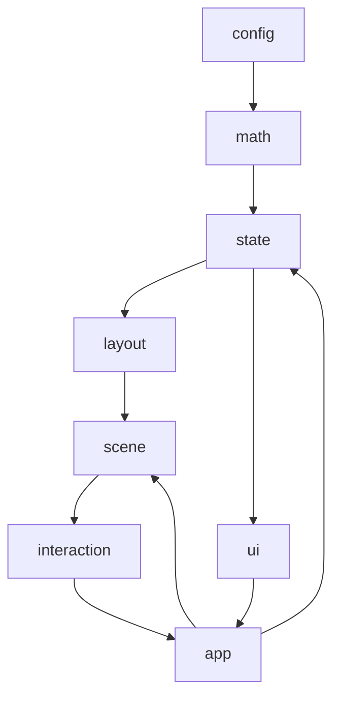

### Required rules

1. `math` must not import Three.js or access the DOM.
2. `layout` must not depend on GUI controls.
3. `layout` must not create Three.js objects.
4. `scene` must not calculate matrix multiplication.
5. `ui` must not mutate Three.js objects directly.
6. `interaction` must issue state commands rather than rewriting canonical tensors.
7. `share-state` must not serialize runtime objects.
8. `camera-controller` must not own canonical tensor data.
9. `resource-manager` must not contain product/business logic.
10. Cycles are prohibited.

Static enforcement **Target:** package boundary lint or simple import-path checks in CI. **Current:** not enforced.

---

## 10. Canonical Mathematical Model

```text
A ∈ R^(m×k)
B ∈ R^(k×n)
C = A @ B
C ∈ R^(m×n)

C[i,j] = Σ_{k=0..K-1} A[i,k] × B[k,j]
```

Vectors and scalars are shapes, not separate types:

| Form | Shape |
| --- | --- |
| Matrix | `m×n` with `m>1` or `n>1` as applicable |
| Column vector | `m×1` |
| Row vector | `1×n` |
| Scalar | `1×1` |

### Canonical structures (TypeScript)

```ts
type TensorId = 'A' | 'B' | 'C';

interface TensorShape {
  rows: number;
  columns: number;
}

interface Tensor2D {
  id: TensorId;
  shape: TensorShape;
  /** Row-major length rows*columns */
  values: Float64Array;
}

interface MatmulProblem {
  A: Tensor2D; // m×k
  B: Tensor2D; // k×n
  C: Tensor2D; // m×n derived
}
```

### Policies

| Topic | Decision |
| --- | --- |
| Storage ordering | Row-major: `addr(i,j) = i * columns + j` |
| Shape validation | `A.columns === B.rows`; positive integers within `config/limits` |
| Immutability | Inputs replaced wholesale on successful parse; `C` recomputed; animation must not mutate `A`/`B` |
| Result derivation | Always derived; never authoritative user input |
| Numeric precision | Canonical math prefers `Float64Array`; **Current** render path uses `Float32Array` via `Array2D` — migration may keep Float32 for GPU upload while computing in f64 |
| Invalid values | Reject `NaN`/±`Infinity` at parse; do not write into canonical tensors |
| Conversion from input | Parser → `Tensor2D` / `Array2D` adapter |
| Conversion to render | Selectors expose values + layout cell centers |

### `Array2D` disposition

**Decision: Retain + Refactor (wrap for compatibility).**

- Keep `Array2D` as a battle-tested row-major container used by existing renderers during migration.
- Treat `math/matmul.ts` as the authoritative multiply implementation for new code and tests; migrate `MatMul.initResult` to call it.
- Stop importing epilog into the core array module for MVP paths.
- Longer term, prefer `Tensor2D` interface; `Array2D` may implement or adapt it.
- **Do not Replace** until renderers no longer depend on `.h/.w/.data`.

---

## 11. Matrix Parsing Architecture

```text
Raw Text
  → Tokenization (rows by newline/semicolon; entries by comma/whitespace)
  → Row Parsing
  → Numeric Validation (finite decimals)
  → Rectangularity Validation
  → Tensor Construction
```

Parsing must not use `eval`, execute expressions, load remote data, or mutate last-good tensors before validation succeeds.

**Current:** `math/parse.ts` implements this pipeline and returns `{ ok: true, rows, cols, data }` or `{ ok: false, message }`.

**Target result types:**

```ts
interface ParseSuccess { ok: true; tensor: Tensor2D }
interface ParseFailure { ok: false; errors: ValidationError[] }
```

| Concern | Owner |
| --- | --- |
| Parse errors | `math` parser → `ValidationState` |
| Presentation | `ui/validation-view` |
| Scene on failure | Unchanged last-good scene (QM-ARC-INV-007) |

**Current gap:** Product path still uses procedural initializers + `expr`/`url`, not textual matrix editors. MVP must wire the parser to UI commands.

---

## 12. Application-State Architecture

```ts
interface AppState {
  tensors: {
    A: Tensor2D;
    B: Tensor2D;
    C: Tensor2D; // derived; stored for selectors/perf
  };
  layout: LayoutSettings;      // MarginGridConfig + plane options
  display: DisplaySettings;    // colors, sizes, grid visibility, labels
  interaction: InteractionState; // hover + selection
  animation: MatmulAnimationState;
  camera: CameraState;
  validation: ValidationState;
  share: ShareStateMetadata;   // version, dirty flags
  meta: { status: AppStatus };
}
```

### Canonical vs derived vs runtime

| Kind | Examples |
| --- | --- |
| Canonical | A/B values & shapes, layout settings, display toggles, selection, animation indices, camera pose |
| Derived | C values, tensor layouts, bounds, share URL string, hover tooltip text |
| Runtime | `THREE.*`, DOM nodes, raycaster, RAF ids, OrbitControls, GUI instances |

### Update mechanism

- **Commands** enter `dispatch`.
- **Reducer** returns next `AppState` (shallow structural sharing acceptable).
- **Selectors** compute derived views.
- **Subscriptions:** `scene-controller` and `ui` subscribe to store changes.
- **Scene sync:** controller diffs previous/next and chooses update class (§19).
- **Errors:** validation errors live in `validation`; last-good tensors retained.

Avoid Redux/Zustand unless complexity demands; a small custom store is sufficient (**ADR-004**).

**Current:** mutable `params` tree — **Temporary Migration State** until Phase 2 completes.

---

## 13. State Transition Architecture

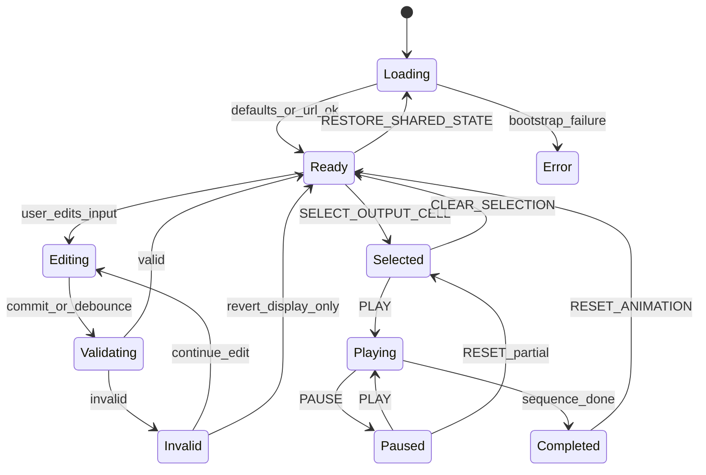

| Transition | Behavior |
| --- | --- |
| Initial load | Parse URL → validate → compute C → layout → scene |
| Input edit | Draft text in UI; canonical unchanged until validate succeeds |
| Validation fail | `validation` errors; scene keeps last-good |
| Scene update | Via scene controller update classes |
| Output selection | Sets `interaction.selection`; cancels/realigns animation as needed |
| Play/Pause/Step/Reset | Animation controller + commands |
| URL restore | `RESTORE_SHARED_STATE`; invalid → defaults + error |
| Camera reset/fit | Camera commands; may serialize pose |

---

## 14. Coordinate-System Architecture

```text
I = output-row dimension
J = output-column dimension
K = contraction dimension

World X → J
World Y → I
World Z → K
```

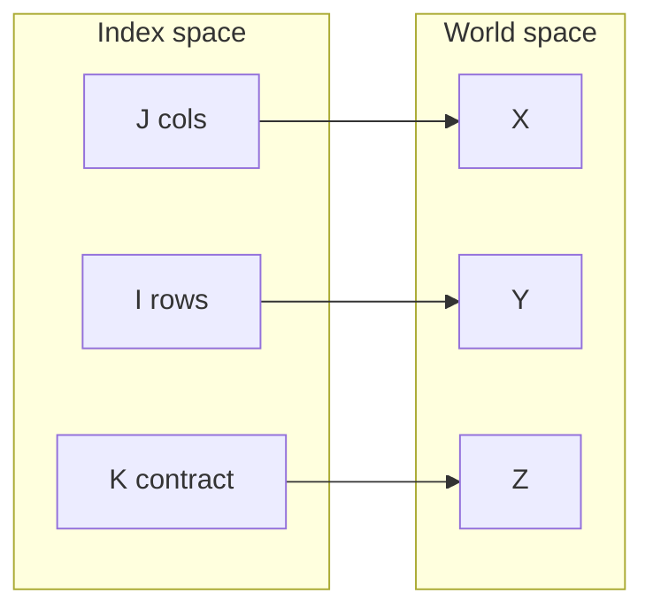

| Topic | Target convention |
| --- | --- |
| Handedness | Three.js right-handed |
| Origin | Margin-grid origin (config); problem volume may be centered for camera convenience via layout bounds, not ad hoc hacks outside layout |
| Axis direction | +X increases J; +Y increases I; +Z increases K |
| Camera up | `+Y` |
| Grid cell unit | `cellSize` world units per index step |
| Index→world | `layout.worldPositionForTensorCell(...)` |
| World→index | Inverse with snap tolerance (current helpers use ~`1e-6`; exact epsilon TBD in tests) |
| Tensor-plane orientation | A: I×K (Y×Z); B: K×J (Z×X); C: I×J (Y×X) |
| Labels | Layout provides anchors; renderer billboards or fixed plane text per label strategy |
| Bounds | Union of frames, titles, guides |

**Current Architecture note:** Local `Mat` uses x=j, y=i; operands rotated into volume via `placeOperands`; root `rotation.x=π` inverts Y. Target must eliminate conflicting flips by baking orientation into layout.

Pure functions must return plain `{x,y,z}` — not `THREE.Vector3` — from `layout/`.

---

## 15. 3D Margin-Grid Architecture

`MarginGrid3D` is the central spatial abstraction.

Responsibilities: cell size, minor/major grid, tensor anchors, margins, frame padding, label margins, operand gaps, depth spacing, axis alignment, grid bounds, camera-fit bounds.

**Current implementation:** `layout/margin-grid.ts` defines `MarginGridConfig`, `snapToGrid`, `cellCenterLocal`, `localTensorExtent`, `mulVolumeExtent`, `placeOperands`, `cameraPresetPose`, `marginGridFromParams`.

```ts
interface MarginGridConfig {
  cellSize: number;
  minorGridSpacing: number;
  majorGridInterval: number;
  tensorPadding: number;
  labelMargin: number;
  framePadding: number;
  operandGap: number;
  axisMargin: number;
  depthSpacing: number;
  origin: Point3;
}

interface TensorLayout {
  tensorId: TensorId;
  origin: Point3;
  rowAxis: AxisDirection;
  columnAxis: AxisDirection;
  frameBounds: Bounds3;
  cellCenters: Point3[];
  labelAnchors: LabelAnchor[];
}
```

Rules:

- Layout must not depend on viewport dimensions.
- Positions derive only from shapes + coordinate convention + `MarginGridConfig`.
- Scene grid renderer consumes the same config.
- All placement calls in product code must go through layout APIs (no duplicated magic numbers in scene/UI).

**Temporary Migration State:** Operand placement uses `placeOperands`; shared decorative grid meshes and camera-fit bounds from full margin-grid still incomplete.

---

## 16. Tensor-Plane Architecture

```text
A → I × K plane
B → K × J plane
C → I × J plane
```

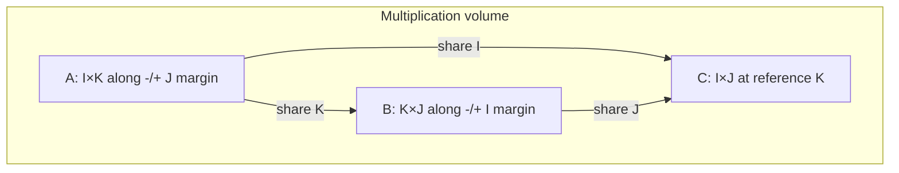

### Invariants (test without rendering)

```text
A.I aligns with C.I
A.K aligns with B.K
B.J aligns with C.J
```

| Topic | Rule |
| --- | --- |
| Anchors | `placeOperands` / `matmul-layout` places A/B/C with `operandGap` / `depthSpacing` so frames do not overlap |
| Vectors | Same plane rules with extent 1 on thin axis |
| Scalars | Single cell + frame |
| Labels | Anchors outside frame padding; readable facing policy in renderer |
| Result relation | `C[i,j]` cell lines up with `A[i,*]` and `B[*,j]` under shared indices |

Default polarity recommended for MVP: preserve current negative/left/top/front semantics until coordinate cleanup proves a simpler absolute mapping (**§41**).

---

## 17. Tensor Margin-Frame Architecture

Separate:

- `TensorMarginFrameLayout` — pure description (boundary, grid, title, shape, axes, guides, hit bounds). **Current:** `buildTensorFrame` in `layout/tensor-frame.ts`.
- `TensorMarginFrameRenderer` — Three.js meshes/lines from layout. **Current:** missing; legends today are ad hoc in `Mat.setLegends`.

| Concern | Strategy |
| --- | --- |
| Geometry | Line segments / simple plane edges; reuse buffers on value-only updates |
| Material | Shared basic line/mesh materials via ResourceManager |
| Labels | See §21 |
| Update | Shape change → replace frame; value change → leave frame |
| Disposal | Renderer owns meshes; dispose on replace |
| Visibility | Driven by display settings |
| Selection | Highlight materials/emissive overlays from interaction state |

---

## 18. Scene Graph Architecture

```text
Scene
├── EnvironmentGroup
│   ├── Lighting (minimal / none if unlit sprites)
│   └── Background
├── GridGroup
│   ├── MinorGrid
│   ├── MajorGrid
│   └── AxisGuides
├── TensorGroup
│   ├── TensorAGroup { Frame, Values, Labels, InteractionTargets }
│   ├── TensorBGroup { ... }
│   └── TensorCGroup { ... }
├── GuideGroup
│   ├── RowHighlight
│   ├── ColumnHighlight
│   ├── ContractionGuides
│   └── RunningSum
└── OverlayGroup
    ├── HoverIndicator
    └── SelectionIndicator
```

| Topic | Rule |
| --- | --- |
| Ownership | `scene-controller` owns root groups; child renderers own subtree resources |
| Naming | `tensor.A.values`, `tensor.A.frame`, … |
| Metadata | `userData: { tensorId, i, j, kind }` on raycast targets |
| Raycast eligibility | Value markers + optional frame proxies; not decorative major grids |
| Disposal | Replace group → `resourceManager.disposeSubtree` |

**Current:** flat `MatMul.group` hierarchy without GridGroup / OverlayGroup separation.

---

## 19. Scene Controller Architecture

`SceneController` synchronizes `AppState` + layout outputs → Three.js.

**Must:** create infrastructure; apply layout; create/update tensors; visibility; selection; animation guides; camera-fit bounds; dispose replaced resources.

**Must not:** parse text; matmul; own canonical state; serialize URL; implement GUI.

| Update class | When |
| --- | --- |
| Full Scene Rebuild | Bootstrap; renderer loss; catastrophic schema change |
| Layout Update | Shape or grid config change |
| Tensor Value Update | A/B values change, shapes same |
| Display Update | Color/size/grid toggles |
| Interaction Update | Hover/selection visuals |
| Animation Update | k-step / running sum guides |
| Camera Update | Preset, fit, resize projection |

**Current:** almost everything triggers `initObj()` full rebuild — migrate toward partial updates.

---

## 20. Rendering Architecture

### Decision table

| Option | Advantages | Risks | Migration Cost | MVP Decision |
| --- | --- | --- | --- | --- |
| Point sprites (current) | Working shader, cheap, familiar | Zero-size zeros; depth sorting quirks | Low | **Recommended** |
| Instanced cubes | Solid cells, clearer zeros | More GPU memory; rewrite | High | Defer |
| Instanced planes | Flat cells | Similar rewrite | High | Defer |
| Voxel meshes | Strong volume metaphor | Heavy | High | Out of MVP |
| Hybrid | Flexibility | Complexity | High | Avoid |

**MVP recommendation: retain point sprites** with these adjustments:

- Always render a cell occupancy cue (frame grid and/or minimum non-zero marker size for zeros — satisfy visible-zero requirement via frame cell + distinct zero style).
- Keep GLSL1 shader until a deliberate shader migration ADR.
- Shared `MATERIAL`; per-geometry attributes for size/color.
- Normalize by configurable sensitivity (global default).
- Positive/negative via hue mapping (existing `hue gap` / `hue spread` / `zero hue` params as starting point).
- Transparency: binary discard in fragment shader (`alpha < 0.5`).
- Depth: standard Three.js depth test; accept sprite sorting limits for MVP.

---

## 21. Label Architecture

### Options evaluated

| Option | Notes | MVP |
| --- | --- | --- |
| DOM overlays | Easy HTML; sync cost | Hover tooltip / validation only |
| CSS2DRenderer | Extra renderer | Avoid unless needed |
| Canvas textures | Flexible | Optional later |
| SDF text | High quality; heavy | Out of MVP |
| Three.js sprites | Possible | Secondary |
| Existing FontLoader meshes (`util/text.ts`) | Already working | **Recommended for world labels** |

### Label types and spaces

| Label | Space |
| --- | --- |
| Tensor name / shape | World |
| Axis labels | World |
| Value labels (spotlight) | World (current) |
| Hover tooltip (optional summary) | DOM UI |
| Running sum | World or DOM — prefer World near C cell |
| Validation message | DOM UI |

Ownership: `label-renderer` owns meshes/DOM nodes it creates; layout owns anchors; interaction owns which values are labeled.

Visibility scales with camera distance (current legend distance heuristics may be reused carefully). Occlusion: best-effort; MVP does not require perfect depth-correct text.

Accessibility fallback: DOM validation + matrix editors expose the same numeric values as text.

Disposal: dispose geometry on label mesh remove; do not leave orphan text meshes after spotlight moves.

---

## 22. Camera Architecture

`CameraController` owns: camera configuration, OrbitControls, presets, reset, Fit View, resize, serialization, restoration.

Supported presets:

```text
Isometric
Front
Top
Multiplication Volume
```

**Current:** `cameraPresetPose` in `layout/margin-grid.ts` defines poses; product wiring is partial (`params.mvp.cameraPreset`).

Fit View must use calculated world bounds including tensor frames, titles, shape labels, relevant axes, and active multiplication guides — not only value markers.

| Topic | Decision |
| --- | --- |
| Projection | Perspective (retain). Orthographic is open for later |
| Near / far | Current: near `5`, far `10000` — revisit Fit View so near plane does not clip small scenes |
| FOV | Current dynamic `45 / min(1, aspect)` |
| Up vector | +Y |
| Damping | OrbitControls defaults unless UX requires damping |
| Min/max distance | Set explicitly in controller (today largely unconstrained) |
| Target | Orbit target; serializable |
| DPR | Bound pixel ratio (recommend `Math.min(devicePixelRatio, 2)`) — **Current unbounded** |

---

## 23. Interaction Architecture

### Raycast Controller

Pointer normalization, raycast execution, hit ordering, metadata extraction, interaction-target filtering.

### Hover Controller

Current hover target, metadata, visuals, tooltip state, cleanup. **Current:** spotlight path in `create-app` + `Mat.updateLabels`.

### Selection Controller

Selected output cell, row, column, contraction path, clear. **Current:** pure helpers unwired.

### Keyboard Controller

Shortcut registration, focus protection (do not steal keys from text editors), command dispatch, listener cleanup.

Interaction controllers must issue application commands rather than mutate rendering objects directly where practical. Scene may apply ephemeral hover visuals from interaction state for performance, but selection/animation indices remain canonical.

---

## 24. Multiplication Animation Architecture

```ts
interface MatmulAnimationState {
  status: AnimationStatus; // idle | playing | paused | done
  outputRow: number;
  outputColumn: number;
  contractionIndex: number;
  runningSum: number;
  completedCells: OutputCellId[];
  speed: number;
}
```

**Current pure helper:** `interaction/animation.ts` uses `cellIndex` + `kIndex` (equivalent encoding). Prefer aligning names toward the schema above when wiring.

Deterministic sequence:

```text
Select C[i,j]
  → Highlight A[i,:]
  → Highlight B[:,j]
  → For each k: highlight A[i,k], B[k,j], show product, update running sum
  → Reveal C[i,j]
```

| Behavior | Rule |
| --- | --- |
| Play / Pause | Toggle status; RAF or timed steps at `speed` |
| Step forward | Advance one micro-step deterministically |
| Step backward | **Recompute** animation state from `(cell,k)` indices + tensors — do not rely on snapshots unless performance proves recomputation unsuitable |
| Reset | Return to idle at start; clear guides |
| Input/selection change | Cancel or rebind animation to new selection |
| Scene rebuild | Rebuild guides from canonical anim state; do not lose indices if shapes unchanged |
| Completion | status `done`; C fully revealed |

**Current:** legacy multi-alg bump animation inside `MatMul` remains the live path; pure module is the target.

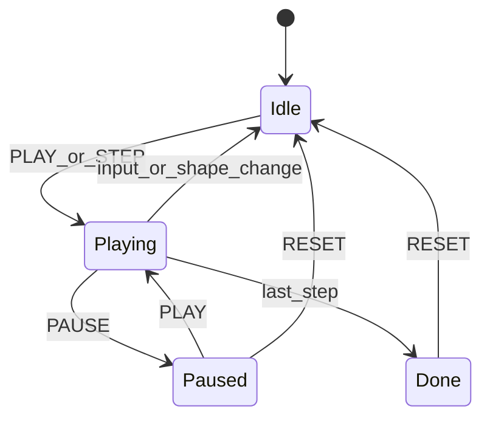

---

## 25. Command Architecture

| Command | Input | Validation | State changes | Derived | Scene update | Failure | Serializable |
| --- | --- | --- | --- | --- | --- | --- | --- |
| `SET_MATRIX_A` | text or values | parse + shape w/ B | A, clear anim | C, layout | value/layout | keep last-good | yes (values) |
| `SET_MATRIX_B` | text or values | parse + shape w/ A | B, clear anim | C, layout | value/layout | keep last-good | yes |
| `SET_DIMENSIONS` | m,k,n | limits | reshape/fill | C, layout | layout | reject | yes |
| `APPLY_PRESET` | preset id | known preset | A/B | C, layout | value/layout | reject | yes |
| `VALIDATE_INPUT` | draft text | parse | validation only | — | none | errors only | n/a |
| `SELECT_OUTPUT_CELL` | i,j | in bounds | selection | path highlight | interaction | no-op | yes |
| `CLEAR_SELECTION` | — | — | selection none | — | interaction | — | yes |
| `PLAY_ANIMATION` | — | valid C | anim playing | — | animation | ignore if invalid | no (runtime) |
| `PAUSE_ANIMATION` | — | — | paused | — | animation | — | no |
| `STEP_FORWARD` | — | — | indices/sum | — | animation | — | no |
| `STEP_BACKWARD` | — | — | recompute indices | — | animation | — | no |
| `RESET_ANIMATION` | — | — | idle | — | animation | — | no |
| `SET_DISPLAY_OPTION` | key/value | schema | display | — | display | reject | yes |
| `SET_GRID_OPTION` | key/value | schema | layout | layouts | layout | reject | yes |
| `SET_CAMERA_PRESET` | preset | known | camera | — | camera | reject | yes |
| `RESET_CAMERA` | — | — | default cam | — | camera | — | yes |
| `FIT_CAMERA` | — | bounds exist | camera | — | camera | — | yes (pose) |
| `RESTORE_SHARED_STATE` | payload | schema | many | all | rebuild | defaults+error | yes |
| `COPY_SHARE_LINK` | — | — | share meta | URL string | none | clipboard fail UX | n/a |

Commands are the primary entry points for UI interaction.

---

## 26. Share-State Architecture

```ts
interface ShareStateV1 {
  version: 1;
  tensors: {
    A: SerializableTensor;
    B: SerializableTensor;
  };
  layout: SerializableLayoutSettings;
  display: SerializableDisplaySettings;
  camera: SerializableCameraState;
  selection?: SerializableSelectionState;
}
```

| Topic | Decision |
| --- | --- |
| Encoding | Prefer query string with versioned JSON or compact typed fields; migrate off opaque compress map |
| Compression | Optional; omit defaults |
| Location | Query string for MVP (matches current); hash fragment is open |
| Validation | Schema + numeric limits before applying |
| Versioning | `version: 1` required; unknown → reject with fallback |
| Migration | Explicit migrators per version |
| Invalid payload | Load defaults; show share-state error |
| URL length | Soft warn beyond ~2k chars; hard fail beyond browser-practical limits |
| Clipboard | `navigator.clipboard.writeText` with fallback |

Must not serialize: result tensor (recompute), animation timers, Three.js objects, DOM refs, handlers, GPU resources.

**Current:** unversioned flatten/compress or `params=` JSON + optional remote `config=` — replace for MVP product path.

---

## 27. Resource-Management Architecture

`ResourceManager` (or equivalent explicit ownership) tracks: geometries, materials, textures, shader materials, render targets, label elements, event listeners, timers, RAF handles, OrbitControls, renderer, resize observers.

Lifecycle: `create` / `update` / `replace` / `dispose` / `disposeAll`.

| Event | Disposal rule |
| --- | --- |
| Tensor shape change | Dispose value geometries + frames; rebuild |
| Tensor value change | Update attributes; do not dispose shared material |
| Renderer change / loss | disposeAll + recreate context |
| Grid change | Dispose grid geometries; rebuild |
| Application reset | disposeAll scene viz resources; keep WebGL context if healthy |
| Hot reload | Best-effort disposeAll |
| Page unload | Cancel RAF; dispose controls; release renderer |

**Current gap:** `disposeAndClear` disposes geometries only; materials/textures/listeners incomplete.

Every scene component must declare owned resources in code comments or a registry API.

---

## 28. Runtime Lifecycle

### Startup sequence

```mermaid
sequenceDiagram
    participant Browser
    participant Boot as Bootstrap
    participant State
    participant Math
    participant Lay as Layout
    participant Scene
    participant UI
    participant Loop as AnimationLoop

    Browser->>Boot: load page
    Boot->>State: defaults
    Boot->>State: parse URL share state
    State->>Math: validate + matmul
    State->>Lay: layouts + bounds
    Boot->>Scene: create context + apply layouts
    Boot->>UI: mount controls
    Boot->>Boot: bind interaction
    Boot->>Loop: start RAF
```

### Other lifecycles

| Event | Flow |
| --- | --- |
| Matrix edit | draft → validate → commit → C → layout → scene update |
| Invalid input | validation errors; scene unchanged |
| Shape change | cancel anim; layout rebuild; dispose old geometries |
| Selection | command → interaction state → guides |
| Animation | command → anim state → guide update each step |
| Camera preset | command → camera controller |
| Share restore | decode → validate → replace state → full/layout rebuild |
| Resize | update projection + size; request label update; bound DPR |
| Teardown | cancel RAF; dispose resources; remove listeners |

---

## 29. Error Architecture

| Category | Detection | Representation | Logging | User-facing | Recovery | Keep last-good scene |
| --- | --- | --- | --- | --- | --- | --- |
| Input Error | parser | ValidationError[] | debug | inline editor | edit again | yes |
| Validation Error | shape/limits | ValidationError[] | info | validation view | edit | yes |
| Mathematical Error | matmul guards | Error / result | error | message | revert command | yes |
| Layout Error | layout asserts | Error | error | banner | fallback layout | prefer yes |
| Rendering Error | try/catch around updates | Error | error | banner | skip frame / rebuild | yes if possible |
| WebGL Error | context lost | event | error | blocking banner | restore context | n/a |
| Share-State Error | schema | ShareError | warn | toast + defaults | defaults | n/a on cold start |
| Asset Error | texture/font load | Error | error | degraded labels | continue | yes |
| Unexpected Runtime | global handler | Error | error | generic | keep loop alive | yes |

Invalid user input must not crash the render loop.

---

## 30. Security Architecture

Client-side boundaries:

- No `eval` for user input.
- No arbitrary remote data execution.
- Safe URL-state parsing (schema + limits).
- Input-size limits (rows/cols/chars).
- Safe DOM rendering (`textContent`, not `innerHTML` for user values).
- Dependency review for `three`, `lil-gui`, Vite.
- CSP compatibility (no inline script requirements beyond build).
- Clipboard permission handling with fallback.
- Safe state merging (no prototype pollution via raw `Object.assign` of untrusted objects — validate keys).
- No repository secrets.
- No arbitrary remote module loading.

### Existing violations / risks

| Behavior | Location | Risk | Migration |
| --- | --- | --- | --- |
| `eval` for expr/init | `viz/expr.ts`, `viz/init.ts` | Code execution | Remove from MVP product paths |
| Sync XHR remote config/CSV | `util/params.ts`, `viz/init.ts` | Freeze + SSRF-like fetch of attacker URL | Remove from MVP |
| `innerHTML` title | `create-app.ts` `updateTitle` | XSS if hostile names | Use `textContent` |
| Unvalidated JSON `params=` | `util/params.ts` | Prototype / unexpected keys | Schema validation |

---

## 31. Performance Architecture

Sensitive areas: grid geometry, value markers, labels, raycasting, scene rebuilding, animation guides, URL encoding, camera fitting, high-DPI rendering.

Strategies: geometry/material reuse; instancing later if needed; bounded DPR; partial updates; cached layout/bounds; reduced raycast targets; avoid allocations in RAF; no sync remote requests; no full rebuild for value-only changes.

| Limit | Guidance |
| --- | --- |
| Recommended interactive maximum | `32 × 32` (and corresponding K) |
| Functional maximum | Soft-cap in UI (e.g. 64) with warning |
| Stress-test maximum | Automate larger sizes for leak/perf tests only |

---

## 32. Testing Architecture

### Pure unit tests

Parsing, validation, tensor addressing, matmul, coordinate conversion, layout alignment, bounds, state transitions, animation transitions, serialization.

**Current:** Array2D + genExpr tests only — expand aggressively as modules stabilize.

### Scene integration tests

Node creation, tensor updates, frame updates, visibility, selection visuals, resource replacement, disposal.

### Browser tests

Default app, input editing, invalid input, camera, hover, selection, animation, share links, resize.

### Visual regression

Default scene; matrix-vector; vector-matrix; scalar; selection; animation; grid toggles; camera presets.

### Performance tests

Startup; `32×32`; repeated matrix changes; reset; memory growth; frame responsiveness.

Pure math/layout tests must not require WebGL.

---

## 33. Technology Decisions

| Topic | Context | Options | Decision | Rationale | Consequences | Migration Cost | MVP Requirement |
| --- | --- | --- | --- | --- | --- | --- | --- |
| JS vs TS | Port already TS | JS / TS | **TypeScript** | Types for tensors/state; repo already TS | Keep typing new modules; reduce `@ts-nocheck` over time | Low–medium | Yes |
| Modules | Vite ESM | ESM | **Native ESM** | Matches Vite | `.js` import suffixes | Done | Yes |
| Build | Vite present | Vite / none | **Vite** | Fast, multi-page | Keep config lean | Done | Yes |
| Three.js | Core renderer | three npm | **three ^0.185** | Current | Watch addon import paths | Done | Yes |
| OrbitControls | Camera UX | three addons | **Retain** | Works | Via camera-controller | Low | Yes |
| lil-gui | Dense research UI | lil-gui / native | **Native HTML for MVP product UI**; lil-gui optional/dev | MVP UX simpler; decouple state | Replace primary GUI | Medium | Yes (native) |
| Unit tests | Vitest present | Vitest | **Vitest** | Already configured | Expand suites | Low | Yes |
| Browser tests | None | Playwright / Cypress | **Playwright later** | Strong static app testing | Add when UI stable | Medium | Phase 8 |
| Lint/format | Minimal | ESLint/Prettier | **Add lightweight ESLint** when feasible | Catch import-boundary violations | Config debt | Low | Soft |
| Visual regression | None | Percy / Playwright screenshots | **Playwright screenshots** | No SaaS required | Fixture maintenance | Medium | Phase 8 |

Do not introduce React/Vue/Svelte without an ADR and demonstrated requirement.

---

## 34. Architecture Decision Records

| ADR | Status | Why ADR | Alternatives | Recommended decision |
| --- | --- | --- | --- | --- |
| ADR-001 Coordinate-System Convention | Proposed | Avoid silent axis flips | Alternate axis maps | X→J, Y→I, Z→K; right-handed; +Y up |
| ADR-002 Tensor-Plane Placement | Proposed | Alignment invariants | Different polarity defaults | A=I×K, B=K×J, C=I×J; preserve mm default polarity until proven |
| ADR-003 Canonical Tensor Representation | Proposed | Dual Array2D/Tensor2D | Replace immediately | Retain Array2D; introduce Tensor2D adapter; f64 canonical preferred |
| ADR-004 State-Management Strategy | Proposed | Avoid framework churn | Redux/Zustand/custom | Small custom store + commands |
| ADR-005 Rendering Primitive | Proposed | Costly rewrite risk | Cubes/planes/hybrid | Point sprites + frame occupancy for zeros |
| ADR-006 Label Rendering | Proposed | Multiple strategies | DOM/CSS2D/SDF | Font mesh world labels + DOM validation |
| ADR-007 Share-State Encoding | Proposed | Legacy URL complexity | Hash vs query; compress vs JSON | Versioned ShareStateV1 query; omit defaults |
| ADR-008 Scene Resource Ownership | Proposed | Leak risk | Ad hoc dispose | ResourceManager + ownership table |
| ADR-009 JavaScript or TypeScript | Proposed | Consistency | Stay mixed | TypeScript; remove nocheck gradually |
| ADR-010 Build and Test Tooling | Proposed | Agent workflow | Alternate runners | Vite + Vitest + later Playwright |

Full ADR bodies live under `docs/adr/` when authored (directory exists; currently empty).

---

## 35. Repository Migration Architecture

### Phase 0 — Establish Baseline

| | |
| --- | --- |
| Inputs | Running `quatricmorph` app |
| Outputs | Screenshots; behavior notes; build/test commands; current URL format notes |
| Files | Docs only |
| Verification | `npm test`, `npm run build`, manual smoke |
| Rollback | N/A |
| Completion | Baseline recorded |

### Phase 1 — Extract Pure Mathematics

| | |
| --- | --- |
| Inputs | `Array2D`, `MatMul.dotprod`, init/eval paths |
| Outputs | `math/*` authoritative; tests |
| Files | `math/*`, `viz/array2d.ts`, callers |
| Status | **Partial** — modules exist; product still uses embedded `dotprod` |
| Verification | Unit tests for matmul/parse/validate; no Three imports in math |
| Rollback | Keep dual path temporarily |
| Completion | Product multiply path calls `math/matmul`; eval removed from MVP path |

### Phase 2 — Establish Canonical State

| | |
| --- | --- |
| Inputs | `params` tree |
| Outputs | `AppState`, commands, selectors |
| Files | new `state/*`; adapt `create-app` |
| Verification | Reducer tests; GUI still works via commands |
| Rollback | Feature flag to params |
| Completion | Single store; GUI does not mutate tensors directly |

### Phase 3 — Extract Coordinate and Layout Logic

| | |
| --- | --- |
| Inputs | `placeOperands`, π flip, emptyPoints |
| Outputs | Pure coordinate + full TensorLayout |
| Files | `layout/*`, `create-app`, `MatMul` |
| Status | **Partial** — placeOperands wired |
| Verification | Alignment invariant tests |
| Rollback | Keep polarity helpers |
| Completion | No placement math outside `layout/` |

### Phase 4 — Implement 3D Margin Grid

| | |
| --- | --- |
| Inputs | MarginGridConfig |
| Outputs | Grid meshes, frames, labels, fit bounds |
| Files | `layout/*`, `scene/*` |
| Verification | Visual + unit bounds tests |
| Rollback | Hide grid toggles |
| Completion | VIZ-03…VIZ-05 |

### Phase 5 — Refactor Scene Ownership

| | |
| --- | --- |
| Inputs | `Mat`/`MatMul` viz |
| Outputs | SceneController, renderers, ResourceManager |
| Files | `scene/*`, slim `viz/` |
| Verification | Disposal tests; partial updates |
| Rollback | `initObj` path |
| Completion | Explicit ownership |

### Phase 6 — Simplify Product UI

| | |
| --- | --- |
| Inputs | lil-gui + attention pages |
| Outputs | Quatricmorph shell; hide OOS features |
| Files | `ui/*`, `vite.config.ts`, examples |
| Verification | VIZ-09; smoke |
| Rollback | Keep gui behind flag |
| Completion | MVP UI only |

### Phase 7 — Interaction and Animation

| | |
| --- | --- |
| Inputs | Pure interaction modules + legacy anim |
| Outputs | Wired hover/selection/deterministic anim/presets |
| Files | `interaction/*`, scene guides |
| Status | Helpers exist unwired |
| Verification | Anim transition tests; manual play/step |
| Rollback | Legacy bump alg |
| Completion | VIZ-07 selection/anim acceptance |

### Phase 8 — Share State and Hardening

| | |
| --- | --- |
| Inputs | Legacy URL codec |
| Outputs | ShareStateV1; browser/perf tests; docs |
| Files | `state/share-state.ts`, CI |
| Verification | Round-trip tests; length limits |
| Rollback | Read legacy URLs temporarily |
| Completion | VIZ-08 replaced |

---

## 36. Compatibility Strategy

| Artifact | Classification |
| --- | --- |
| Existing share URLs | Temporarily retain read path; Migrate writers to V1; Deprecate compress map |
| Existing examples (attention) | Out of scope / Remove from MVP UI and preferably from production build inputs |
| Existing matrix initializers | Temporarily retain subset (sequential/identity/zeros); Remove `expr`/`url` from MVP UI |
| Existing animations (multi-alg) | Deprecate in MVP UI; Replace with single deterministic path |
| Attention explorer | Out of scope |
| Existing GUI parameters | Migrate minimal display/layout subset; Remove advanced |
| Existing shader behavior | Preserve |
| Reference pages (`ref.html`, intro) | Temporarily retain as reference; not primary MVP |
| `mm/` tree | Preserve read-only |

Do not preserve legacy behavior when it conflicts with the focused MVP unless documented.

---

## 37. Deployment Architecture

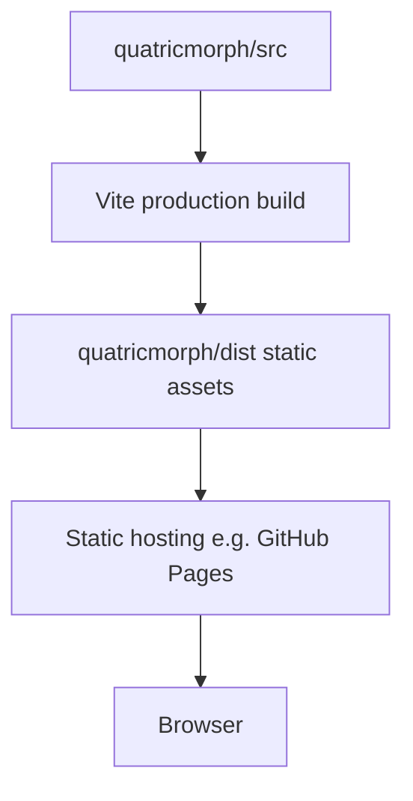

| Topic | Spec |
| --- | --- |
| Output | `quatricmorph/dist/` |
| Asset paths | Respect Vite `base` for Pages subpaths |
| Cache | Fingerprinted assets; HTML short cache |
| Local preview | `npm run preview` |
| Error page | Host-dependent; app must self-handle route-less SPA needs (MVP is multi-page static, not SPA router) |
| Source maps | Optional in prod; enable in CI artifacts if needed |
| Reproducibility | Lockfile committed (`package-lock.json`) |

No backend infrastructure.

---

## 38. Repository Documentation Map

| Document | Purpose | Authority | Audience | Update trigger | Relationship |
| --- | --- | --- | --- | --- | --- |
| `README.md` | Project entry | Low | Humans | Release/setup changes | Points to docs |
| `docs/TECHNICAL_REQUIREMENTS.md` | What to build | **Product/eng contract when published** | All implementers | Requirement changes | Governs architecture |
| `docs/SYSTEM_ARCHITECTURE.md` | How to structure | Architecture | Implementers/agents | Structural decisions | Implements TRD |
| `docs/requirements/VIZ_MVP.md` | Track A checklist | Active Track A | Agents | VIZ progress | Interim TRD |
| `docs/TESTING_GUIDELINE.md` | Test how-to | Testing | QA/agents | Strategy changes | **Target;** today `docs/TESTING.md` |
| `docs/COORDINATE_SYSTEM.md` | Axes deep-dive | Coord detail | Graphics eng | Axis ADR | Extracts §14–16 |
| `docs/SCENE_LIFECYCLE.md` | Scene create/update/dispose | Scene detail | Graphics eng | Scene ADR | Extracts §18–19, §27–28 |
| `docs/STATE_MODEL.md` | AppState schema | State detail | Frontend eng | State ADR | Extracts §12–13, §25–26 |
| `docs/adr/` | Decision records | Decision | Reviewers | Each ADR | Supports architecture |
| `prompts.md` | Engineering brief | Historical/brief | Agents | Rare | Aligns with VIZ MVP |
| `AGENTS.md` | Agent operating rules | Process | Agents | Process changes | Points here |

Avoid duplicating normative requirements across documents; link instead.

---

## 39. Architecture Invariants

| ID | Invariant | Enforcement Layer | Verification |
| --- | --- | --- | --- |
| QM-ARC-INV-001 | Mathematical modules do not import Three.js | Module boundaries | Static analysis |
| QM-ARC-INV-002 | Every tensor value occupies one grid cell | Layout | Unit test |
| QM-ARC-INV-003 | `A.K` aligns with `B.K` | Layout | Unit test |
| QM-ARC-INV-004 | `A.I` aligns with `C.I` | Layout | Unit test |
| QM-ARC-INV-005 | `B.J` aligns with `C.J` | Layout | Unit test |
| QM-ARC-INV-006 | Three.js objects are never serialized | Share-state | Unit test |
| QM-ARC-INV-007 | Invalid input does not replace valid canonical state | State | Integration test |
| QM-ARC-INV-008 | Scene resources have explicit owners | Scene lifecycle | Review and tests |
| QM-ARC-INV-009 | Animation does not mutate input tensors | Animation | Unit test |
| QM-ARC-INV-010 | UI does not directly calculate matmul | Dependency rules | Static review |
| QM-ARC-INV-011 | Layout modules do not create Three.js objects | Module boundaries | Static analysis |
| QM-ARC-INV-012 | Product multiply uses one authoritative matmul implementation | Math/state | Unit + integration |
| QM-ARC-INV-013 | Dim mismatch fails before allocating tensor scene subgraphs | MatMul/state | Integration test |
| QM-ARC-INV-014 | MVP UI does not surface attention/LoRA/nested expr/model loading | UI/build | Review + smoke |

---

## 40. Risks and Trade-Offs

| Risk | Probability | Impact | Mitigation | Detection | Contingency | Blocking |
| --- | --- | --- | --- | --- | --- | --- |
| Refactoring monolithic sources | High | High | Small vertical slices; tests first | Build/test failures | Revert slice | Yes for Phases 1–5 |
| Behavior drift during extraction | High | High | Screenshot baseline; golden matmul | Visual + numeric diffs | Dual-path compare | Yes |
| Shader portability | Medium | Medium | Keep GLSL1 | Browser smoke | Freeze three version | No |
| Label complexity | Medium | Medium | Cap spotlight labels | Perf counters | Reduce legends | No |
| Resource leaks | High | High | ResourceManager + tests | Memory stress | Force full rebuild | Yes Phase 5 |
| Coordinate mistakes | High | Critical | Invariant tests | Unit tests | Freeze layout API | Yes |
| Grid performance | Medium | Medium | Instanced/batched lines | 32×32 profiling | Simplify grid | No |
| URL size | Medium | Medium | Omit defaults; limits | Length checks | Local-only presets | No |
| State sync bugs | High | High | Single store | Transition tests | Disable partial updates | Yes Phase 2 |
| Animation nondeterminism | Medium | High | Recompute steps | Golden sequences | Snapshots | Yes Phase 7 |
| Browser differences | Medium | Medium | Playwright matrix | CI | Feature detect | No |
| Experimental code retention | High | Medium | Hide from UI/build | VIZ-09 checklist | Hard delete later | Soft |
| Overengineering MVP | Medium | High | Scope discipline | Review | Cut abstractions | Soft |
| Removing reusable code | Medium | Medium | File map actions | Regression | Restore from `mm/` | Soft |
| Retaining too much legacy | High | High | Compatibility table | UI audit | Aggressive deprecate | Soft |
| Dual matmul path drift | High | High | Delete embedded path after wiring | Diff tests | Prefer math/ | Yes |

---

## 41. Open Architecture Questions

| Question | Context | Options | Recommended default | Consequences | Decision deadline | Blocking phase |
| --- | --- | --- | --- | --- | --- | --- |
| Point sprites vs cubes | Zeros visibility | Sprites / cubes / hybrid | Sprites + frame cells | Less rewrite | Phase 4 | Phase 4 |
| JS vs TS strictness | Many `@ts-nocheck` | Gradual / big-bang | Gradual typed modules | Slower purity | Ongoing | No |
| lil-gui vs native | UX | Keep / replace | Native MVP shell | Rebuild controls | Phase 6 | Phase 6 |
| DOM vs world labels | Readability | Mix | World + DOM validation | Dual systems | Phase 4–7 | Soft |
| Perspective vs ortho | Camera | Persp / ortho | Perspective | Familiar orbit | Phase 7 | Soft |
| Full camera serialize vs presets | URL size | Full pose / presets only | Full pose (current-like) | Larger URLs | Phase 8 | Soft |
| Hash vs query state | Sharing | `#` / `?` | Query (compat) | Server logs see state | Phase 8 | Soft |
| Snapshot vs recompute step-back | Anim | Snapshots / recompute | Recompute | CPU vs memory | Phase 7 | Phase 7 |
| Max editable dims | Perf | 32 / 64 / unbounded | UI soft-cap 32 interactive | Limits editors | Phase 6 | Soft |
| Retain initializers | UX | Subset / none | Deterministic subset | Random off by default | Phase 6 | Soft |
| Retain legacy URLs | Compat | Read forever / sunset | Temporary read | Codec complexity | Phase 8 | Soft |
| Retain examples in build | Scope | Keep / drop | Drop from prod build | Smaller build | Phase 6 | Soft |
| Remove create-app π flip | Coordinates | Keep / bake into layout | Bake into layout after tests | Visual change risk | Phase 3 | Phase 3 |
| Float32 vs Float64 canonical | Precision | f32 / f64 / dual | f64 math, f32 GPU | Conversion cost | Phase 1–2 | Soft |

---

## 42. Target Runtime Flow

```text
User enters A and B
  → UI dispatches update command
  → Parser validates textual values
  → Shape validator validates dimensions
  → Canonical input state is updated
  → Math engine derives C
  → Layout engine derives A, B, and C placements
  → Scene controller applies layout
  → Tensor renderers update visual markers
  → Camera-fit bounds are recalculated
  → Interaction metadata is rebuilt
  → Renderer displays the updated scene
```

### Failure paths

| Stage | Failure | Behavior |
| --- | --- | --- |
| Parse | Non-numeric / ragged | Validation errors; no state commit |
| Shape | `A.cols !== B.rows` | Validation errors; no multiply; last-good scene |
| Math | Unexpected NaN | Treat as math error; do not commit C |
| Layout | Assert fail | Layout error banner; keep prior layouts if possible |
| Scene | WebGL/resource error | Log; attempt rebuild; keep loop |
| Interaction rebuild | Hit map fail | Disable hover until next successful update |

---

## 43. Example Architecture Walkthrough

Default example:

```text
A = [[1,2,3],[4,5,6]]   # 2×3
B = [[7,8],[9,10],[11,12]]  # 3×2
C = [[58,64],[139,154]]  # 2×2
```

1. **Parsing** — `parseMatrixText` yields rectangular finite rows (or presets load `DEFAULT_A`/`DEFAULT_B`).
2. **Canonical tensors** — A `{rows:2,cols:3}`, B `{rows:3,cols:2}` with row-major values.
3. **Validation** — `validateMatmulDims(2,3,3,2)` → ok `{m:2,k:3,n:2}`.
4. **Result** — `matmul(A,B)` → C; e.g. `C[0,0] = 1·7 + 2·9 + 3·11 = 58`.
5. **Planes** — A on I×K, B on K×J, C on I×J via `placeOperands(2,3,2, config)`.
6. **Cell coordinates** — local centers from `cellCenterLocal(i,j)`; world via plane transforms.
7. **Frames** — `buildTensorFrame('A'|…)` outer/inner AABB in local coords.
8. **Scene nodes** — Tensor groups with Points attributes sized/colored from values.
9. **Camera fit** — bounds ∪ frames/labels → Fit View / volume preset.
10. **Hover** — ray hit `userData {tensorId,i,j}` → label.
11. **Select `C[0,0]`** — selection `{kind:'output',i:0,j:0}` → path highlight A row 0, B col 0.
12. **Animate k=0..2** — products `1·7`, `2·9`, `3·11`; running sum → 58; reveal C[0,0].
13. **Share** — serialize A/B + layout/display/camera; omit C.
14. **Shape change cleanup** — dispose old geometries/labels; rebuild layout; cancel anim; retain shared `MATERIAL`.

Concrete world positions after polarity/π-flip cleanup are **Assumption Requiring Verification** until Phase 3 measurements land in tests.

---

## 44. Implementation Guidance for Autonomous Agents

Agents must:

1. Read `docs/TECHNICAL_REQUIREMENTS.md` when present; otherwise `VIZ_MVP.md` + this document.
2. Read this architecture before structural edits.
3. Identify affected layers and preserve dependency rules.
4. Prefer wiring existing `math/` / `layout/` / `interaction/` modules over duplicating them.
5. Add tests for new deterministic behavior.
6. Update checklist/docs when acceptance criteria met.
7. Avoid unrelated refactors and excluded features (including `PLAT-P0-*` platform work).
8. Verify resource disposal on scene replacements.
9. Report unverified assumptions explicitly.
10. Use requirement IDs (`VIZ-*`) in plans and PRs.
11. Keep math out of scene; placement out of UI.

Agents must not:

- Introduce frameworks without an ADR.
- Change coordinates silently.
- Duplicate tensor placement calculations outside `layout/`.
- Add global mutable product state.
- Serialize Three.js objects.
- Add unsafe input evaluation.
- Mark complete without `npm test` / `npm run build` verification for `quatricmorph/` changes.
- Treat platform SafeTensors / WeightQL work as part of this MVP.
- Claim architecture is implemented merely because it is documented.

---

## 45. Architecture Acceptance Criteria

This document is complete only when:

1. It reflects the actual repository — **yes (analysis-based, v0.2.0)**.
2. It maps existing files to target responsibilities — **yes §5**.
3. It defines the canonical mathematical model — **yes §10**.
4. It defines the canonical application-state model — **yes §12**.
5. It defines one coordinate-system authority — **yes §14–15**.
6. It defines the 3D margin-grid architecture — **yes §15**.
7. It defines tensor-plane placement — **yes §16**.
8. It defines scene ownership — **yes §18–19**.
9. It defines resource disposal — **yes §27**.
10. It defines interaction boundaries — **yes §23**.
11. It defines deterministic animation — **yes §24**.
12. It defines share-state serialization — **yes §26**.
13. It defines dependency rules — **yes §9**.
14. It defines testing boundaries — **yes §32**.
15. It defines an incremental migration plan — **yes §35**.
16. It identifies architecture risks — **yes §40**.
17. It identifies unresolved decisions — **yes §41**.
18. It does not expand MVP scope — **yes**.
19. It is consistent with `TECHNICAL_REQUIREMENTS.md` — **conditional**: consistent with TRD *contract* and `VIZ_MVP.md`; **re-verify when TRD is published**.
20. An autonomous agent can decompose work from it — **intended yes**.

---

## Appendix A — Diagram Index

1. System context — §7
2. Module dependencies — §9
3. Mathematical data flow — below
4. Coordinate-system mapping — §14
5. Tensor-plane arrangement — §16
6. Application-state transitions — §13
7. Runtime startup sequence — §28
8. Matrix-edit sequence — below
9. Animation state machine — §24
10. Scene lifecycle — below
11. Resource ownership — below
12. Deployment flow — §37

### A.3 Mathematical data flow

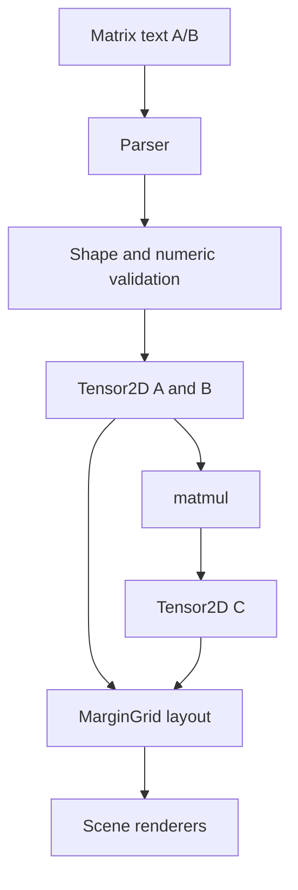

### A.8 Matrix-edit sequence

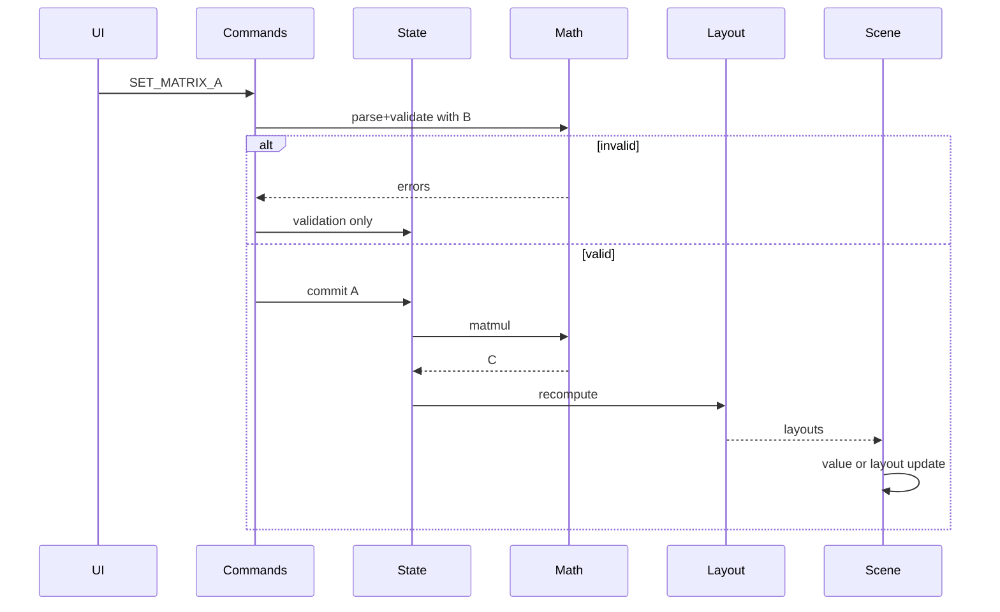

### A.10 Scene lifecycle

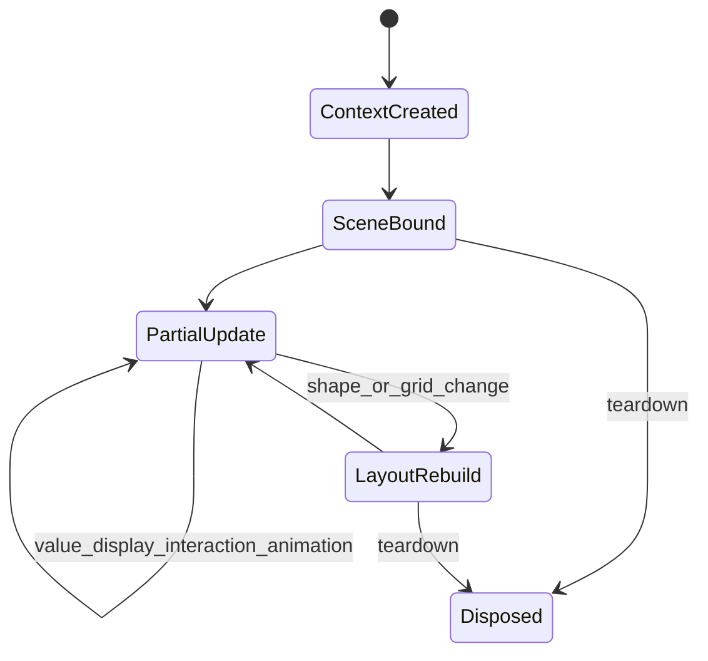

### A.11 Resource ownership

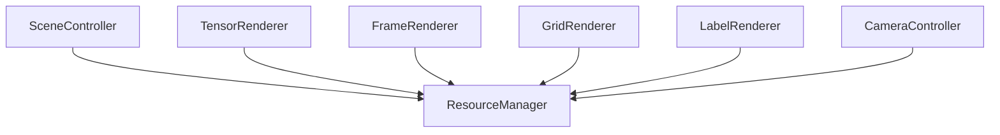

---

*End of architecture document. This documents the target design and current Temporary Migration State; it does not implement the target architecture.*
