# Quatricmorph System Architecture — Visualization MVP

## 1. Document Control

| Field | Value |
| --- | --- |
| Document title | Quatricmorph System Architecture |
| Product name | Quatricmorph |
| Architecture version | 0.1.0 |
| MVP version | Visualization MVP (Track A / `VIZ-*`) |
| Status | Draft — grounded in repository analysis |
| Intended audience | Engineers, graphics engineers, QA, autonomous coding agents, maintainers |
| Source repository | https://github.com/bhosmer/mm (reference); active product code in this repo under `quatricmorph/` |
| Related documents | `docs/TECHNICAL_REQUIREMENTS.md` *(authoritative contract; see note)*, `docs/requirements/VIZ_MVP.md`, `prompts.md`, `docs/PRODUCT_BRIEF.md`, `docs/PRODUCT_ARCHITECTURE_v1.md`, `docs/TESTING.md`, `AGENTS.md`, `docs/agent/CHARTER.md` |
| Last updated | 2026-08-03 |
| Architecture owner | *[TBD]* |
| Reviewers | *[TBD]* |

### Authority note

**Assumption Requiring Verification:** At the time of writing, `docs/TECHNICAL_REQUIREMENTS.md` is not present as a published requirements document. The repository root contains `TECHNICAL_REQUIREMENTS.md`, which is a *generation prompt* for that document, not the TRD itself. This architecture is grounded in:

1. The TRD contract structure and MVP scope defined by that prompt.
2. Published requirements in `docs/requirements/VIZ_MVP.md` and `prompts.md`.
3. Direct analysis of `quatricmorph/` and read-only `mm/`.

When `docs/TECHNICAL_REQUIREMENTS.md` is published, this architecture must be re-checked for consistency and updated if the TRD and this document diverge. Until then, `VIZ_MVP.md` + this document jointly govern Track A implementation.

### Change history

| Version | Date | Author | Summary |
| --- | --- | --- | --- |
| 0.1.0 | 2026-08-03 | Architecture draft | Initial system architecture from repository analysis |

---

## 2. Executive Summary

**Current architecture.** Quatricmorph’s active app is a Vite + TypeScript port of `mm` under `quatricmorph/`. Runtime entry is `src/main.ts` → `createApp()`. A mutable nested `params` object drives leaf matrix initialization (`Array2D` + `INIT_FUNCS`), embedded matmul (`MatMul.dotprod`), point-sprite rendering (`Mat` + shared `ShaderMaterial`), hard-coded 3D placements (rotations/translations in `MatMul.init*Viz`), lil-gui controls, orbit camera, spotlight hover labels, and query-string URL state. Advanced features (nested matmul trees, expression `eval`, remote `url`/`config` loading, attention examples) remain in the build surface.

**Target architecture.** A layered browser application for one expression `A @ B = C` with matrix/vector/scalar shapes, where:

- Pure math modules own tensors and matmul.
- A pure layout subsystem (`MarginGrid3D`) is the single spatial authority.
- A scene controller derives Three.js objects from canonical state + layout.
- Commands update state; UI and interaction do not own math or placement.
- Share-state encodes serializable snapshots only.
- Resources have explicit owners and disposal paths.

**Main transformation.** From a params-driven monolithic visualizer (`Mat`/`MatMul`/GUI coupled) to a command/state/layout/scene pipeline with a shared 3D margin grid as the product feature.

**Major boundaries.** `math` → `state` → `layout` → `scene` → `interaction`/`ui` → `app`. Cycles prohibited.

**3D margin grid role.** Every tensor plane, cell, frame, label anchor, guide, and camera-fit bound must derive from `MarginGrid3D` + coordinate convention (`X→J`, `Y→I`, `Z→K`).

**Migration strategy.** Incremental extraction inside `quatricmorph/`; keep `mm/` read-only; hide/remove MVP-excluded UX; add tests before each structural cut.

**Important decisions.** Retain point sprites for MVP; retain/refactor `Array2D`; introduce lightweight reducer-style state (no Redux); replace hard-coded placement with pure layout; remove `eval` and sync XHR from product paths; keep TypeScript; prefer deterministic animation recomputation for step-back.

---

## 3. Architecture Goals

| ID | Goal |
| --- | --- |
| G1 | Mathematical correctness for `C[i,j] = Σ_k A[i,k]·B[k,j]` |
| G2 | Deterministic behavior for fixed inputs, layout config, and animation commands |
| G3 | Explicit coordinate conventions documented and testable |
| G4 | Reusable 3D margin-grid layout as sole placement authority |
| G5 | Separation of mathematics and rendering |
| G6 | Separation of canonical state and GUI |
| G7 | Predictable scene lifecycle (create / update / replace / dispose) |
| G8 | Deterministic animation (play / pause / step / reset) |
| G9 | Resource safety (no orphaned GPU/DOM listeners after updates) |
| G10 | Testability of math/layout/state without WebGL |
| G11 | Lightweight static browser deployment |
| G12 | Incremental migration from `mm` / current `quatricmorph` |
| G13 | Minimal unnecessary rewriting of verified rendering behavior |

---

## 4. Architecture Principles

### 4.1 Pure Mathematics

Mathematical modules must not depend on Three.js, the browser DOM, GUI controls, camera state, or animation timers.

### 4.2 Derived Rendering

Rendered objects must be derived from canonical mathematical state and layout outputs. Scene objects are not sources of truth.

### 4.3 Single Coordinate Authority

Only the layout subsystem may define tensor-to-world placement. Scene code may transform layout points into Three.js objects; it must not invent alternate anchors.

### 4.4 Canonical State

Application state must have one authoritative representation. GUI widgets mirror state; they must not hold a second source of truth.

### 4.5 Explicit Resource Ownership

Every Three.js geometry/material/texture, DOM node owned by the app, event listener, timer, and animation-frame handle must have an identifiable owner and disposal path.

### 4.6 Deterministic Transitions

The same canonical state and command sequence must produce the same derived math, layout, animation indices, and share payload (modulo documented non-determinism such as random initializers, which MVP should avoid in default paths).

### 4.7 Incremental Refactoring

Preserve verified working behavior unless replacement is required for correctness, security, or MVP scope.

### 4.8 MVP Scope Discipline

Do not design unused frameworks for attention, LoRA, nested expressions, backends, or other excluded features.

---

## 5. Current-System Architecture

### 5.1 Runtime entry and build

| Item | Location |
| --- | --- |
| Product entry HTML | `quatricmorph/index.html` |
| Bootstrap | `quatricmorph/src/main.ts` imports `createApp()` |
| App wiring | `quatricmorph/src/app/create-app.ts` |
| Build | Vite 8 + `tsc`; multi-page inputs: main, ref, intro, attngpt2, attnqkov |
| Dependencies | `three` ^0.185, `lil-gui` ^0.21, Vitest, TypeScript |
| Reference (read-only) | `mm/` — original ES-module visualizer with vendored `lib/` |

Almost all product TS files currently use `// @ts-nocheck`.

### 5.2 Runtime flow (page load → first frame)

```text
index.html
  → main.ts
  → createApp()
      → createDefaultParams()
      → createUrlInfo() / createScene()  (PerspectiveCamera, WebGLRenderer, OrbitControls, Raycaster)
      → initFromSearchParams()
          → updateObjectFromSearchParams OR resetParams
          → genExpr(params)
          → initFromParams()
              → saveUrlInfo (optional)
              → apply camera
              → initObj() → new MatMul(params, context); rotation.x = π; center(); initAnimation(); scene.add
              → gui.initGui(params, callbacks, info)
      → animate() loop (requestAnimationFrame)
      → window.onload → setupInstructions
```

### 5.3 Mathematical representation (current)

- `Array2D` (`viz/array2d.ts`): `{ h, w, data: Float32Array }`, row-major `addr = i*w + j`.
- Leaf matrices filled by `getInitFunc` (`viz/init.ts`) from named initializers, optional sync URL CSV, or `eval` expression.
- Result computed in `MatMul.initResult` via `dotprod(i,j,0,D)` over left/right data arrays.
- Nested `matmul` children allowed (expression tree); epilogs may rescale/transform results.

### 5.4 Matrix object construction and scene hierarchy (current)

```text
Scene
└── MatMul.group  (additionally rotated x=π by create-app, then centered)
    ├── left.group   (Mat or nested MatMul; often rot Y ±π/2)
    ├── right.group  (Mat or nested MatMul; often rot X ±π/2)
    ├── result.group (Mat; z front/back)
    ├── flow_guide_group (optional)
    └── anim_mats[*].group (animation intermediates)
```

Each `Mat` owns:

- `Points` geometry with `position`, `pointSize`, `pointColor`
- shared `MATERIAL` shader (ball texture)
- legend text meshes (`getText` / FontLoader shapes)
- optional row guides and spotlight label meshes

### 5.5 Placement logic (current)

Placement is **not** a shared margin grid. It is:

1. Unit cell indices mapped to local XY in `emptyPoints` (`j`→x, `i`→y, z=0), with block `gap` offsets.
2. Operand rotations/translations in `MatMul.initLeftViz` / `initRightViz` / `initResultViz` based on polarity and placement enums.
3. Global `group.rotation.x = Math.PI` flipping the composed volume.
4. `center()` translating so the world AABB center is at origin.

**Assumption Requiring Verification:** Exact equivalence between current “negative polarity + left/top/front” layout and the target `X→J, Y→I, Z→K` planes after removing the π flip has not been formally proven; Phase 3 must measure and document.

### 5.6 Interaction, animation, URL, GUI, disposal (current)

| Concern | Current behavior |
| --- | --- |
| Hover | Raycast against `Points`; rebuild world-space text labels within spotlight threshold |
| Selection | No first-class `C[i,j]` selection model; animation algorithms drive reveal |
| Animation | `MatMul.initAnimation` + `bump` closures; algs: dotprod/axpy/mv/vm/vv; pause/step in create-app |
| URL | Query string: flattened+compressed keys or `params=` JSON; optional sync `config=` XHR |
| GUI | Global lil-gui instance; mutates `params` and often calls `initObj()` full rebuild |
| Disposal | `disposeAndClear` disposes geometries recursively; **materials generally not disposed**; shared `MATERIAL` intentional |

### 5.7 Existing file map

| Existing File | Current Responsibility | Coupling | Reusability | Recommended Action |
| --- | --- | --- | --- | --- |
| `quatricmorph/src/main.ts` | Entry | Low | High | Retain |
| `quatricmorph/src/app/create-app.ts` | App orchestration, input, RAF loop | High (everything) | Medium | Split |
| `quatricmorph/src/app/scene.ts` | Camera/renderer/orbit bootstrap | Medium | High | Refactor → scene-context |
| `quatricmorph/src/app/url.ts` | URL info + history push | Medium | Medium | Wrap → share-state |
| `quatricmorph/src/app/default-params.ts` | Default nested params | Medium | Medium | Refactor → config + state schema |
| `quatricmorph/src/app/instructions.ts` | Instructions modal | Low | High | Retain / brand |
| `quatricmorph/src/viz/array2d.ts` | 2D tensor storage | Low (epi import) | High | Retain + Refactor (isolate epi) |
| `quatricmorph/src/viz/matmul.ts` | Matmul + layout + anim + guides | Very high | Medium core / low structure | Split |
| `quatricmorph/src/viz/mat.ts` | Points viz, color/size, labels | High (Three.js) | High renderer ideas | Split |
| `quatricmorph/src/viz/material.ts` | Point sprite shader | Medium | High | Retain |
| `quatricmorph/src/viz/sizing.ts` | Points geometry, elem size globals | Medium | High | Refactor |
| `quatricmorph/src/viz/layout.ts` | Nested layout scheme rules | Medium | Low for MVP | Deprecate (MVP UI) / Isolate |
| `quatricmorph/src/viz/expr.ts` | Expr gen/sync; uses `eval` | High / unsafe | Low for MVP | Deprecate product path |
| `quatricmorph/src/viz/init.ts` | Initializers; URL sync XHR; `eval` | High / unsafe | Partial | Split / Remove unsafe |
| `quatricmorph/src/viz/epilog.ts` | Post-matmul transforms | Medium | Low for MVP | Isolate / hide |
| `quatricmorph/src/viz/defaults.ts` | Default dims/cam/leaves | Low | Medium | Refactor |
| `quatricmorph/src/viz/constants.ts` | Enums, child counts | Low | Medium | Refactor |
| `quatricmorph/src/gui/index.ts` | lil-gui surface | Very high | Low for MVP UX | Wrap then Replace |
| `quatricmorph/src/util/params.ts` | URL encode/decode; sync config XHR | High | Medium encode utils | Split |
| `quatricmorph/src/util/objects.ts` | flatten/compress/copy/dispose | Low–medium | High | Retain |
| `quatricmorph/src/util/geometry.ts` | Axes, row/flow guides | Medium | High guides | Refactor |
| `quatricmorph/src/util/text.ts` | Font mesh labels | Medium | High | Retain (MVP) |
| `quatricmorph/src/examples/*` | Attention explorers | High / OOS | Research only | Remove from MVP / Out of scope |
| `quatricmorph/src/ref/*` | Reference gallery page | Medium | Docs | Temporarily retain |
| `mm/*` | Original reference | N/A | Reference | Retain read-only |
| `public/assets/ball.png` | Sprite texture | Low | High | Retain |

Recommended actions vocabulary: Retain | Refactor | Wrap | Split | Deprecate | Remove | Investigate.

---

## 6. Current Architectural Problems

| Issue | Evidence | Impact | MVP risk | Treatment | Priority |
| --- | --- | --- | --- | --- | --- |
| Monolithic `MatMul` | `matmul.ts` ~883 lines: math, layout, viz, animation | Hard to test/change placement | High | Split into math/layout/scene/animation | P0 |
| Mixed responsibilities in `create-app` | URL, input, mag lens, GUI callbacks, RAF | Opaque lifecycle | High | Extract controllers + commands | P0 |
| Global mutable `params` | Single object mutated by GUI, URL, postMessage | No clear transitions | High | Canonical state + commands | P0 |
| Hard-coded placement | Rotations/translations in `init*Viz` | Blocks margin-grid product | Critical | Replace with `MarginGrid3D` | P0 |
| Hidden coordinate conventions | Local i/j axes + `rotation.x=π` + polarity enums | Easy to break alignment | Critical | Document + pure converters + tests | P0 |
| Math coupled to rendering | `dotprod` inside `MatMul` construction with Three groups | Cannot unit-test cleanly in situ | High | Extract `math/matmul` | P0 |
| GUI coupled to state | `gui/index.ts` mutates params + rebuilds scene | UI changes rewrite architecture | High | Commands; MVP native UI | P1 |
| Animation coupled to scene rebuild | Anim mats created as full `Mat` instances | Heavy; hard to reverse step | High | Deterministic anim state machine | P1 |
| Incomplete disposal | `disposeAndClear` skips materials; label mats per mesh | Leak risk on churn | Medium | ResourceManager + material policy | P1 |
| Unsafe expression evaluation | `eval` in `expr.ts`, `init.ts` | XSS / arbitrary code | Critical | Remove from product paths | P0 |
| Synchronous network loading | `XMLHttpRequest` sync in `init.ts`, `params.ts` | UI freeze; CSP/network risk | High | Remove from MVP | P0 |
| Experimental / nested expr paths | Nested matmul, schemes, fuse, epilogs | Scope creep | High | Isolate; hide from MVP UI | P1 |
| Legacy attention functionality | `examples/attngpt2`, `attnqkov` in Vite inputs | Distracts MVP; build cost | Medium | Remove from MVP build surface | P2 |
| URL-state complexity | flatten/compress + JSON + config URL | Fragile restore | Medium | Versioned ShareStateV1 | P1 |
| Unclear data ownership | `Mat.data` mutated; params copied into MatMul | Dual copies of params | Medium | Canonical tensors in state | P0 |
| Difficult testing boundaries | Three.js classes hold math | Slow/fragile tests | High | Pure layers first | P0 |
| Zero values invisible | `sizeFromData(0)=0`, black color | Conflicts with “visible zero cell” TRD intent | High | Layout cell + distinct zero style | P0 |
| Title uses `innerHTML` | `create-app` `updateTitle` | XSS if names ever user-hostile | Medium | `textContent` | P1 |
| Shape validation weak | Dim mismatch only `console.log` | Invalid scenes | Critical | Hard validate before update | P0 |

---

## 7. Target System Context

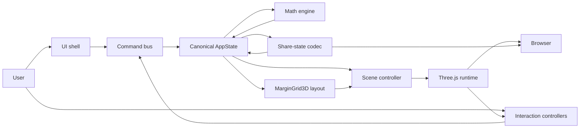

### Boundary explanations

| Boundary | Rule |
| --- | --- |
| UI → Command | UI may only dispatch commands; never write tensors or Three.js nodes directly |
| Command → State | Validates and applies transitions; records validation errors without clobbering last-good tensors |
| State → Math | Math reads inputs; writes derived `C` into state (or derived cache owned by state module) |
| State → Layout | Layout is pure: shapes + grid config → `TensorLayout` / bounds |
| Layout → Scene | Scene consumes layout DTOs; does not recompute operand anchors ad hoc |
| Scene → Three.js | Sole owner of GPU objects for the visualization |
| Interaction → Command | Raycast/hover/selection emit commands (`SELECT_OUTPUT_CELL`, etc.) |
| Share ↔ State | Serializes/deserializes versioned plain data only |

---

## 8. Target Module Architecture

Conceptual target under `quatricmorph/src/` (evolves from current tree; names may be `.ts`):

```text
src/
  app/
    application.ts
    bootstrap.ts
    commands.ts
  math/
    tensor.ts
    tensor-shape.ts
    matrix-parser.ts
    matmul.ts
    numeric-validation.ts
  state/
    app-state.ts
    state-reducer.ts
    selectors.ts
    state-schema.ts
    share-state.ts
  layout/
    coordinate-system.ts
    margin-grid-3d.ts
    tensor-layout.ts
    matmul-layout.ts
    bounds.ts
  scene/
    scene-context.ts
    scene-controller.ts
    tensor-renderer.ts
    tensor-frame-renderer.ts
    grid-renderer.ts
    guide-renderer.ts
    label-renderer.ts
    camera-controller.ts
    resource-manager.ts
  interaction/
    raycast-controller.ts
    hover-controller.ts
    selection-controller.ts
    animation-controller.ts
    keyboard-controller.ts
  ui/
    app-shell.ts
    matrix-editor.ts
    toolbar.ts
    display-controls.ts
    animation-controls.ts
    validation-view.ts
    share-control.ts
  config/
    defaults.ts
    limits.ts
  main.ts
```

**Temporary Migration State:** Existing `viz/`, `gui/`, `util/` remain until functions are extracted. New modules should be preferred for new behavior.

### Module catalog

#### `app/bootstrap.ts` / `application.ts`

| Aspect | Definition |
| --- | --- |
| Responsibility | Wire DOM, create store, scene, UI, start RAF, teardown |
| Public API | `startApp(root)`, `disposeApp()` |
| Dependencies | state, scene, ui, interaction, config |
| Prohibited | Matmul math; URL bit-packing details |
| Owned state | Runtime handles (renderer, RAF id) |
| Owned resources | Top-level listeners via interaction/scene |
| Input | DOM container |
| Output | Running app |
| Errors | Fatal bootstrap → user-visible WebGL/error banner |
| Tests | Smoke bootstrap with mocked WebGL where feasible |

#### `app/commands.ts`

| Aspect | Definition |
| --- | --- |
| Responsibility | Typed command creators + dispatch to reducer |
| Public API | Command union + `dispatch(cmd)` |
| Dependencies | state |
| Prohibited | Three.js |
| Tests | Transition tables |

#### `math/*`

| Aspect | Definition |
| --- | --- |
| Responsibility | Shapes, parsing, validation, matmul, addressing |
| Public API | `parseMatrixText`, `validateShapes`, `matmul`, `get/set` |
| Dependencies | config/limits only |
| Prohibited | three, DOM, gui |
| Owned state | None (pure) |
| Errors | Result types / thrown domain errors — no scene side effects |
| Tests | Exhaustive unit tests |

#### `state/*`

| Aspect | Definition |
| --- | --- |
| Responsibility | Canonical `AppState`, reducer, selectors, share codec |
| Dependencies | math, config |
| Prohibited | three, DOM |
| Owned state | `AppState` |
| Tests | Reducer + serialization round-trips |

#### `layout/*`

| Aspect | Definition |
| --- | --- |
| Responsibility | Coordinates, margin grid, tensor plane layouts, bounds |
| Dependencies | math shapes, config |
| Prohibited | GUI; creating Three.js objects (plain `{x,y,z}` only) |
| Output | `TensorLayout`, `MarginGridLayout`, `Bounds3` |
| Tests | Alignment invariants without WebGL |

#### `scene/*`

| Aspect | Definition |
| --- | --- |
| Responsibility | Map state+layout → Three.js; camera; resources |
| Dependencies | layout DTOs, state selectors, three |
| Prohibited | Matmul; parsing; owning canonical tensors |
| Owned resources | Scene graph nodes, geometries, materials it creates |
| Tests | Integration with headless/mock renderer where possible |

#### `interaction/*`

| Aspect | Definition |
| --- | --- |
| Responsibility | Pointer/raycast, hover, selection, animation stepping, keyboard |
| Dependencies | scene hit metadata, commands |
| Prohibited | Direct canonical tensor mutation |
| Tests | Unit for animation index math; integration for hit mapping |

#### `ui/*`

| Aspect | Definition |
| --- | --- |
| Responsibility | Product shell: editors, toggles, validation, share |
| Dependencies | commands, selectors |
| Prohibited | Direct Three.js mutation; matmul |
| Tests | DOM unit/integration as needed |

#### `config/*`

| Aspect | Definition |
| --- | --- |
| Responsibility | Defaults, dimension limits, grid defaults |
| Prohibited | Runtime services |

---

## 9. Dependency Rules

### Allowed graph

```text
config
  ↓
math
  ↓
state
  ↓
layout
  ↓
scene
  ↓
interaction
  ↓
ui
  ↓
app
```

Controlled lateral: `interaction` and `ui` both → `app/commands` → `state`. `share-state` lives under `state` and must not import `scene`.

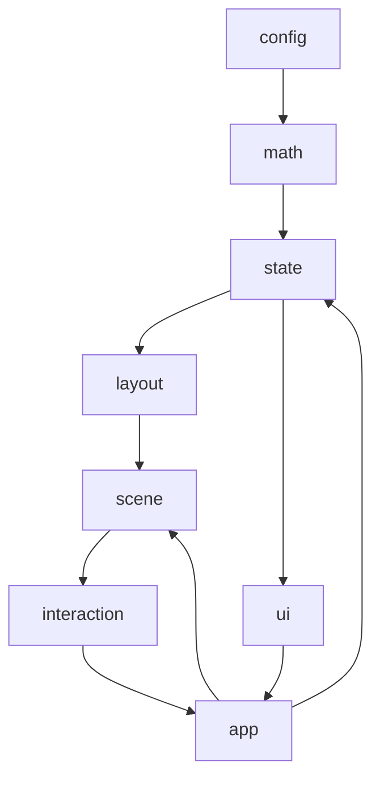

### Required rules

1. `math` must not import Three.js or access the DOM.
2. `layout` must not depend on GUI controls.
3. `layout` must not create Three.js objects.
4. `scene` must not calculate matrix multiplication.
5. `ui` must not mutate Three.js objects directly.
6. `interaction` must issue state commands rather than rewriting canonical tensors.
7. `share-state` must not serialize runtime objects.
8. `camera-controller` must not own canonical tensor data.
9. `resource-manager` must not contain product/business logic.
10. Cycles are prohibited.

Static enforcement **Target:** package boundary lint or simple import-path checks in CI. **Current:** not enforced.

---

## 10. Canonical Mathematical Model

```text
A ∈ R^(m×k)
B ∈ R^(k×n)
C = A @ B
C ∈ R^(m×n)

C[i,j] = Σ_{k=0..K-1} A[i,k] × B[k,j]
```

Vectors and scalars are shapes, not separate types:

| Form | Shape |
| --- | --- |
| Matrix | `m×n` with `m>1` or `n>1` as applicable |
| Column vector | `m×1` |
| Row vector | `1×n` |
| Scalar | `1×1` |

### Canonical structures (TypeScript)

```ts
type TensorId = 'A' | 'B' | 'C';

interface TensorShape {
  rows: number;    // m or K depending on tensor
  columns: number; // K or n depending on tensor
}

interface Tensor2D {
  id: TensorId;
  shape: TensorShape;
  /** Row-major length rows*columns */
  values: Float64Array;
}

interface MatmulProblem {
  A: Tensor2D; // m×k
  B: Tensor2D; // k×n
  C: Tensor2D; // m×n derived
}
```

### Policies

| Topic | Decision |
| --- | --- |
| Storage ordering | Row-major: `addr(i,j) = i * columns + j` |
| Shape validation | `A.columns === B.rows`; positive integers within `config/limits` |
| Immutability | Inputs replaced wholesale on successful parse; `C` recomputed; in-place anim must not mutate `A`/`B` |
| Result derivation | Always derived; never authoritative user input |
| Numeric precision | Canonical math uses `Float64Array`; render path may downsample |
| Invalid values | Reject `NaN`/±`Infinity` at parse (display validation error); do not write into canonical tensors |
| Conversion from input | Parser → `Tensor2D` |
| Conversion to render | Selectors expose values + layout cell centers |

### `Array2D` disposition

**Decision: Retain + Refactor (wrap for compatibility).**

- Keep `Array2D` as a battle-tested row-major container used by existing renderers during migration.
- Extract pure `matmul(a,b)` that today exists only in tests into `math/matmul.ts`.
- Stop importing epilog into the core array module for MVP paths.
- Longer term, prefer `Tensor2D` interface; `Array2D` may implement or adapt it.
- **Do not Replace** until renderers no longer depend on `.h/.w/.data`.

---

## 11. Matrix Parsing Architecture

```text
Raw Text
  → Tokenization (rows by newline; entries by comma/whitespace)
  → Row Parsing
  → Numeric Validation (finite decimals)
  → Rectangularity Validation
  → Tensor Construction
```

Parsing must not use `eval`, execute expressions, load remote data, or mutate last-good tensors before validation succeeds.

```ts
interface ParseSuccess { ok: true; tensor: Tensor2D }
interface ParseFailure { ok: false; errors: ValidationError[] }
```

| Concern | Owner |
| --- | --- |
| Parse errors | `math/matrix-parser` → `ValidationState` |
| Presentation | `ui/validation-view` |
| Scene on failure | Unchanged last-good scene (QM-ARC-INV-007) |

**Current gap:** Product path uses procedural initializers + `expr`/`url`, not textual matrix editors. MVP must add the parser pipeline.

---

## 12. Application-State Architecture

```ts
interface AppState {
  tensors: {
    A: Tensor2D;
    B: Tensor2D;
    C: Tensor2D; // derived; stored for selectors/perf
  };
  layout: LayoutSettings;      // MarginGridConfig + plane options
  display: DisplaySettings;    // colors, sizes, grid visibility, labels
  interaction: InteractionState; // hover + selection
  animation: MatmulAnimationState;
  camera: CameraState;
  validation: ValidationState;
  share: ShareStateMetadata;   // version, dirty flags
  meta: { status: AppStatus };
}
```

### Canonical vs derived vs runtime

| Kind | Examples |
| --- | --- |
| Canonical | A/B values & shapes, layout settings, display toggles, selection, animation indices, camera pose |
| Derived | C values, tensor layouts, bounds, share URL string, hover tooltip text |
| Runtime | `THREE.*`, DOM nodes, raycaster, RAF ids, OrbitControls, GUI instances |

### Update mechanism

- **Commands** enter `dispatch`.
- **Reducer** returns next `AppState` (shallow structural sharing acceptable).
- **Selectors** compute derived views.
- **Subscriptions:** `scene-controller` and `ui` subscribe to store changes.
- **Scene sync:** controller diffs previous/next and chooses update class (§19).
- **Errors:** validation errors live in `validation`; last-good tensors retained.

Avoid Redux/Zustand unless complexity demands; a small custom store is sufficient (**ADR-004**).

**Current:** mutable `params` tree — **Temporary Migration State** until Phase 2 completes.

---

## 13. State Transition Architecture

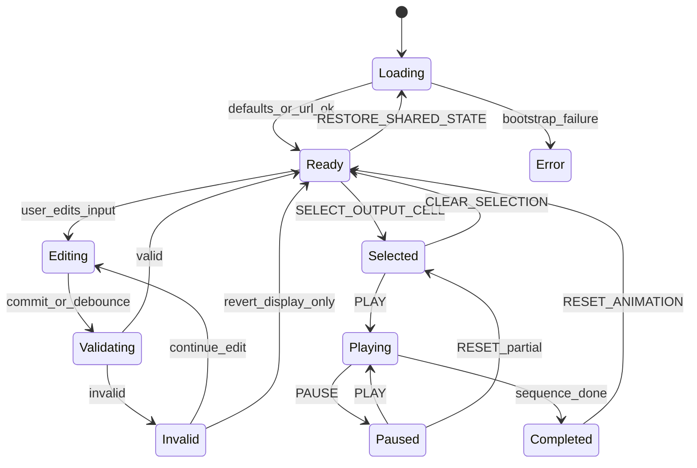

| Transition | Behavior |
| --- | --- |
| Initial load | Parse URL → validate → compute C → layout → scene |
| Input edit | Draft text in UI; canonical unchanged until validate succeeds |
| Validation fail | `validation` errors; scene keeps last-good |
| Scene update | Via scene controller update classes |
| Output selection | Sets `interaction.selection`; cancels/realigns animation as needed |
| Play/Pause/Step/Reset | Animation controller + commands |
| URL restore | `RESTORE_SHARED_STATE`; invalid → defaults + error |
| Camera reset/fit | Camera commands; may serialize pose |

---

## 14. Coordinate-System Architecture

```text
I = output-row dimension
J = output-column dimension
K = contraction dimension

World X → J
World Y → I
World Z → K
```

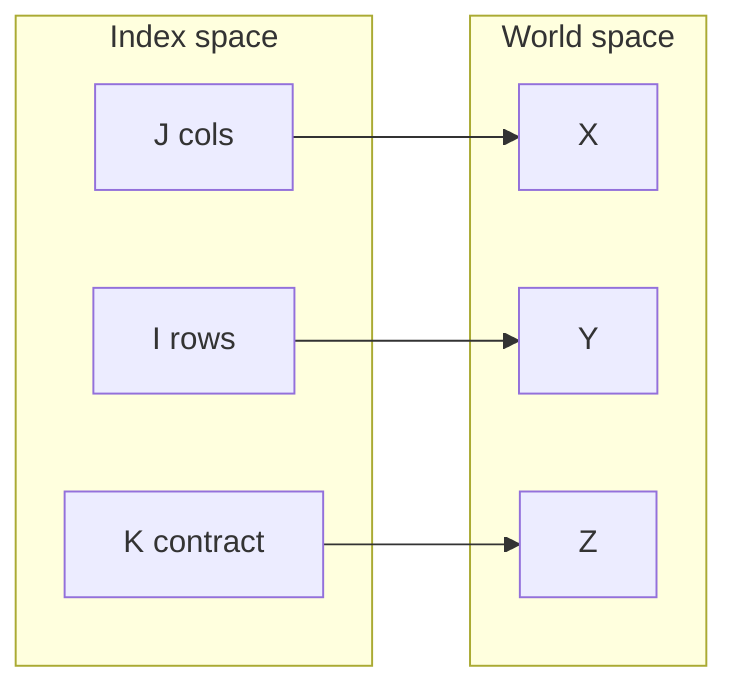

| Topic | Target convention |
| --- | --- |
| Handedness | Three.js right-handed |
| Origin | Margin-grid origin (config); problem volume centered for camera convenience via layout bounds, not ad hoc hacks |
| Axis direction | +X increases J; +Y increases I; +Z increases K |
| Camera up | `+Y` |
| Grid cell unit | `cellSize` world units per index step |
| Index→world | `layout.worldPositionForTensorCell(...)` |
| World→index | Inverse with snap tolerance `1e-6 * cellSize` (**Assumption:** exact epsilon TBD in tests) |
| Tensor-plane orientation | A: I×K (Y×Z); B: K×J (Z×X); C: I×J (Y×X) |
| Labels | Layout provides anchors; renderer billboards or fixed plane text per label strategy |
| Bounds | Union of frames, titles, guides |

**Current Architecture note:** Local `Mat` uses x=j, y=i; operands rotated into volume; root `rotation.x=π` inverts Y. Target must eliminate conflicting flips by baking orientation into layout.

Pure functions must return plain `{x,y,z}` — not `THREE.Vector3` — from `layout/`.

---

## 15. 3D Margin-Grid Architecture

`MarginGrid3D` is the central spatial abstraction.

Responsibilities: cell size, minor/major grid, tensor anchors, margins, frame padding, label margins, operand gaps, depth spacing, axis alignment, grid bounds, camera-fit bounds.

```ts
interface MarginGridConfig {
  cellSize: number;
  minorGridSpacing: number;
  majorGridInterval: number;
  framePadding: number;
  titleMargin: number;
  labelMargin: number;
  operandGap: number;
  depthSpacing: number;
  origin: Point3;
}

interface TensorLayout {
  tensorId: TensorId;
  origin: Point3;
  rowAxis: AxisDirection;
  columnAxis: AxisDirection;
  frameBounds: Bounds3;
  cellCenters: Point3[];
  labelAnchors: LabelAnchor[];
}
```

Rules:

- Layout must not depend on viewport dimensions.
- Positions derive only from shapes + coordinate convention + `MarginGridConfig`.
- Scene grid renderer consumes the same config.

**Current:** `layout.gap` and polarity placements approximate spacing but are not a shared margin grid. **Target:** replace.

---

## 16. Tensor-Plane Architecture

```text
A → I × K plane
B → K × J plane
C → I × J plane
```

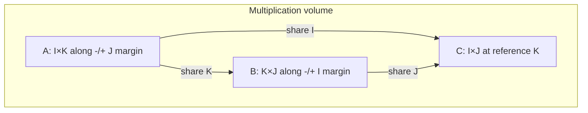

### Invariants (test without rendering)

```text
A.I aligns with C.I
A.K aligns with B.K
B.J aligns with C.J
```

| Topic | Rule |
| --- | --- |
| Anchors | `matmul-layout` places A/B/C with `operandGap` / `depthSpacing` so frames do not overlap |
| Vectors | Same plane rules with extent 1 on thin axis |
| Scalars | Single cell + frame |
| Labels | Anchors outside frame padding; readable facing policy in renderer |
| Result relation | `C[i,j]` cell lines up with `A[i,*]` and `B[*,j]` under shared indices |

Exact default polarity (which side of C holds A/B) is an open decision with recommended default matching current negative/left/top/front after coordinate cleanup (**§41**).

---

## 17. Tensor Margin-Frame Architecture

Separate:

- `TensorMarginFrameLayout` — pure description (boundary, grid, title, shape, axes, guides, hit bounds).
- `TensorMarginFrameRenderer` — Three.js meshes/lines from layout.

| Concern | Strategy |
| --- | --- |
| Geometry | Line segments / simple plane edges; reuse buffers on value-only updates |
| Material | Shared basic line/mesh materials via ResourceManager |
| Labels | See §21 |
| Update | Shape change → replace frame; value change → leave frame |
| Disposal | Renderer owns meshes; dispose on replace |
| Visibility | Driven by display settings |
| Selection | Highlight materials/emissive overlays from interaction state |

---

## 18. Scene Graph Architecture

```text
Scene
├── EnvironmentGroup
│   ├── Lighting (minimal / none if unlit sprites)
│   └── Background
├── GridGroup
│   ├── MinorGrid
│   ├── MajorGrid
│   └── AxisGuides
├── TensorGroup
│   ├── TensorAGroup { Frame, Values, Labels, InteractionTargets }
│   ├── TensorBGroup { ... }
│   └── TensorCGroup { ... }
├── GuideGroup
│   ├── RowHighlight
│   ├── ColumnHighlight
│   ├── ContractionGuides
│   └── RunningSum
└── OverlayGroup
    ├── HoverIndicator
    └── SelectionIndicator
```

| Topic | Rule |
| --- | --- |
| Ownership | `scene-controller` owns root groups; child renderers own subtree resources |
| Naming | `tensor.A.values`, `tensor.A.frame`, … |
| Metadata | `userData: { tensorId, i, j, kind }` on raycast targets |
| Raycast eligibility | Value markers + optional frame proxies; not decorative major grids |
| Disposal | Replace group → `resourceManager.disposeSubtree` |

---

## 19. Scene Controller Architecture

`SceneController` synchronizes `AppState` + layout outputs → Three.js.

**Must:** create infrastructure; apply layout; create/update tensors; visibility; selection; animation guides; camera-fit bounds; dispose replaced resources.

**Must not:** parse text; matmul; own canonical state; serialize URL; implement GUI.

| Update class | When |
| --- | --- |
| Full Scene Rebuild | Bootstrap; renderer loss; catastrophic schema change |
| Layout Update | Shape or grid config change |
| Tensor Value Update | A/B values change, shapes same |
| Display Update | Color/size/grid toggles |
| Interaction Update | Hover/selection visuals |
| Animation Update | k-step / running sum guides |
| Camera Update | Preset, fit, resize projection |

**Current:** almost everything triggers `initObj()` full rebuild — migrate toward partial updates.

---

## 20. Rendering Architecture

### Decision table

| Option | Advantages | Risks | Migration Cost | MVP Decision |
| --- | --- | --- | --- | --- |
| Point sprites (current) | Working shader, cheap, familiar | Zero-size zeros; depth sorting quirks | Low | **Recommended** |
| Instanced cubes | Solid cells, clearer zeros | More GPU memory; rewrite | High | Defer |
| Instanced planes | Flat cells | Similar rewrite | High | Defer |
| Voxel meshes | Strong volume metaphor | Heavy | High | Out of MVP |
| Hybrid | Flexibility | Complexity | High | Avoid |

**MVP recommendation: retain point sprites** with these adjustments:

- Always render a cell occupancy cue (frame grid and/or minimum non-zero marker size for zeros — satisfy visible-zero requirement via frame cell + distinct zero style).
- Keep GLSL1 shader until a deliberate shader migration ADR.
- Shared `MATERIAL`; per-geometry attributes for size/color.
- Normalize by configurable sensitivity (global default).
- Clamp extremes; reject non-finite at parse.
- Transparency: discard low alpha in sprite texture (current).
- Depth: default Three.js; document sorting limitations of points.

---

## 21. Label Architecture

### Options

| Option | MVP fitness |
| --- | --- |
| Existing ShapeGeometry font meshes | **Recommended short-term** — already integrated |
| DOM / CSS2D | Good for tooltips/validation; use for UI + hover tooltip fallback |
| Canvas textures | Possible later |
| SDF text | Overkill for MVP |

### Label placement spaces

| Label type | Space |
| --- | --- |
| Tensor name, shape, axis | World (layout anchors) |
| Value labels (optional dense) | World, gated by density |
| Hover tooltip | Screen/DOM preferred for accessibility |
| Running sum | World or DOM overlay near selection |
| Validation messages | DOM UI |

Ownership: `label-renderer` + UI validation view. Dispose font meshes on replace. Occlusion: accept imperfect depth for MVP; do not build full occlusion system.

---

## 22. Camera Architecture

`CameraController` owns perspective camera, OrbitControls, presets, reset, fit, resize, serialization.

| Preset | Intent |
| --- | --- |
| Isometric | Default teaching view |
| Front | Face C (I×J) |
| Top | Emphasize B / J×K relationship |
| Multiplication Volume | Show A/B/C together |

**Fit View** uses layout bounds including frames, titles, shape labels, active guides — not only point positions.

| Topic | Decision |
| --- | --- |
| Projection | Perspective (current); FOV adaptive to aspect as today |
| Near/far | Start from current `5` / `10000`; revisit with bounds |
| Up | `+Y` |
| Damping | Optional; current OrbitControls defaults + zoomSpeed 0.2 |
| DPR | Cap pixel ratio (e.g. `min(devicePixelRatio, 2)`) for perf |
| Serialization | Pose + target in share state (see open Q on preset-only) |

---

## 23. Interaction Architecture

### RaycastController

Normalize pointer → raycast → ordered hits → extract `userData` → filter eligible kinds.

### HoverController

Tracks hover target; updates tooltip state; requests interaction scene update; clears on leave.

### SelectionController

Owns selected `C[i,j]` (and derived row/col/path). Clear selection command. Selecting cancels incompatible animation or rebinds animation to cell.

### KeyboardController

Shortcuts → commands; ignore when typing in inputs; cleanup on dispose.

**Current:** spotlight hover exists; first-class cell selection does not — must be added.

---

## 24. Multiplication Animation Architecture

```ts
interface MatmulAnimationState {
  status: 'idle' | 'playing' | 'paused' | 'completed';
  outputRow: number;
  outputColumn: number;
  contractionIndex: number;
  runningSum: number;
  completedCells: Array<{ i: number; j: number }>;
  speed: number;
}
```

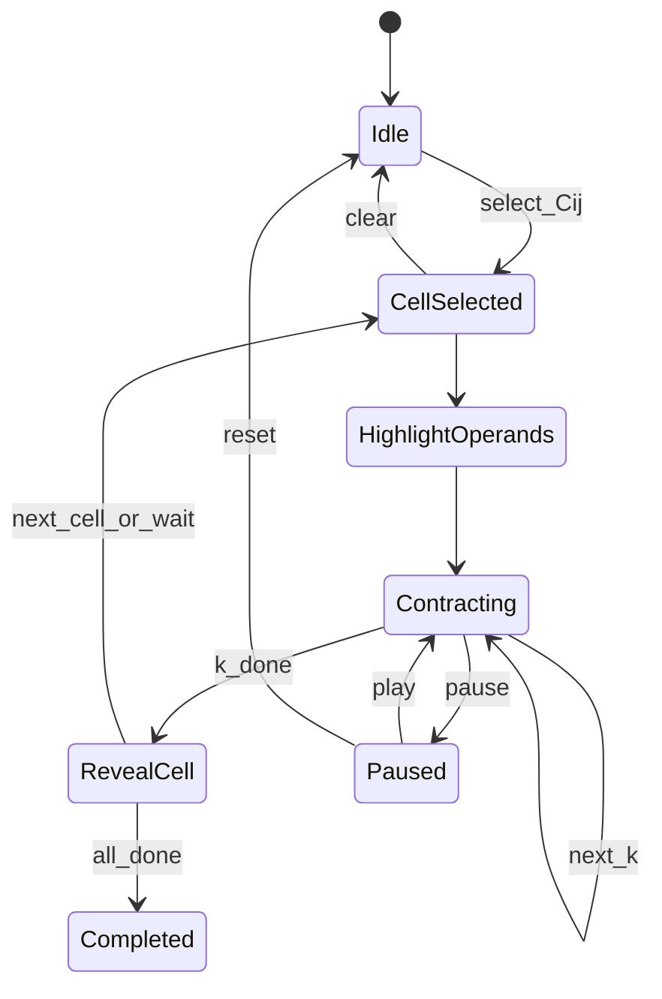

Deterministic sequence:

```text
Select C[i,j] → highlight A[i,:] & B[:,j]
  → for k: highlight A[i,k], B[k,j], show product, update running sum
  → reveal C[i,j]
```

**Step Backward:** Prefer **deterministic recomputation** of animation state from `(selection, stepIndex)` rather than snapshot stacks, unless profiling proves it too expensive for 32×32.

Input/selection changes cancel or rebind animation. Animation must not mutate input tensors (QM-ARC-INV-009).

**Current:** rich block-oriented algs in `MatMul` — **Temporarily retain** internally; MVP UI exposes only the deterministic educational sequence above.

---

## 25. Command Architecture

| Command | Input | Validation | State changes | Derived | Scene update | Failure | Serializable |
| --- | --- | --- | --- | --- | --- | --- | --- |
| `SET_MATRIX_A` | text/tensor | parse+shape w/ B | A, clear anim | C, layout | layout/value | keep last-good | Yes (tensor) |
| `SET_MATRIX_B` | text/tensor | parse+shape w/ A | B, clear anim | C, layout | layout/value | keep last-good | Yes |
| `SET_DIMENSIONS` | m,k,n | limits | reshape policy | C, layout | layout | error | Yes |
| `APPLY_PRESET` | preset id | known preset | tensors+display | all | rebuild | ignore | Yes |
| `VALIDATE_INPUT` | drafts | parser | validation only | — | none | errors | No |
| `SELECT_OUTPUT_CELL` | i,j | in C bounds | selection | guides | interaction | no-op | Yes |
| `CLEAR_SELECTION` | — | — | clear | — | interaction | — | Yes |
| `PLAY_ANIMATION` | — | selection exists | status playing | — | animation | error toast | No |
| `PAUSE_ANIMATION` | — | — | paused | — | animation | — | No |
| `STEP_FORWARD` | — | — | indices++ | running sum | animation | clamp | No |
| `STEP_BACKWARD` | — | — | recompute prior | running sum | animation | clamp | No |
| `RESET_ANIMATION` | — | — | idle defaults | — | animation | — | No |
| `SET_DISPLAY_OPTION` | key/value | schema | display | — | display | reject | Yes |
| `SET_GRID_OPTION` | key/value | schema | layout | layouts | layout | reject | Yes |
| `SET_CAMERA_PRESET` | preset | known | camera | — | camera | reject | Yes |
| `RESET_CAMERA` | — | — | default cam | — | camera | — | Yes |
| `FIT_CAMERA` | — | bounds exist | camera | — | camera | — | Yes |
| `RESTORE_SHARED_STATE` | payload | schema | many | all | rebuild | defaults+error | Yes |
| `COPY_SHARE_LINK` | — | — | metadata | URL | none | clipboard fail | No |

Commands are the primary UI entry points.

---

## 26. Share-State Architecture

```ts
interface ShareStateV1 {
  version: 1;
  tensors: { A: SerializableTensor; B: SerializableTensor };
  layout: SerializableLayoutSettings;
  display: SerializableDisplaySettings;
  camera: SerializableCameraState;
  selection?: SerializableSelectionState;
}
```

| Topic | Decision |
| --- | --- |
| Encoding | JSON → `URLSearchParams` (`s=<payload>`) or hash fragment; prefer **query** for consistency with current `mm`, with size guard |
| Compression | Optional `lz`-style or existing flatten/compress **only if** versioned; default omit defaults |
| Omit defaults | Yes |
| Validation | Schema + math validation on restore |
| Versioning | `version: 1`; migrate functions per version |
| Invalid payload | Fall back to defaults; show Share-State Error |
| URL length | Soft limit ~2k; compress or refuse + copy instructions |
| Clipboard | `navigator.clipboard.writeText` with fallback |

**Do not serialize:** C (recompute), timers, Three.js, DOM, handlers, GPU resources, animation playhead (optional exception: selection only).

**Current format:** unversioned flattened params — classify as **Migrate** with optional temporary reader.

---

## 27. Resource-Management Architecture

`ResourceManager` tracks geometries, materials, textures, render targets, label meshes, listeners, timers, RAF, OrbitControls, renderer, resize observers.

Lifecycle: `create` → `update` → `replace` → `dispose` / `disposeAll`.

| Event | Disposal rule |
| --- | --- |
| Shape change | Dispose tensor value geometry + frame subtree; rebuild |
| Value change | Update attributes in place when possible |
| Grid change | Dispose grid geometries; rebuild |
| Renderer change | disposeAll + recreate context |
| App reset | disposeAll visualization; keep renderer |
| Hot reload / unload | `disposeApp` removes listeners and GPU resources |

**Current gap:** materials on text meshes not disposed; shared point material must not be disposed per Mat.

---

## 28. Runtime Lifecycle

### Startup sequence

```mermaid
sequenceDiagram
    participant Browser
    participant Bootstrap
    participant State
    participant Math
    participant Layout
    participant Scene
    participant UI
    participant Loop as AnimationLoop

    Browser->>Bootstrap: load
    Bootstrap->>State: defaults
    Bootstrap->>State: parse URL
    State->>Math: validate + matmul
    Math-->>State: C
    State->>Layout: shapes + config
    Layout-->>Scene: TensorLayouts + bounds
    Bootstrap->>Scene: create context + apply
    Bootstrap->>UI: mount
    Bootstrap->>Loop: start RAF
```

### Other lifecycles (summary)

| Event | Flow |
| --- | --- |
| Matrix edit | UI draft → VALIDATE → SET_MATRIX_* → math → layout → scene partial |
| Invalid input | validation state; scene unchanged |
| Shape change | layout update + resource replace |
| Selection | command → interaction update → optional anim rebind |
| Animation | RAF polls controller OR controller schedules steps from speed |
| Camera preset | camera controller |
| Share restore | decode → validate → replace state → rebuild |
| Resize | camera aspect + DPR; layout unchanged |
| Teardown | disposeApp |

---

## 29. Error Architecture

| Category | Detection | Representation | Log | User | Recovery | Keep scene? |
| --- | --- | --- | --- | --- | --- | --- |
| Input Error | UI/parser | ValidationError[] | debug | inline | edit | Yes |
| Validation Error | math/state | ValidationError[] | debug | validation view | edit | Yes |
| Mathematical Error | matmul invariants | thrown/domain | error | banner | reset dims | Yes if last-good |
| Layout Error | layout asserts | Error | error | banner | fallback layout | Best-effort |
| Rendering Error | scene try/catch | Error | error | banner | skip frame update | Yes |
| WebGL Error | context lost | flag | error | blocking message | restore handler | N/A |
| Share-State Error | codec | Error | warn | toast + defaults | defaults | New defaults scene |
| Asset Error | texture/font | Error | warn | degraded labels | continue | Yes |
| Unexpected | window.onerror | Error | error | generic | continue loop | Yes |

Render loop must not die on invalid user input.

---

## 30. Security Architecture

| Control | Requirement |
| --- | --- |
| No `eval` | Product paths must not evaluate user strings as code |
| No remote code | No arbitrary remote module loading |
| Safe URL parse | Schema validation; size limits |
| Input-size limits | Enforce max rows/cols/chars (`config/limits`) |
| Safe DOM | Use `textContent`; no `innerHTML` for user values |
| Dependency review | Keep three/lil-gui/vite pinned; review upgrades |
| CSP compatibility | Avoid inline script requirements where possible |
| Clipboard | Permission-safe fallbacks |
| Safe merge | Share restore replaces via schema, not blind `updateProps` deep merge of unknown keys |
| Secrets | None in repo for MVP |

### Existing violations / risks

| Behavior | Location | Migration |
| --- | --- | --- |
| `eval` expression parse | `viz/expr.ts` | Remove from MVP; isolate or delete |
| `eval` init expressions | `viz/init.ts` | Remove from MVP UI |
| Sync XHR URL/config | `init.ts`, `params.ts` | Remove from MVP |
| `innerHTML` title | `create-app.ts` | Switch to `textContent` |
| postMessage param injection | `create-app.ts` | Restrict/disable for MVP or validate schema |

---

## 31. Performance Architecture

Sensitive areas: grid geometry, value markers, labels, raycasting, scene rebuilds, animation guides, URL encoding, camera fit, HiDPI.

Strategies: geometry/material reuse; partial updates; cache layouts/bounds; limit raycast targets to value points; cap DPR; avoid sync network; avoid full rebuild on value-only edits; bound label count.

| Limit class | Guidance |
| --- | --- |
| Recommended interactive maximum | **32×32** (and K≤32) per VIZ / TRD intent |
| Functional maximum | 64 (may degrade) — **Assumption Requiring Verification** |
| Stress-test maximum | 128 for perf tests only |

---

## 32. Testing Architecture

### Pure unit tests

Parsing, validation, addressing, matmul, coordinates, layout alignment, bounds, reducers, animation index transitions, share codec.

### Scene integration tests

Node creation, updates, visibility, selection visuals, disposal (mock Three.js or minimal WebGL).

### Browser tests

Default load, edit, invalid input, camera, hover, selection, animation, share links, resize.

### Visual regression

Default; matrix-vector; vector-matrix; scalar; selection; animation; grid toggles; presets.

### Performance tests

Startup; 32×32; repeated edits/resets; memory growth; frame responsiveness.

**Boundary:** pure math/layout tests must not require WebGL.

**Current:** Vitest unit tests for `Array2D` and expr helpers only.

---

## 33. Technology Decisions

### JavaScript versus TypeScript

| | |
| --- | --- |
| Context | Repo already TypeScript with widespread `@ts-nocheck` |
| Options | Stay JS; gradual TS; full strict TS now |
| Decision | **TypeScript, gradual strictness** |
| Rationale | Matches package tooling; enables typed state/commands |
| Consequences | More typing work during extraction |
| Migration cost | Medium |
| MVP requirement | Yes — do not revert to plain JS |

### Native ES modules + Vite

| | |
| --- | --- |
| Decision | **Keep Vite + native ESM** |
| Rationale | Already working; simple static deploy |
| MVP requirement | Yes |

### Three.js + OrbitControls

| | |
| --- | --- |
| Decision | **Keep three r185+ and OrbitControls** |
| Rationale | Core of existing viz |
| MVP requirement | Yes |

### lil-gui versus native HTML

| | |
| --- | --- |
| Context | lil-gui exposes research controls |
| Decision | **MVP product UI = native HTML controls**; lil-gui optionally behind “advanced” or removed from main entry |
| Rationale | VIZ-09; clearer UX |
| Migration cost | Medium |
| MVP requirement | Native UI required |

### Unit / browser / lint / format / visual tools

| Tool | Decision |
| --- | --- |
| Unit | **Vitest** (present) |
| Browser | Playwright or Cypress — **open**, default Playwright when added |
| Lint | ESLint recommended when modules stabilize |
| Format | Prettier optional |
| Visual regression | Defer until fixtures exist (`docs/TESTING.md`) |

Do not introduce React/Vue/Svelte without an ADR and demonstrated need.

---

## 34. Architecture Decision Records

| ADR | Status | Why ADR | Alternatives | Recommended decision |
| --- | --- | --- | --- | --- |
| ADR-001 Coordinate-System Convention | Proposed | Prevent conflicting axes | Keep π-flip folklore; alternate mappings | X→J, Y→I, Z→K; document migration from π flip |
| ADR-002 Tensor-Plane Placement | Proposed | Product feature | Keep polarity enums only | MarginGrid planes with testable invariants |
| ADR-003 Canonical Tensor Representation | Proposed | Math/render split | Replace Array2D now; Float32 only | Tensor2D Float64 + Array2D adapter |
| ADR-004 State-Management Strategy | Proposed | GUI coupling | Redux; MobX; status quo params | Small custom store/reducer |
| ADR-005 Rendering Primitive | Proposed | Perf vs clarity | Cubes/voxels | Point sprites MVP |
| ADR-006 Label Rendering | Proposed | Complexity | CSS2D-only; SDF | ShapeGeometry + DOM tooltips |
| ADR-007 Share-State Encoding | Proposed | URL fragility | Keep unversioned flatten | Versioned ShareStateV1 |
| ADR-008 Scene Resource Ownership | Proposed | Leaks | Ad hoc dispose | ResourceManager |
| ADR-009 JavaScript or TypeScript | Proposed | Tooling | Revert to JS | TypeScript gradual |
| ADR-010 Build and Test Tooling | Proposed | Quality gates | Add heavy e2e now | Vitest + build; browser tests next |

Full ADR bodies are out of scope for this document.

---

## 35. Repository Migration Architecture

### Phase 0 — Establish Baseline

| | |
| --- | --- |
| Inputs | Current `quatricmorph`, `mm` |
| Outputs | Screenshots, behavior notes, URL format notes, test/build green |
| Files | Docs only |
| Verification | `npm test`, `npm run build`, manual smoke |
| Rollback | N/A |
| Done when | Baseline recorded |

### Phase 1 — Extract Pure Mathematics

| | |
| --- | --- |
| Outputs | `math/matmul`, parser stub, shape validation; tests |
| Files | `viz/array2d.ts`, new `math/*`, tests |
| Dependencies | Phase 0 |
| Verification | Unit tests including example walkthrough numbers |
| Rollback | Keep adapters to Array2D |
| Done when | VIZ-01/02 testable without Three.js |

### Phase 2 — Establish Canonical State

| | |
| --- | --- |
| Outputs | AppState + commands; GUI dispatches commands |
| Files | `state/*`, `create-app.ts`, `gui` |
| Verification | State tests; app still renders |
| Rollback | Feature flag to legacy params writes |
| Done when | Single authoritative state for A/B/C |

### Phase 3 — Extract Coordinate and Layout Logic

| | |
| --- | --- |
| Outputs | coordinate + matmul layout pure modules; characterization tests vs old positions |
| Files | new `layout/*`, reduce `matmul.ts` placement |
| Done when | Invariants tested; old hard-coded paths wrapped |

### Phase 4 — Implement 3D Margin Grid

| | |
| --- | --- |
| Outputs | MarginGrid3D, frames, bounds |
| Files | `layout/*`, `scene/grid-renderer`, frame renderer |
| Done when | VIZ-03/04/05 acceptance |

### Phase 5 — Refactor Scene Ownership

| | |
| --- | --- |
| Outputs | SceneController, ResourceManager, partial updates |
| Files | `scene/*`, slim `Mat`/`MatMul` |
| Done when | Disposal tests; no product matmul in scene |

### Phase 6 — Simplify Product UI

| | |
| --- | --- |
| Outputs | Quatricmorph shell; matrix editors; hide attention/nested/url-expr |
| Files | `ui/*`, `index.html`, vite inputs |
| Done when | VIZ-09 |

### Phase 7 — Interaction and Animation

| | |
| --- | --- |
| Outputs | Selection, deterministic animation, camera presets |
| Files | `interaction/*`, camera controller |
| Done when | VIZ-07 + animation AC |

### Phase 8 — Share State and Hardening

| | |
| --- | --- |
| Outputs | ShareStateV1, browser/perf tests, docs updates |
| Files | `share-state`, TESTING docs |
| Done when | VIZ-08 hardened; gates green |

---

## 36. Compatibility Strategy

| Artifact | Classification |
| --- | --- |
| Existing `mm` share URLs | Migrate (temporary reader) → Deprecate |
| Existing examples (attention) | Remove from MVP / Out of scope |
| Matrix initializers (row major, etc.) | Temporarily retain for demos; MVP prefers explicit matrix text |
| Existing animations (vmprod, etc.) | Temporarily retain internally; MVP UI uses educational sequence |
| Attention explorer | Out of scope |
| Existing GUI parameters | Deprecate from primary UX |
| Shader behavior | Preserve |
| Reference pages (`ref.html`, intro) | Temporarily retain |
| Nested expr / epilog / blocking | Remove from MVP UX; isolate code |
| License attribution (MIT Meta) | Preserve |

Do not preserve legacy behavior that conflicts with margin-grid alignment or security.

---

## 37. Deployment Architecture

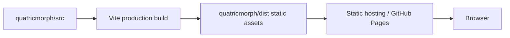

| Topic | Guidance |
| --- | --- |
| Output | `quatricmorph/dist` |
| Asset paths | Root-absolute `/assets/...` today — verify base-path for Pages (`base` in Vite) — **Assumption Requiring Verification** for project Pages URL |
| Cache | Hashed assets; HTML short cache |
| Local preview | `npm run preview` |
| Source maps | Enable for debugging builds as needed |
| Backend | None |

---

## 38. Repository Documentation Map

| Document | Purpose | Authority | Audience | Update trigger | Relationship |
| --- | --- | --- | --- | --- | --- |
| `README.md` | Entry | Low | All | Setup changes | Points to docs |
| `docs/TECHNICAL_REQUIREMENTS.md` | What to build | **Product/eng contract** | Eng/agents | Requirement changes | Governs architecture |
| `docs/SYSTEM_ARCHITECTURE.md` | How to structure | Architecture | Eng/agents | Structural decisions | Implements TRD |
| `docs/requirements/VIZ_MVP.md` | Track A checklist | Active coding gate | Agents | VIZ progress | Subset of TRD |
| `docs/TESTING.md` / `TESTING_GUIDELINE.md` | How to test | Process | Eng/QA | Tooling changes | Aligns §32 |
| `docs/COORDINATE_SYSTEM.md` | Deep axis spec | Derived from ADR-001 | Graphics | Coord changes | Detail extract |
| `docs/SCENE_LIFECYCLE.md` | Scene update/dispose | Derived | Graphics | Scene refactors | Detail extract |
| `docs/STATE_MODEL.md` | State schema | Derived | Eng | State changes | Detail extract |
| `docs/adr/*` | Decision records | Decision | Eng | ADR accepted | Traceability |
| `prompts.md` | Historical eng brief | Advisory | Agents | Rare | Superseded by TRD+architecture when published |
| `docs/PRODUCT_ARCHITECTURE_v1.md` | Long-term platform | Platform vision | All | Platform work | **Not** viz MVP scope expander |

Avoid duplicating normative rules; link instead.

---

## 39. Architecture Invariants

| ID | Invariant | Enforcement Layer | Verification |
| --- | --- | --- | --- |
| QM-ARC-INV-001 | Mathematical modules do not import Three.js | Module boundaries | Static analysis |
| QM-ARC-INV-002 | Every tensor value occupies one grid cell | Layout | Unit test |
| QM-ARC-INV-003 | `A.K` aligns with `B.K` | Layout | Unit test |
| QM-ARC-INV-004 | `A.I` aligns with `C.I` | Layout | Unit test |
| QM-ARC-INV-005 | `B.J` aligns with `C.J` | Layout | Unit test |
| QM-ARC-INV-006 | Three.js objects are never serialized | Share-state | Unit test |
| QM-ARC-INV-007 | Invalid input does not replace valid canonical state | State | Integration test |
| QM-ARC-INV-008 | Scene resources have explicit owners | Scene lifecycle | Review and tests |
| QM-ARC-INV-009 | Animation does not mutate input tensors | Animation | Unit test |
| QM-ARC-INV-010 | UI does not directly calculate matmul | Dependency rules | Static review |
| QM-ARC-INV-011 | Product paths do not `eval` user input | Security | Static grep + tests |
| QM-ARC-INV-012 | Layout does not depend on viewport size | Layout | Unit test |
| QM-ARC-INV-013 | `C` is always derived from `A` and `B` | Math/state | Unit test |
| QM-ARC-INV-014 | Raycast targets carry tensor metadata | Scene | Integration test |
| QM-ARC-INV-015 | MVP UI does not expose attention/nested/url-expr loaders | UI | Review + checklist VIZ-09 |

---

## 40. Risks and Trade-Offs

| Risk | Probability | Impact | Mitigation | Detection | Contingency | Blocking? |
| --- | --- | --- | --- | --- | --- | --- |
| Refactoring monolithic files | High | High | Incremental extract + tests | Build/test fail | Wrap before split | Yes for Phases 1–5 |
| Behavior drift during extract | High | High | Characterization tests vs old positions | Visual/unit diffs | Freeze layout behind adapter | Yes Phase 3 |
| Shader portability | Medium | Medium | Keep GLSL1 | Visual break on three bump | Pin three version | No |
| Label complexity | Medium | Medium | DOM tooltips for hover | Perf jank | Density caps | No |
| Resource leaks | High | Medium | ResourceManager + tests | `renderer.info.memory` | Periodic full rebuild | No |
| Coordinate mistakes | High | Critical | Invariant tests | Misaligned planes | Revert to adapter | Yes |
| Grid performance | Medium | Medium | Instanced lines / merge | FPS drop at 32 | Simplify grid | No |
| URL size | Medium | Medium | Omit defaults; compress | Restore fail | External gist out of scope — truncate | No |
| State sync bugs | High | High | Single store | UI/scene mismatch | Force rebuild | Yes Phase 2 |
| Animation determinism | Medium | High | Recompute steps | Flaky step-back | Snapshots | No |
| Browser differences | Medium | Medium | Cap DPR; smoke browsers | Bug reports | Feature detect | No |
| Experimental code gravity | High | High | VIZ-09 UI discipline | Scope creep in PRs | Code owners review | Yes |
| Overengineering MVP | Medium | High | Scope list § non-goals | Extra frameworks | Reject PR | Yes |
| Removing too much reusable code | Medium | Medium | Prefer isolate over delete | Regressions | Restore from `mm/` | No |
| Retaining too much legacy | High | High | Phase 6 UI cut | Confused UX | Hard remove entry points | Yes |

---

## 41. Open Architecture Questions

| Question | Context | Options | Recommended default | Consequences | Deadline | Blocking phase |
| --- | --- | --- | --- | --- | --- | --- |
| Point sprites vs cubes | Zero visibility | Sprites / cubes / hybrid | Sprites + frame cells | May revisit zeros | Phase 4 | Phase 4 |
| JS vs TS strictness | nocheck everywhere | Gradual / strict now | Gradual | Slower typing payoff | Continuous | Phase 1+ |
| GUI vs native | lil-gui density | Native / lil-gui / both | Native MVP | Rebuild controls | Phase 6 | Phase 6 |
| DOM vs world labels | Hover readability | DOM / world / both | World titles + DOM hover | Two systems | Phase 7 | Phase 7 |
| Perspective vs ortho | Teaching clarity | Persp / ortho | Perspective | Ortho later preset | Phase 7 | Phase 7 |
| Full camera vs preset-only in URL | URL size | Full pose / presets | Full pose | Larger URLs | Phase 8 | Phase 8 |
| Hash vs query share | Routing | Hash / query | Query `s=` versioned | History UX | Phase 8 | Phase 8 |
| Snapshot vs recompute step-back | Anim | Snapshot / recompute | Recompute | CPU on large K | Phase 7 | Phase 7 |
| Max editable dims | Perf | 32 / 64 | 32 interactive | Hard limits in UI | Phase 1 | Phase 1 |
| Retain initializers | Demo convenience | Keep / drop | Keep off MVP primary path | Code weight | Phase 6 | Phase 6 |
| Legacy URLs | Compat | Support / break | Temporary reader | Codec complexity | Phase 8 | Phase 8 |
| Retain examples in build | Bundle | Keep / drop | Drop from MVP build | Breaks old links | Phase 6 | Phase 6 |
| Publish TRD path | Missing `docs/TECHNICAL_REQUIREMENTS.md` | Author TRD / treat prompt as TRD | Author real TRD ASAP | Authority gap | Immediate | All |
| Default plane polarity | Match old mm | polarity sets | Match current default after cleanup | Visual continuity | Phase 3 | Phase 3 |

---

## 42. Target Runtime Flow

```text
User enters A and B
  → UI dispatches update command
  → Parser validates textual values
  → Shape validator validates dimensions
  → Canonical input state updated (only if valid)
  → Math engine derives C
  → Layout engine derives A, B, C placements
  → Scene controller applies layout
  → Tensor renderers update markers
  → Camera-fit bounds recalculated (if shape/layout changed)
  → Interaction metadata rebuilt
  → Renderer displays scene
```

### Failure paths

| Stage | Failure | Result |
| --- | --- | --- |
| Parse | Malformed / non-finite | Validation errors; state/scene unchanged |
| Shape | `A.cols !== B.rows` | Validation errors; unchanged |
| Math | Unexpected domain error | Mathematical Error banner; unchanged if caught pre-commit |
| Layout | Assert fail | Layout Error; best-effort previous layout |
| Scene | WebGL error | Rendering/WebGL Error; loop continues if possible |

---

## 43. Example Architecture Walkthrough

Default example:

```text
A = [[1,2,3],[4,5,6]]     # 2×3
B = [[7,8],[9,10],[11,12]] # 3×2
C = [[58,64],[139,154]]    # 2×2
```

1. **Parsing** — Two rectangular finite tensors; shapes `(2,3)`, `(3,2)`.
2. **Canonical tensors** — `Float64Array` row-major; `A.values[5]=6`, `B.values[5]=12`.
3. **Validation** — `A.columns===B.rows===3`.
4. **Result** — `C[0,0]=1·7+2·9+3·11=58`, etc.
5. **Planes** — A on I×K; B on K×J; C on I×J.
6. **Cell coordinates** — With `cellSize=1`, `origin=(0,0,0)` (illustrative):  
   `C[0,0]→(0,0,zC)`, `A[0,0]→(xA,0,0)`, `B[0,0]→(0,yB,0)` per `matmul-layout` (exact offsets from `operandGap`).
7. **Frames** — Each tensor gets padding/`titleMargin` bounds from layout.
8. **Scene nodes** — `TensorAGroup` points at cell centers; shared sprite material.
9. **Camera fit** — Sphere/box from union bounds → OrbitControls target + distance.
10. **Hover** — Ray hit `userData:{tensorId:'A',i:0,j:1}` → tooltip `A[0,1]=2`.
11. **Select `C[0,0]`** — Highlights `A[0,:]`, `B[:,0]`.
12. **Animation k=0..2** — Products `7,18,33`; running sum `7 → 25 → 58`; reveal `C[0,0]`.
13. **Share** — `ShareStateV1` encodes A/B + layout/display/camera/selection; C omitted.
14. **Shape change cleanup** — ResourceManager disposes old A/B/C geometries/frames; rebuilds for new shapes; materials shared retained.

---

## 44. Implementation Guidance for Autonomous Agents

Agents must:

1. Read `docs/TECHNICAL_REQUIREMENTS.md` when present; otherwise `VIZ_MVP.md` + this document.
2. Read this architecture before structural edits.
3. Identify affected layers and preserve dependency rules.
4. Add tests for new deterministic behavior.
5. Update checklist/docs when acceptance criteria met.
6. Avoid unrelated refactors and excluded features.
7. Verify resource disposal on scene replacements.
8. Report unverified assumptions explicitly.
9. Use requirement IDs (`VIZ-*`) in plans and PRs.
10. Keep math out of scene; placement out of UI.

Agents must not:

- Introduce frameworks without an ADR.
- Change coordinates silently.
- Duplicate tensor placement calculations outside `layout/`.
- Add global mutable product state.
- Serialize Three.js objects.
- Add unsafe input evaluation.
- Mark complete without `npm test` / `npm run build` verification for `quatricmorph/` changes.
- Treat platform SafeTensors work as part of this MVP.

---

## 45. Architecture Acceptance Criteria

This document is complete only when:

1. It reflects the actual repository — **yes (analysis-based)**.
2. It maps existing files to target responsibilities — **yes §5**.
3. It defines the canonical mathematical model — **yes §10**.
4. It defines the canonical application-state model — **yes §12**.
5. It defines one coordinate-system authority — **yes §14–15**.
6. It defines the 3D margin-grid architecture — **yes §15**.
7. It defines tensor-plane placement — **yes §16**.
8. It defines scene ownership — **yes §18–19**.
9. It defines resource disposal — **yes §27**.
10. It defines interaction boundaries — **yes §23**.
11. It defines deterministic animation — **yes §24**.
12. It defines share-state serialization — **yes §26**.
13. It defines dependency rules — **yes §9**.
14. It defines testing boundaries — **yes §32**.
15. It defines an incremental migration plan — **yes §35**.
16. It identifies architecture risks — **yes §40**.
17. It identifies unresolved decisions — **yes §41**.
18. It does not expand MVP scope — **yes**.
19. It is consistent with `TECHNICAL_REQUIREMENTS.md` — **conditional**: consistent with TRD *contract* and `VIZ_MVP.md`; **re-verify when TRD is published**.
20. An autonomous agent can decompose work from it — **intended yes**.

---

## Appendix A — Diagram Index

1. System context — §7  
2. Module dependencies — §9  
3. Mathematical data flow — below  
4. Coordinate-system mapping — §14  
5. Tensor-plane arrangement — §16  
6. Application-state transitions — §13  
7. Runtime startup sequence — §28  
8. Matrix-edit sequence — below  
9. Animation state machine — §24  
10. Scene lifecycle — below  
11. Resource ownership — below  
12. Deployment flow — §37  

### A.3 Mathematical data flow

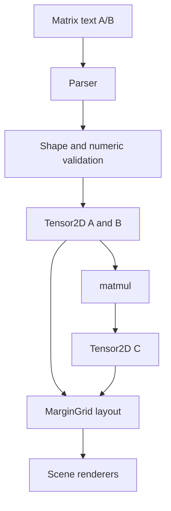

### A.8 Matrix-edit sequence

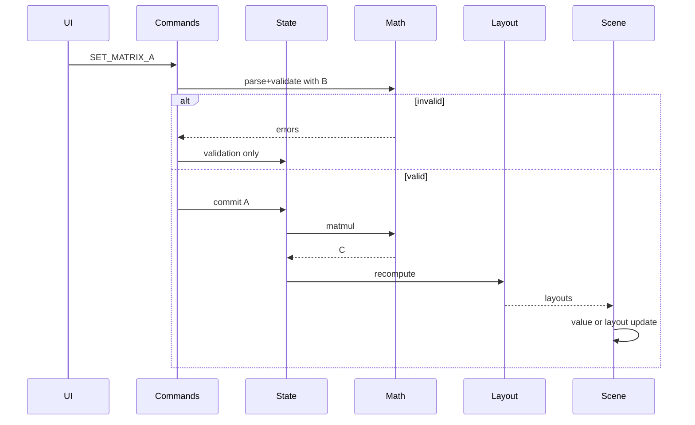

### A.10 Scene lifecycle

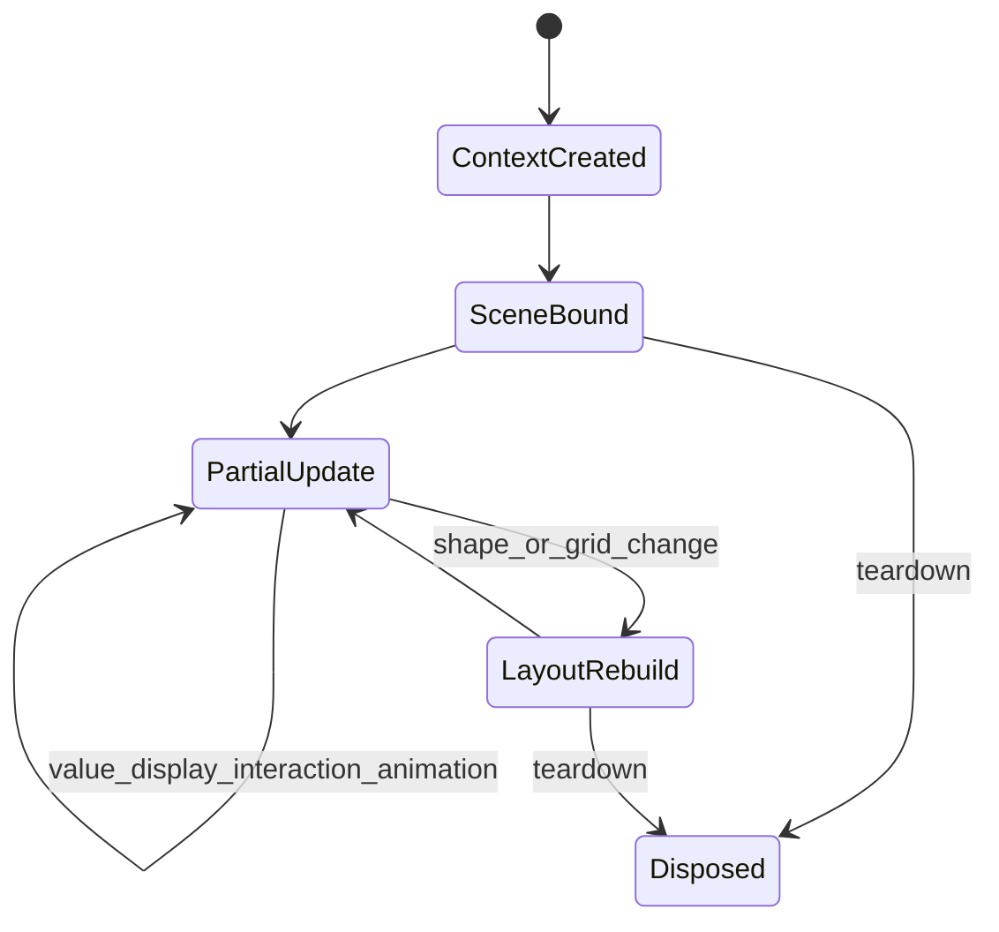

### A.11 Resource ownership

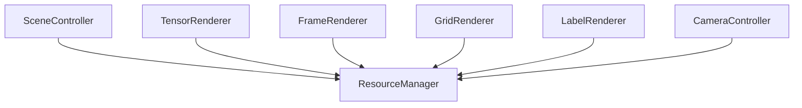

---

*End of architecture document. This documents the target design; it does not implement it.*
